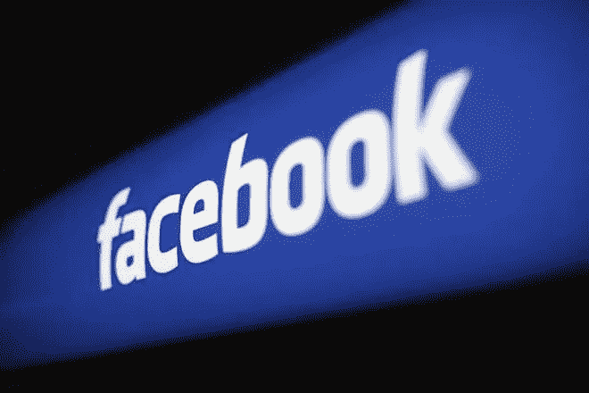

# 我们都是脸书操纵的受害者

> 原文：<https://medium.com/hackernoon/we-are-all-victims-of-facebook-manipulation-925fe5d2f8f0>

脸书最近遭受重创，许多用户发现，该公司的运营方式和它向世界发出的公关信息之间存在巨大差距。

看看马克·扎克伯格在 2012 年发出的一些信息，那一年，它收购了 Instagram，并将雪莉·桑德伯格带到了董事会议桌上:

*“帮助 10 亿人联系是令人惊讶的，令人谦卑的，也是迄今为止我一生中最自豪的事情。”*

*“我每天都致力于让脸书对你来说更好，希望我们能够一起连接世界其他地方。”*

*“在脸书，我们相信开放和沟通的需求是我们之所以为人的原因。是它让我们走到了一起。它给我们的生活带来了意义。”*

这一切听起来都很温暖，很值得。然而，正如英国国会议员达米安·科林斯在网上公布的一系列脸书内部电子邮件所揭示的那样，幕后还有其他一些不太道德的事情。正如 Motherboard 指出的那样，内容包括扎克伯格和桑德伯格之间的交流，讨论该公司的商业模式以及如何利用我们的数据赚钱。

科林斯在他的文件摘要中写道，“脸书知道，对其安卓手机系统政策的改变，即允许脸书应用程序收集用户的通话和短信记录，会引起争议，”他补充说，“为了减轻任何不良公关，脸书计划尽可能让用户难以知道这是他们应用程序升级的基本功能之一。”

他随后在推特上写道:“我相信公众对公布这些文件有相当大的兴趣。他们提出了一些重要的问题，比如脸书如何对待用户数据，他们与应用开发者合作的政策，以及他们如何在社交媒体市场上行使主导地位。”

本质上，内部邮件包括了脸书各种应用程序的分发细节。它们揭示了该公司如何与一些应用程序开发者密切合作，让他们获得用户数据，以及该公司如何特别鼓励在平台上分享数据，以便将数据反馈给广告商。这些电子邮件还包括该公司如何试图隐藏和淡化从安卓版脸书应用程序收集的数据量的信息。

不用说，脸书回应称，这些电子邮件“只是故事的一部分，并且在没有额外背景的情况下，以非常误导的方式呈现。”

当然，我们不能责怪脸书想要盈利，但正如科林·霍根写道的，“然而，这些电子邮件揭示了脸书多年来试图向其十多亿用户营销的理念与这些用户在商业意义上如何被利用之间的核心矛盾。”

脸书用户认为他们是一个理想主义项目的一部分，而事实上他们正被用于更黑暗的目的，正如剑桥分析丑闻所揭露的那样。英国议会在其网站上曝光媒体巨头的事实表明了对脸书处理事务方式的厌恶程度。

有一点可以肯定，作为脸书的用户，我们与该公司并不像它所宣传的那样是平等的关系；相反，它完全建立在不平等的基础上，因为最终，脸书比它的用户受益更多。