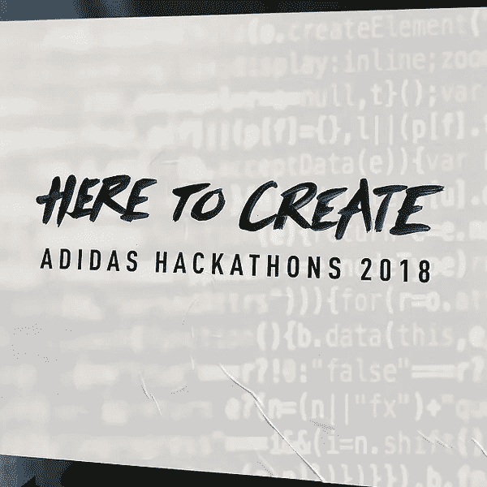
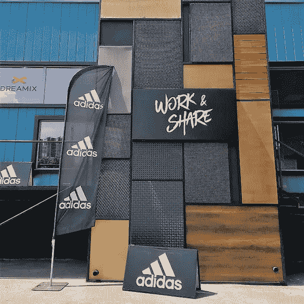

# 我们用 Appzio 在 48 小时内构建了两个 100%原生的应用。你能打败它吗？

> 原文：<https://medium.com/hackernoon/we-built-two-100-native-apps-in-48h-using-appzio-can-you-beat-that-6f103c3f8a01>

## 可用应用程序的下载链接。

**小背景**

[阿迪达斯在上周末组织了一次黑客马拉松](https://adidas-hack.com/location/Sofia)，我们看到了展示 Appzio 能力的绝佳机会。我们组建了一个团队来证明从零开始并在一个周末内交付一个复杂的原生应用是可能的。

**App 概念**

我们的概念是基于连接球迷、当地球迷俱乐部和举办足球比赛活动的当地场所(如酒吧)。我们想做一些能给所有用户群带来价值的东西，同时拉近阿迪达斯与粉丝的距离。

Over 160 people took part in the event.

**周六**

黑客马拉松**于周六**上午 10 点开始。阿迪达斯透露了挑战，并向团队做了简报。需要注意的是，我们事先没有关于挑战的信息。我们必须从零开始，创造一个概念并执行它。

我们的团队由四个编码忍者组成:卡门，维克多，丹尼尔和我。我们还让 Simeon 帮助我们进行概念创建和应用程序设计。

**11:00**我们开始整理将要建造的概念。它包括三个不同的用户角色。你可以[在这里](https://drive.google.com/file/d/14SarjAhWWUxbgXfLV4O6bQ50d1xeuDmv/view?usp=sharing)下载书面概念描述。之后，我们开始基于 Appzio UI 套件进行设计。你可以在这里查看[，在这里](https://drive.google.com/file/d/1wgSms0JzmkpkmjZAeudFtGI6xb1m6ZpN/view?usp=sharing)[查看](https://drive.google.com/file/d/1L1VxYlL77F-cYpudFdK6evBxbIqvWnLs/view?usp=sharing)，在这里[查看](https://drive.google.com/file/d/1grldeqEZTUHnGTSUexq1pqgAfG8YOBQh/view?usp=sharing)。
**12:00**我们开始创建整体结构，并构建应用程序所需的 Appzio 模块。
**13:00**实际编码开始。我们为那天剩下的时间编码，我和维克多呆到凌晨 1 点。Daniel 参与了这一天的部分工作，并实现了一个 API 来获取关于足球比赛的数据。

**周日**

睡了几个小时后，我们又聚在一起完成我们开始的工作。

The coding ninjas in action. Front to back & left to right we have Viktor, Kamen, me (Timo) and Daniel.

在 08:00 我们继续编码
**在 14:00** 我们停止了主要的开发。我们做了一些问答，修复了一些错误，改进了几个屏幕上的演示。
**16:00**我们在评审团和观众面前展示了这个概念([见此处的推介](https://drive.google.com/file/d/1w5BBewn-3lRRUZ5-h_5ZYE0WZ3zt9mvc/view?usp=sharing))。您也可以下载该演示文稿。 [pdf 此处](https://drive.google.com/file/d/1Oc5HCIxhx02dX1rzF1hWMevOIweKf3V4/view?usp=sharing)。

 [## 黑客马拉松结束，我们的结果—视频

drive.google.com](https://drive.google.com/file/d/1nB2YDTQcH6obUib2lISGhYAU7kJAwLSa/view?usp=sharing) 

**自己看 app**

您将看到的唯一虚拟屏幕是排行榜。由于 Appzio 的基础设施，所有其他视图都功能齐全，该应用程序可以支持无限数量的用户。

为了让你对这个应用的范围有一个概念，这里是完成的应用的全屏。

Registration & login

Screens for the venue and fan clubs

Screens for the fan

可以自己查看 app。只需从下面的链接下载 Android 版本。如果您想获得 iOS 应用的试飞邀请，请发表评论。

[**链接到安卓应用**](https://goo.gl/6SCzZ6)

**团队**

这里我想总结一下每个团队成员的努力。大声对你们说，没有你们，这是不可能的！

**西米恩·米特夫** —周六约 8 小时的概念创造和商业案例构建
**卡门·杜波夫** —约 12 小时的移动开发。我们实际上并不需要移动开发来实现这些应用，但我们把这作为一个机会来改进我们的一些动画。
**来自 [Programista](http://programista.bg) 的 Viktor Velkov** ，他从去年夏天开始使用 Appzio 平台——用 PHP
**Daniel Minchev** 进行实际的应用程序构建大约花了 18 个小时——用 PHP
**Timo Railo** (me)进行实际的应用程序构建大约花了 15 个小时

# 你能打败我们吗？

该项目的总应用程序开发时间大约为 48 小时。

最终的结果是一个漂亮、精致的应用程序(好吧，视觉效果仍然需要一点提升)，完全是原生的。没有网页浏览量，没有混杂的废话。

我们很好奇——你能用另一种技术更快地达到同样的结果吗？

我们认为不是。

但是我们希望你能证明我们是错的。