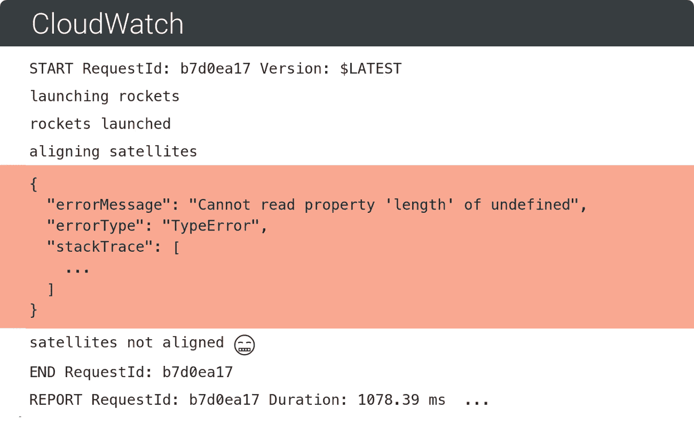
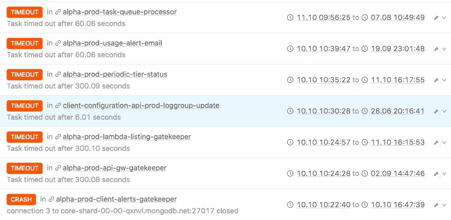
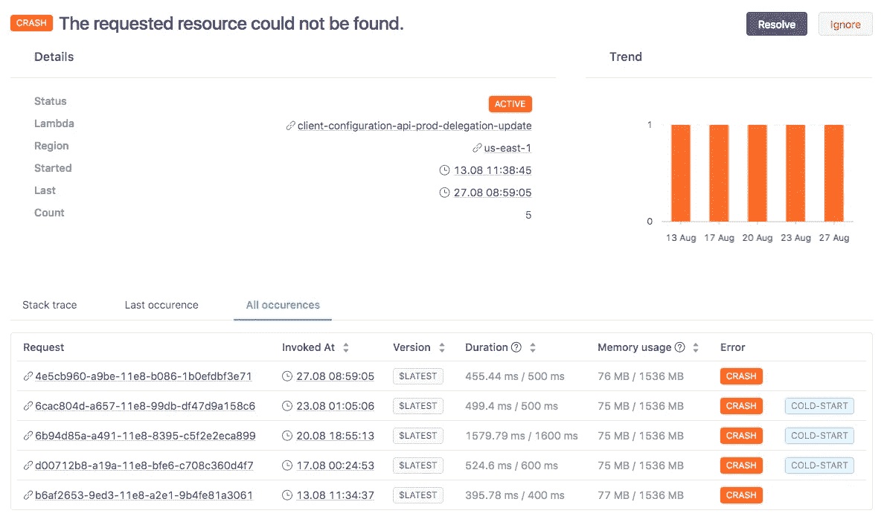
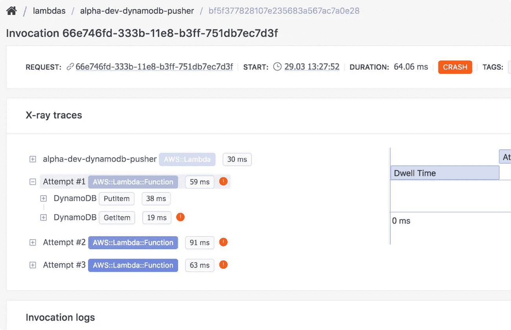

# 我们可以在无服务器应用程序中进行更好的故障检测

> 原文：<https://medium.com/hackernoon/we-can-do-better-failure-detection-in-serverless-applications-e2ff0cb94972>

传统上，在白盒监控中，错误报告是通过第三方库实现的，第三方库捕捉并向外部服务传达故障，并在出现问题时通知开发人员。我想说的是，对于托管服务来说，这可以通过更少的工作、没有代理和没有性能开销来实现。

事实上，有很多理由说明为什么你**不应该**在 [AWS](https://hackernoon.com/tagged/aws) Lambda 中使用经典的错误报告工具。其中最关键的是代码中的错误处理库对特定于 Lambda 的故障视而不见，比如超时、错误配置的包和内存不足故障。此外，还有一个关于覆盖率的问题——为每个功能实现错误报告需要大量的工作。每当您向基础设施中添加服务时，您都必须为其设置错误跟踪和监控，忘记这样做可能会导致系统中出现盲点。

幸运的是，这些问题很容易解决，在大多数情况下，只需要采用新的工具和开发实践。

# 关于“可观察性”这个词

在进入细节之前，理解可观察性背后的思想是很重要的。这并不意味着您将拥有可见性，或者您甚至可以立即监控您的服务。这意味着系统通过输出数据使自己变得可以理解，这使得开发人员可以提出任何关于系统当前或过去状态的任意问题。幸运的是，信息发布方面在 AWS 中实现得很好，例如，[无服务器](https://hackernoon.com/tagged/serverless)用户有机会获得可见性，而无需在他们的代码中专门实现额外的东西。

除了 CloudWatch 日志，我们还可以利用 AWS APIs 进行资源发现，利用 X-ray 和 CloudTrail 跟踪和连接执行流。

# 今天，我们可以更好地检测故障

跨所有功能检测故障并将它们与特定调用关联起来、查看日志并提取 X 射线跟踪的能力显著减少了故障场景中的平均解决时间。

# 我们来分解一下

一般来说，基于日志的错误检测和可见性的唯一先决条件是将日志推送到 CloudWatch(大多数情况下这是默认的)。从那里开始，我们可以做一些智能模式匹配和推断来检测故障场景。

最重要的是，日志包含许多其他数据，这些数据指示延迟和内存使用情况，并允许我们将请求与 AWS X-ray 联系起来，并搜索特定请求的跟踪报告。所有这些使我们能够收集大量的背景信息，以便了解在特定情况下哪里出了问题。

当您为特定的 Lambda 请求搜索 X 射线跟踪时，下面是它包含的内容。这使您能够捕捉 Lambda 函数所涉及的服务中的错误。

# 结论

随着托管和分布式服务的出现，监控环境必须经历重大变革，才能跟上现代云应用的步伐。目前，devops 开销是那些希望在生产中使用无服务器并依赖它运行关键任务应用程序的公司面临的最大障碍之一。我们在 Dashbird 的团队希望一次解决一个问题。

设置 Dashbird 大约需要 5 分钟，之后您将可以全面了解您的无服务器应用程序。在这里报名 [*试试吧。*](https://dashbird.io/)