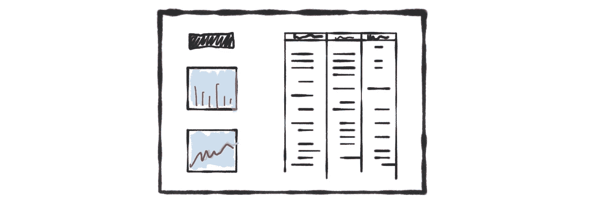
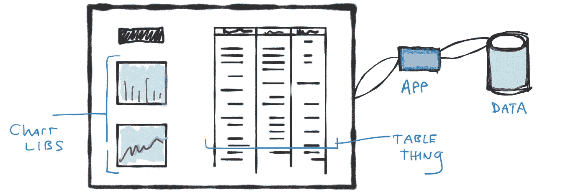
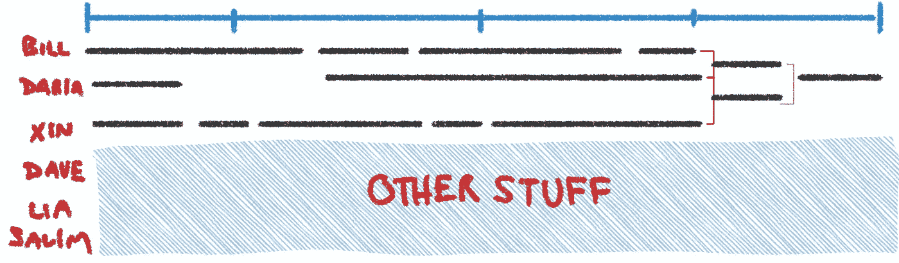
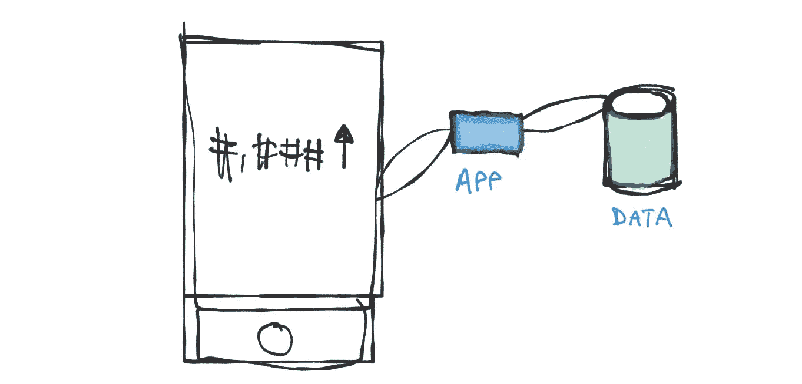

# 我们无法在一次冲刺中完成

> 原文：<https://medium.com/hackernoon/we-cant-do-that-in-one-sprint-a6780d67480>

好的。我们开始开会吧。

**UXD 和产品经理:**

> 好的。以下是我们对一些客户进行的测试。这将让用户看到一些重要的指标，然后在右侧的表格中深入查看。有意义吗？需要多长时间？

**团队中的软件开发人员:**

> 是啊。有道理。关于时机…

产品开发团队快速浏览了一下，想象出这样的场景:

他们必须把一些东西连接在一起。该表以一种新的方式聚合，因此需要一些思考。他们有一些现有的图表库，但这是他们第一次在同一个“屏幕”上尝试可过滤/可排序的表格和图表。

**团队中的软件开发人员:**

> 大概两三次冲刺。我们还有一些其他的东西在飞行中，所以事情可能需要更长的时间。

他们需要分而治之。如果 Bill、Daria 和 Xin 可以关注问题的不同部分，他们应该可以在四次冲刺中完成所有工作(“可能需要更长时间”…非常有效)。在他们看来，事情大概是这样的:

他们可以在 sprint 结构中粗略地工作，但是这个*实际上并不适合 sprint* ，所以他们不详细说明这一点。这无异于在他们心中“吹毛求疵”。

“其他东西”…那是另一天的故事。

**团队中的软件开发人员 Daria 大声说道:**

> 你知道，我认为在这里明智的做法是对这个问题做一个超薄切片，并将其投入生产。即使它在特征标志或其他东西后面。我们做了很多假设。像这样怎么样:

> 在生产中，如何在移动设备(小屏幕)上获得一个指标？只有一个数字。这将有助于我们在几天内实现端到端的连接。我们可能过于简化了聚合，同时处理过滤和图表将会很困难。我不知道…这是我的直觉。

房间里静了十秒钟。然后:

> PM: 我的意思是……也许？但是这对用户来说没有价值。我们知道这一点
> 
> UX:我在版面上花了很大力气。我测试过了。我们真的需要在这里走过场吗？感觉我们正在失去大局。而且很丑。
> 
> 比尔:哦，那太微不足道了。真的对我们有帮助吗？我真的很兴奋开始研究聚合，并使这些性能。
> 
> 辛:前端怎么样？我们将完成这个，然后必须回去重新计划。另外…tbh，我在这里也没什么可做的。我将怎么办?
> 
> 每个人(除了达莉亚):我不认为这是个好主意，达莉亚

在他们看来，这就是将要发生的事情。它不漂亮:

这类似于当你走向远处一个非常明显的山峰时，有人要求你每小时检查一次。很浪费吧？

在每个人(除了首相)的脑海里都有这样一句话:

> 哦，你知道这里会发生什么。我们会像这样小规模地工作，突然首相会突然出现，告诉我们把它运出去…在我们都感到自豪之前，以一种超级蹩脚的状态。MVP 烂！

增量工作感觉有风险。我们喜欢做好工作。

# 所以…

一些观察结果:

*   人类喜欢拍**大图查看**。当你知道自己的目的地时，迈出小步——尤其是那些可能会被改写的步骤——感觉是一种浪费。我们是没有耐心的动物。
*   **我们讨厌做低劣的工作！团队生活在持续的恐惧中，担心有人会大喊“滚蛋”并要求他们继续前进。**
*   我们都讨厌被微观管理。不得不把事情分解成小问题可能会让我们觉得不被信任。
*   **小规模工作的成本非常明显**(更多的会议、更多的停止/开始、更多的整合、更多的生产推动、更多的待评论的拉动请求)。换句话说，Daria 的提议会感觉慢一些。会觉得是浪费时间。
*   **小规模工作的好处不会立即显现**。在我看来，Daria 的提议是更好的选择，假设它会有更完善的解决方案。你最终会得到一个更好的最终产品，最小化风险，并更早地学习。但是当我们发现未知的事物时，这些好处就会自然产生！所以几乎从定义上来说，在做心算的时候，我们不能“知道”那些东西。大量的认知偏见使得小规模增量工作(Daria 的选择)感觉很愚蠢。
*   **小工作要求将小工作与大工作联系起来**。挑战在于我们需要以不同的分辨率处理事物。指着模型说“我们正在建造它”是很容易的。可视化渐进的进展要困难得多。像 Jeff Patton 的用户故事映射这样的工具会有所帮助。但这仍然很难，需要一些精神体操。另一个问题……我们经常对价值的构成非常教条。Daria 的选择是“低劣的”(对用户来说没有价值)，但是我们会学到很多，并且可以展示给客户看。

# 抛开…

我有经验的资深开发者朋友发誓放弃增量开发。我突然想到，更有经验的人可以在浮出水面换气之前潜水更长时间……至少从技术角度来看是这样的(关于用户行为还有很多需要学习)。然而，大多数工作小作为一种习惯，而忽视了正式分裂，吉拉体操和正式审查的盛况。换句话说……他们会自动这么做。他们不认为他们有…但他们有。

我认为这值得一提，因为很容易把自己塑造成一个忍者，并想象这不适用于你。但确实如此。

# 结论

让我们重温一下之前的一篇文章:从小处着手，即使它“没有意义”。你必须迈出信念的一大步，因为成本会感觉真实，而收益会感觉理论上的和遥远的。你必须看到它工作。这是没有办法的。没有灵丹妙药。

在一次冲刺中得到一些东西。