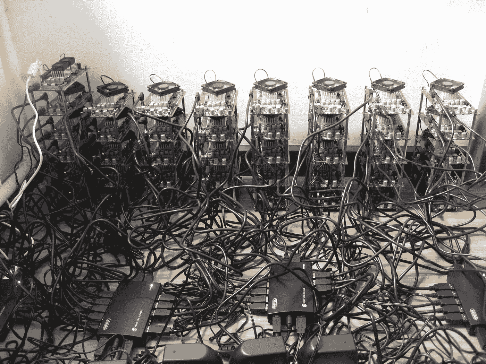
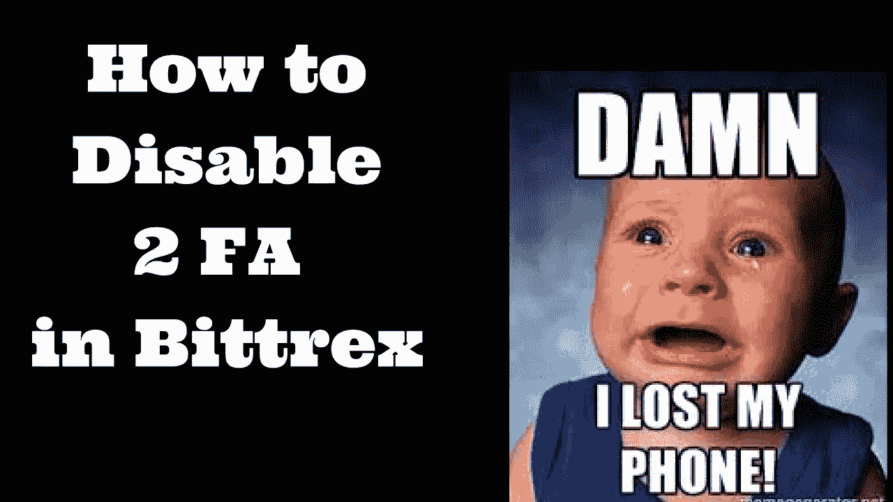
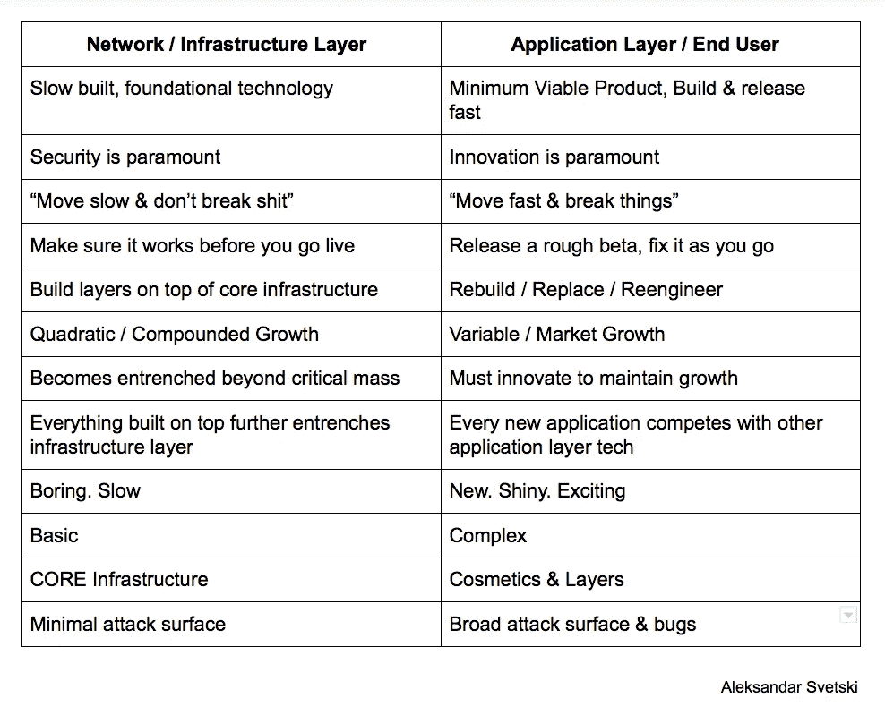
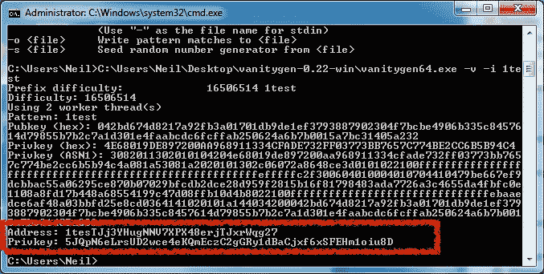

# 我们不需要另一个“区块链”！

> 原文：<https://medium.com/hackernoon/we-dont-need-another-blockchain-349273ea6350>

## 够了，下一个闪亮的新东西…请

说真的。

“加密”和“区块链”生态系统已经成为一个集群..

如今，一切都有一个新的所谓的“区块链”解决方案，很明显，这些新区块链的 90%要么是愚蠢的，要么是骗局，要么是不应该使用区块链建筑的好主意。

现在……有人可能会说:“谢谢你，显而易见的船长”——自 2017 年年中以来，市场一直存在泡沫。

我会说:“是的——我同意——但我的观点更深入一点”。

我说的是这样一个事实:

# 在学会爬之前，我们都在试着跑。

我们已经有人在构建新的预测市场、文件共享协议、spankchains 等(请注意，你们都是这项技术的优秀用例)*甚至在基础设施层还没做好之前。*

尽管区块链密码公司现在很“热门”，但只有极少数人以某种方式、形式真正参与其中。

如果你问你的兄弟、姐妹、母亲或表弟在哪里做最简单的“购买比特币”的行为，他们可能会耸耸肩说“我不知道”——除非他们已经通过你的推荐链接注册了比特币基地😜

但是说真的，每个人都“听说过”这个东西，从新闻上，通过朋友，从他们的优步司机那里——但是没有人真正参与过。

为什么？

## **因为恐怖。**

很复杂。没有人知道它是什么意思，它是什么，它是如何工作的，他们应该做什么。他们会被逮捕，被黑客攻击，失去他们的钱，进监狱，被税务员打吗？

What do you think the average person thinks of this??

这一切都很好，因为这是所有新生的革命性技术都必须经历的阶段——机会存在于这一切的混乱和不确定性中——但是…

如果一个人能做的最简单的事情是购买一些比特币，而大多数人都没有这样做，那么我们需要停下来一会儿&解决这个问题。

Happens to the best of us.

在交易所购买一些比特币(或乙醚)并从钱包 A 发送到钱包 B 是第一步。第一名。地面。入口点 a。

我们没有解决这个问题，而是开始为我们可能或可能永远无法实现的模糊未来构建分散网络和应用程序。(老实说，无论如何我们可能都错了)

这就是为什么这个空间仍然是书呆子、极客和怪胎的领地。

比特币本应降低壁垒。这应该是一项包容性的技术，但迄今为止，我们只是建立了自己的俱乐部。

别误会我的意思。建立俱乐部至关重要。我们确实需要一个强大的内部社区，然后才能联系到其他人&把他们带过来，但我想说，现在是我们开始把联系做得更好的时候了。

# 那么我们*真正*需要做什么……真的吗？

加密、区块链、比特币，无论你想怎么称呼它，它仍然是一个边缘运动和新生技术。

我们需要打好基础。这包括两个部分:

1.  在协议层面:

*   安全性
*   隐私
*   抵制审查

2.在应用程序/用户级别

*   交换
*   钱包
*   基础教育

#1 是一切的支柱，也是我们信任这项新技术的核心基石。这是我们在互联网上没有做好的事情。

#2 是提高采用率的因素，而超越你我的采用率是这一技术、运动和行业所需要的。

# 我们错在哪里？

当我们发现新事物时，我们正在做所有人类都会做的经典的在你会走(或爬)之前跑。

我们认为这将解决世界饥饿问题，给全世界带来和平。作为人类，当我们发现新的东西时，我们总是认为它是灵丹妙药——当然，直到我们意识到它不是——然后，我们不是让它变得更好或改进我们现有的东西，而是去建造我们还不需要的新东西！

这是人类的天性，我们的大脑就是这样的。在我们的核心中，我们线性地思考，我们为了生存而工作(也是线性的)，因此我们在一些重要的事情上犯了错误，例如，构建基础和构建应用层之间的区别。

Common misconception

让我们考虑一下钱。

如果我们没有得到像价值交换一样重要的东西，比如抵制审查、全球化、即时、安全等——那么你可以忘记所有其他“酷”的想法。没有人会使用你的预测市场，也没有人会使用你的分散式交易所，也没有人会使用你的全球计算机或任何其他“分散”的东西。

这就是为什么我有时会对这些新项目或比特币的分叉感到厌恶。在我们解决安全、隐私和去中心化的构建模块之前，他们担心吞吐量等问题。事实上，由于投机者的压力，他们为化妆品牺牲了这些建筑材料🤦🏽‍♂️🤦🏽‍♂️🤦🏽‍♂️🤦🏽‍♂️

缩放问题将一直存在。随着技术的发展，它们是每个技术都需要解决的问题。这不是你一开始就能解决的问题。

关于缩放的争论完全是愚蠢的，因为它完全没有必要。再次重申:

比特币甚至连价值储存手段都算不上，更不用说交易媒介了。所以它还不需要扩展。2017 年底 tx 费用暴涨的交易量，并不是因为硬币本身的效用，而是因为*的短时间泡沫投机*。它不是底层协议处理吞吐量能力的指标，也不是它无法伸缩的信号。

在比特币成为交易媒介之前，它需要通过作为价值储存手段的阶段——这需要时间、信任和基础设施投资……这些我们都受够了！！

*不管怎样……那是另一篇文章的主题。*

我们在这个行业中的问题是缺乏经验的短期思考者和近视患者，他们想在所有事情上都贴上创可贴来快速解决问题(例如:块大小增加)。

这不是建立基础设施的方式。

You can’t build atop a poor foundation.

# 那么我们实际上需要什么呢？

抱歉，我应该在前一节回答这个问题——但是我跑题了。

比特币和以太坊(以及其他伟大项目)的天才们正在致力于加速和扩展这些核心协议的解决方案，同时保持(或增强)安全性、隐私性、可替代性和去中心化。

我不会为他们说话，因为我相信他们比我们大多数人更清楚自己在做什么。

但是，我会为我知道我可以影响的领域发言。

在消费者/应用程序/用户层，我们需要专注于提高采用率。我们最能影响的是:

## 1.建立更好的交易所。

有多种类型的交换，但现阶段最重要的是 Fiat → Crypto → Fiat (off and on-ramp)交换。

密码市场在 3000 亿美元的生态系统中只是沧海一粟。它远没有大到足以自我维持。它需要更多更好的解决方案，让人们参与进来，让它变得容易、简单、精简，理想的是“有趣”。

现在……当你考虑到这些开关斜坡交易所也有管辖限制，然后你再想想有多少国界，因此有多少货币，你就会意识到这是一个大工程——而且需要聪明的头脑来支持。

这是我们团队和我正在做的事情之一..

## 2.打造更好的钱包/储物解决方案

一旦人们“进入”生态系统，发送、交换、存储、保护等过程就成为最重要的焦点。

钱包有各种形状和大小(从字面上和比喻上来说)。

思想实验:如果你去银行开户，他们会说；

“嘿，我们有 140 个不同类型的账户，有些比其他的更安全，有些容易被黑客攻击，有些是安全的，但你需要把它放在一个地下金库里，你可能需要 1 把钥匙、2 把钥匙、3 把钥匙或更多，你必须写下你的钥匙，把它们存放在不止一个地方，这样你就可以存取你的钱..废话连篇"

我很确定你会告诉他们“去拿 f$#%ed”。

猜猜看，我们正试图通过*的销售宣传，让人们从传统金融系统的舒适和可感知的“安全”中走出来！*

*真的吗？？？*

**我们需要开发更好的钱包&储物解决方案。**

*安全和隐私是首要考虑的问题。用户界面和用户体验排在第二位，但同样重要。拥有一个完全安全的东西，仅仅为了操作就需要一个信息安全博士学位，这是没有好处的。*

*钱包需要在其用户界面和用户流中内置优雅、简单且安全的密钥保健。*

**

*What some wallets feel like.*

*人们需要能够快速访问他们的资金，能够直观地发送，交换或转移，然后退出。它需要是微风。*

*这也是监管发挥作用的一个领域——无论是在用户层(即:持有大量资产的人将他们的资金存放在托管人处)，或者在宿主层(即；专注于 UI/UX 的托管钱包提供商将通过合格的托管人代表他们的用户存储资金)。*

*同样，这是我们正在用 Stashh.io 在多个层上进行的工作*

## *3.教育更多的人。好多了。*

*这是最后一件，也可以说是最重要的一件。*

*我并不是说每个人都需要去大学获得一个密码学学位，也不是说我们需要强迫每个人去上一门该死的 Udemy 课程。*

*但是，作为一个社区，我们可以做更多的事情来“教育大众”。*

*这包括两个部分:*

*a)我们需要更多的机构和培训组织来帮助人们掌握进入这个领域的基本知识。这并不意味着背地里把它们卖给庞氏骗局，比如 USI 理工大学等。*

*这些可以是免费的会面，付费的研讨会，等等。如果有人要将 1000 美元投入这一新的资产类别，那么花 500 美元学习如何做&最好的方法是谨慎使用资金。*

*世界上几乎每个城市都有聚会，聚会是一个很好的开始。*

*b)该领域的公司需要教育他们的用户。比特币基地在这方面并不差，但老实说可以做得更好。宇宙飞船(在退休金空间)是一个很好的例子。他们通过每周的电子邮件和股票市场发生变化时的提醒来让用户了解市场。*

*我们需要更多的这种在加密/区块链土地。*

*那里有大量的内容，每个公司都可以在多点教育他们的用户方面尽自己的一份力量。营销和推广、入职培训、培养、新产品/功能发布等。*

*内容是另一种方式。公司博客。媒体是一个很棒的工具——从总体上来说，教育你的用户群/追随者/粉丝/市场从来没有这么容易过。*

*我们可以做的其他事情是策划已经存在的优秀内容。*

*我最喜欢的每周策划报告(到目前为止)是《Token Daily》和《Token Economy》，作者分别是 Yannick Roux 和 T2。*

*他们收集一切&任何有价值的东西(这在这个市场上很难)，并将其浓缩成 TL；如果你愿意的话，你可以深入研究。*

*我们需要更多。*

**

*No more of this crap. BitConnect, USI tech..horse shit.*

# ***总之***

*我们必须首先关注原语。*

*如果我们有正确的积木，我们可以创造任何东西。*

*如果我们急于求成&只是盲目地在其他狗屎之上建造狗屎，我们将最终陷入泡沫，导致一切崩溃(这可以说是 2017 年的全部，也是我们今年可能进入熊市的原因)。*

*我们需要记住，网络和基础设施技术不同于最终用户或应用层技术。*

*我们需要通过增加采用来支持基础设施，让每个人都可以安全、轻松、方便地访问基础设施，从而继续建设改变世界的网络。*

*安德烈亚斯和往常一样，在这个视频中完美地解释了事情(前 4 分钟)。*

*女士们先生们，这就是了。*

*让我们回到最重要的事情上来。无聊的狗屎。*

# *免责声明。*

*这篇文章并不是要抹杀其他一些正在完成的伟大工作，也不是要挑战创新的极限。*

*这更像是对突然出现的下一个闪亮愚蠢的尝试，或者是现有网络的下一个分叉，等等我们不需要的东西。噪音已经够大了。*

***_ _ _ _ _ _ _ _ _ _ _ _ _ _ _ _ _ _ _ _ _ _ _ _ _ _ _ _ _ _ _ _ _ _ _ _ _ _ _ _ _ _ _ _ _ _ _ _ _ _ _ _ _ _ _ _ _ _ _ _***

*如果你喜欢这篇文章，请给它一些爱，为它鼓掌(或几下)，并把它传给任何你认为应该读一读的人。*

*我的一些东西有点粗糙，但这样做是希望能让人们更清楚/更深入地思考他们在做什么。*

*希望你得到一些价值&反馈总是受欢迎的！*

*阿列克斯*

*首席执行官@ Amber*

**非常感谢您对我们项目的支持和反馈:www.amber.app**

***您也可以关注我:***

*** [## 亚历山大·斯维特斯基|职业简介| LinkedIn

### 查看 Aleksandar Svetski 在 LinkedIn 上的职业简介。LinkedIn 是世界上最大的商业网络，帮助…

www.linkedin.com](https://www.linkedin.com/in/alekssvetski/)  [## 亚历山大·斯维茨基—中等

### 阅读亚历山大·斯韦茨基在媒介上的作品。试图“思考”的企业家。我所有东西的出口加密…

medium.com](/@AleksandarSvetski)  [## Earn.com

### 和我一起在 Earn.com 工作。

earn.com](https://earn.com/aleksandarsvetski/)  [## 亚历山大·斯维茨基(@亚历山大·斯维茨基)|推特

### Aleksandar Svetski 的最新推文(@AleksSvetski)。CEO @ Valley Iconic。澳大利亚

twitter.com](https://twitter.com/AleksSvetski)  [## 亚历山大·斯维特斯基-黑客正午

### 阅读《黑客正午》中亚历山大·斯维特斯基的文章。创始人& CEO @ Stashh +区块链培训机构。我的出路…

hackernoon.com](https://hackernoon.com/@AleksandarSvetski)***