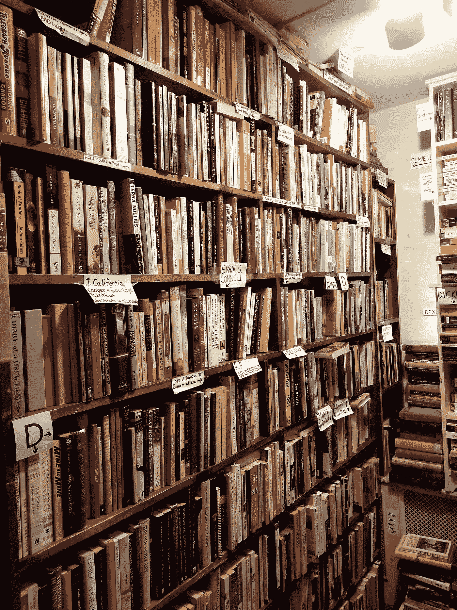
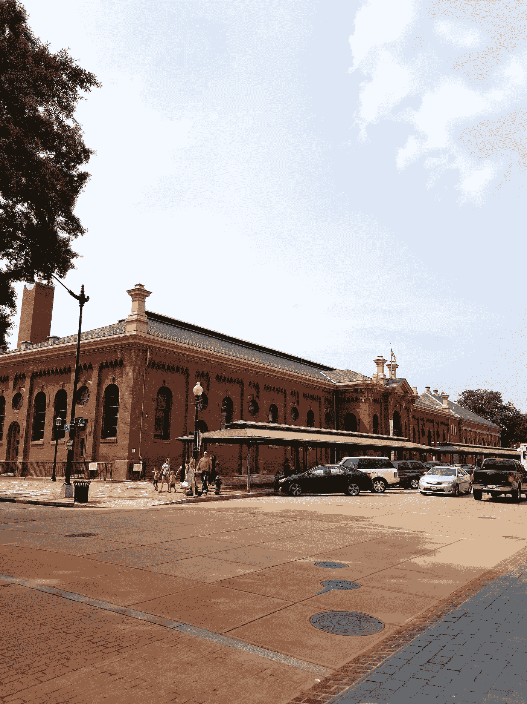

# 我们把比特币藏在华盛顿特区

> 原文：<https://medium.com/hackernoon/we-hid-bitcoin-in-washington-d-c-40bcd4913a58>

“Going outside is highly overrated.”

如果你在华盛顿特区，我想请你喝杯啤酒。但是…你需要为此再努力一点点。

上周，我和我哥哥在[无人天空](https://hackernoon.com/we-hid-bitcoin-in-no-mans-sky-c6de43b27b1b)藏了一批比特币。我们喜欢加密货币，我们喜欢游戏，对我们来说，在一个知名游戏中隐藏一些比特币是有意义的。但是游戏并不是我们享受的全部。

在 DC 住了两年后，我和我哥哥明白了走出城市的重要性。所以今天，我们坐地铁去了东方市场，留下了一些比特币让任何人都能找到。

五张黄色的便利贴藏在东市地铁站的步行距离内。它们包含一条小消息和一个装有 0.0016 BTC(或在写这篇文章时大约 10 美元)的钱包的种子。如果你能找到我们的藏身之处，你就能得到奖励。我们请喝酒！

想要得到他们位置的图片线索和提示，请前往我们的 subred dit[r/GingersBitcoinBounty](https://reddit.com/r/GingersBitcoinBounty/)。我们将继续监控比特币地址，看它们何时/是否被提现。

虽然一段时间以来我一直想做一个推广加密货币的现实寻宝活动，但我必须感谢我的朋友

[比特币很酷的一点是，它可以通过几乎任何媒介向任何人转移价值。我们把它藏在一个游戏里。我们在便利贴上找到了它。这些只是有趣的练习，但想想比特币所有未被探索的应用吧！谁知道我们将来会如何使用它。](https://medium.com/u/57f5bd90eb31#GingersBitcoinBounty
<figure class=)

[你知道下一步我们应该把比特币藏在哪里吗？请在评论中、在我们的 subreddit 上告诉我们，或者在 Twitter 上打电话给我，电话号码是](https://medium.com/u/57f5bd90eb31#GingersBitcoinBounty
<figure class=) [@PurpleSuede22](https://twitter.com/PurpleSuede22) ！在那之前，祝你狩猎愉快！

Brushing up on the history of Eastern Market…

*在搜寻比特币的过程中筋疲力尽，但仍想参与加密游戏？最简单的方法是从比特币基地开始。* ***当你****[***使用此链接***](https://www.coinbase.com/join/589a032d2c1f1600ed8731e2)*——这是我的推荐链接——并立即开始！**