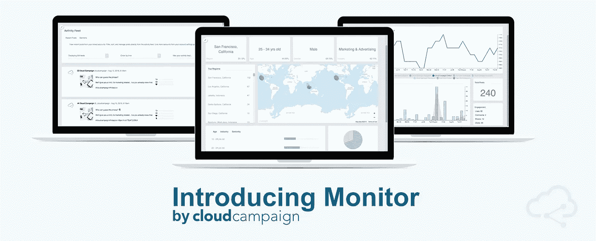
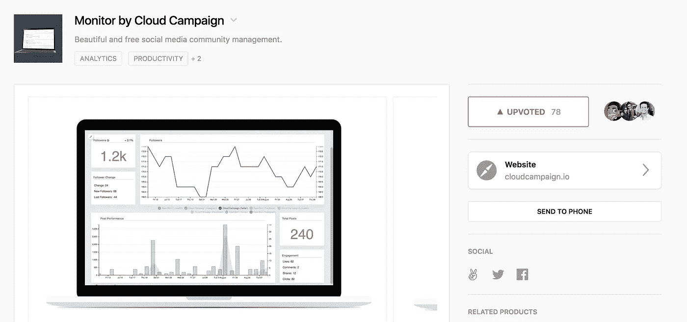
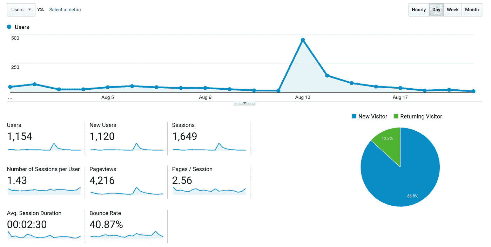
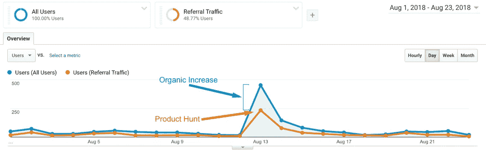
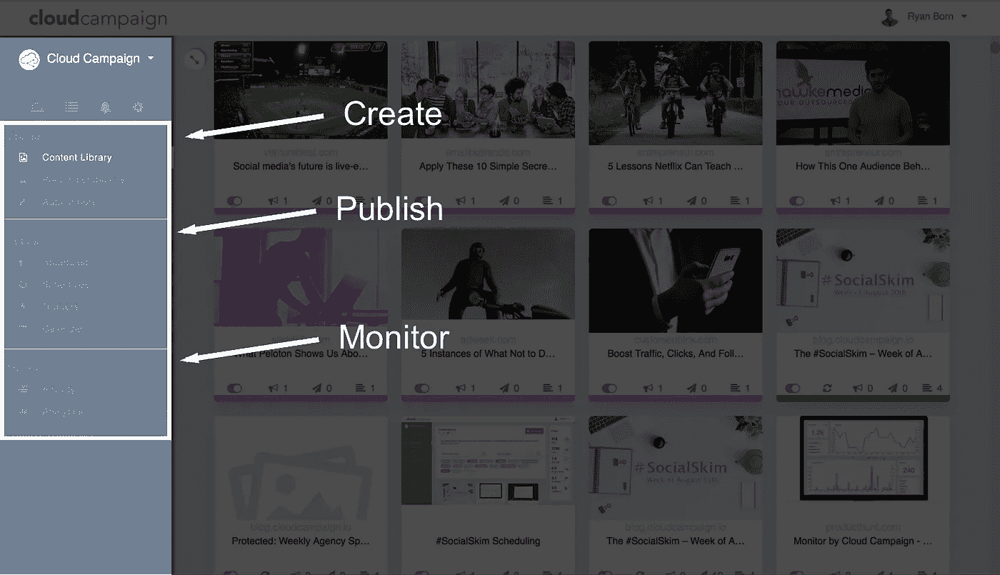

# 我们启动了产品搜索…

> 原文：<https://medium.com/hackernoon/we-launched-on-product-hunt-fd2fcb064a7d>

我们最近拆除了我们的核心产品 T1，并在 T2 产品搜索 T3 上推出了它的一个子集作为独立产品。

我们的核心产品是[社交媒体营销软件](https://cloudcampaign.io/)，包括内容监管、内容库、日程安排、社区管理和分析。这是面向数字营销机构的高端产品。

该工具是健壮的，因此，我们有大量的开销来保持它的运行。

我们希望提高品牌知名度，并在我们的平台上获得更多用户，但由于相关的开销，免费提供我们的核心产品并不是一个选项。

我们想建立一个简化的社交媒体调度程序来免费发布，但是已经有很多了:Buffer，Hootsuite 等等…

因此，我们试图想出另一个大多数营销人员都在努力的领域——另一个没有很多免费工具的领域。

**社区管理！**

有无数伟大的免费工具来安排帖子，但没有多少，如果有的话，来分析和回应跨渠道的评论。

我们将社区管理和分析部分从我们的核心产品中分离出来，构建了[**Monitor**](https://cloudcampaign.io/monitor)——一个免费的社交媒体管理和分析平台。

# 结果呢

现在是有趣的部分——发布的结果。

就产品搜索发布而言，这次发布并不成功，但对我们来说仍是一次巨大的推动。

值得注意的是，我们是由一个著名的猎人。

**网络流量**

在 3 天的时间里，大约有 700 名用户陆续来到这个网站。

我们在 PH 上获得了大约 80 张赞成票，使我们在当天的总票数中排在第 15 位。对于社交媒体工具，Monitor 当天位居第二。

这 700 名用户带来了大约 70 名新用户。10%的转化率是不容小觑的。

更重要的是，这导致了入境游兴趣的增加。

发布后，优质、有机的潜在客户数量增加了 5 倍。一些线索变成了 5 位数的交易，目前正在进行中。

我们也有一家私募股权公司希望收购我们的公司。这些数字当时并不太有意义，但令人欣慰的是，他们相信我们的愿景，并看到了该产品的同样潜力。

# 关键要点

不要低估免费流量。

即使访问者不购买，如果他们至少在网站周围点击，而不是马上反弹，你可以看到由于搜索引擎优化的好处，有机流量大幅增加。

想办法改变现有产品的用途。显示器只是我们核心产品的一部分。如果我们愿意，我们可以对我们核心产品的所有方面做同样的事情——发布和创建可以各自成为独立的产品，用于另一个未来的发布。

