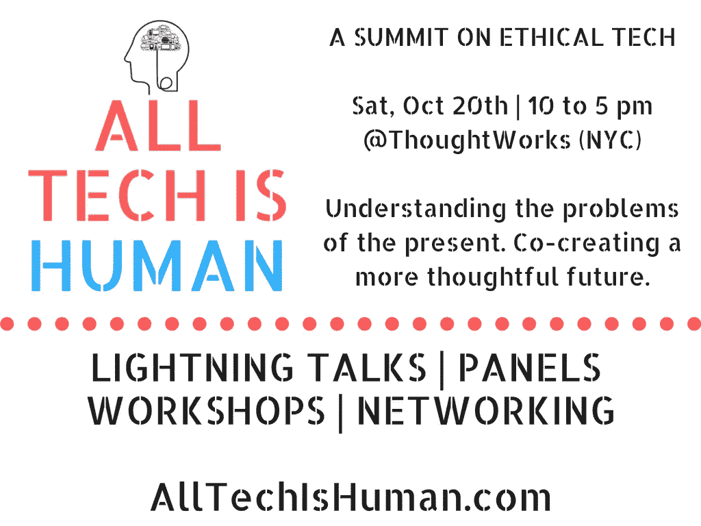

# 我们需要一个伦理技术峰会

> 原文：<https://medium.com/hackernoon/we-need-a-summit-on-ethical-tech-7484fbdbcb31>

Photo by Matan Segev from Pexels

我总是在阅读的时候受到启发——这是另一篇发人深省和经过充分研究的关于技术行业道德规范的文章。

# 或者缺少它，摇着手指说我告诉过你。

# 或者一个道德规范的提议。

# 或者是一位科技行业资深人士写给我的一封曾经失明但现在重见光明的信。

人们显然对技术的道德使用充满热情。但是当我的兴奋消退后，我总是带着希望和焦虑:

# 我们将何去何从？

Photo by Zamani Sahudi from Pexels

自 2012 年以来，我一直深入参与技术伦理领域。多年来，我注意到一个令人不安的趋势——大多数人认为他们在伦理技术领域相对孤独，这是一个肩负着反乌托邦未来世界重担的地图集。

# 不应该是这样的。

“在筒仓中操作”已经成为一种老生常谈，但随着美国伦理技术的发展，它已经变得相对真实。没有太大的凝聚力。人们经常被其他人和组织绊倒，这些人和组织充满活力，但与运动脱节。

# 当然，事情不一定是那样的。

英国似乎在伦理技术方面处于领先地位，像 [DotEveryone](https://doteveryone.org.uk/) 这样的组织已经在规划人员和组织——这正是美国需要做的。

但是这里有一个通常不被提及的关于“筒仓操作”的肮脏秘密:**有些人不合作**。在我们的青少年和宠物已经演变成品牌的时代，有些人高度保护他们的想法和联想。

# 我们不能改变人类的本性，但是我们可以把具有协作精神的人和组织聚集在一起。

Photo by Kaboompics .com from Pexels

像 Baratunde Thurston 这样的道德技术领导者一直是一个亮点，他们提供了一个新的技术宣言[的开端](/s/trustissues/a-new-tech-manifesto-21d251058af3)将公开邀请您贡献自己的想法、反馈以及其他人应该知道的组织和人员。

# 这就是为什么我们将于 10 月 20 日星期六在纽约 ThoughtWorks 举办道德技术峰会，这将是一个全天的闪电谈话、小组讨论、研讨会和网络活动。

它被称为**所有技术都是人类的:伦理技术峰会**，旨在建立利益相关方、组织和独立声音之间的凝聚力，这些利益相关方、组织和独立声音渴望更周到、透明和公平的技术未来。

道德技术峰会的目标是让与会者更好地了解我们今天面临的挑战，更好地了解不断发展的道德技术生态系统，并获得参与新的和现有的合作努力的具体机会。

本次道德技术峰会旨在开放和包容。换句话说，**加上你的声音**。

# 如果您有兴趣参加，想建议一个小组或研讨会的主题，或想被考虑发言，请填写此表:【https://goo.gl/forms/g84rZXXPhtXnHRF33。

我们开始吧。