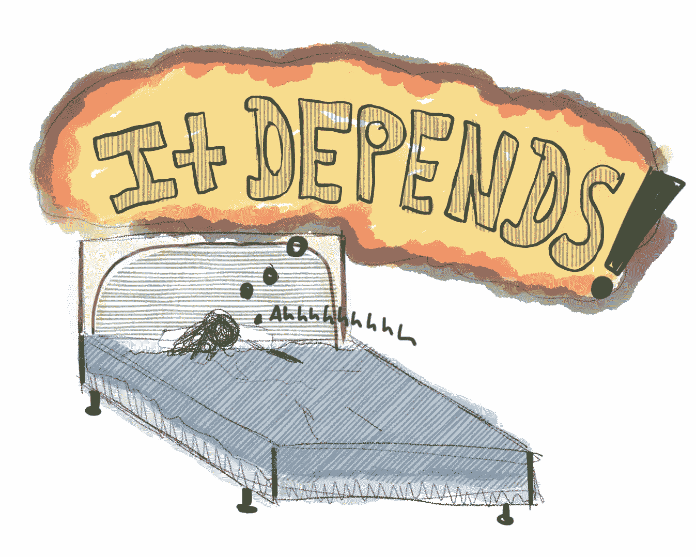

# 我们需要更少的产品经理

> 原文：<https://medium.com/hackernoon/we-need-fewer-product-managers-50e47dfd95a0>

***注 1*** *:这篇帖子读起来可能像是对产品管理的攻击。那根本不是我的意图。我喜欢所有的产品。这篇文章是在我与越来越多的公司互动时酝酿的，这些公司在日益复杂的组织中努力定义(和扩展)产品“管理”。*

***注 2*** *:这部分是对“没有足够多有经验的产品经理”的回应我不同意。没有足够的人能够神奇地填补被张贴的完全不合理和分散的角色。然而，还是有很棒的人。雇佣他们解决实际问题。*

我们需要更少的产品经理。

我们需要更多的内部初创公司联合创始人、UX、客户支持者、领域专家、服务设计师、复杂性解决者、研究人员，以及直接与用户/客户互动的可靠方式。我们需要更多的产品思维，更少的产品管理。

你不需要*一个**产品经理**来:*

*   “完成工作”，让团队保持专注
*   管理项目，并提供状态更新
*   管理团队，倡导团队
*   对运输功能/项目负有“责任”
*   促进站立、计划会议和回顾
*   与客户和用户交谈
*   衡量工作的影响，设计实验
*   编写用户故事和需求
*   客户和用户的测试工作

我们为这些事情设置了角色(帽子):项目经理、UX、研究人员、数据科学家、业务分析师、团队经理、教练等等。**产品经理经常戴这些帽子吗？当然可以。需要产品经理来戴这些帽子吗？编号**

产品经理已经成为一个包罗万象的头衔。这使得它对于日常使用毫无意义。

当有产品需要管理的时候，你需要一个产品经理……当有收益、商业模式、定价和营销的明确联系的时候。对许多 SaaS 公司来说，可以说整个公司就是“产品”。然而，我们坚持把任何事情和所有东西——每个项目、接触点、一组屏幕和应用程序——称为“产品”,而任何监督“产品”的人……称为产品经理。

为什么？我倾向于听到:

**1。因为“每个团队都应该有一个产品负责人！”我们习惯性地认为，拥有产品经理/所有者是“真正团队”的标志。没有产品经理的团队是没有方向的。他们会建造他们想建造的东西。 ***事情会出轨*** 。我们需要有人负责！**

**2。因为“我们需要产品思维！”**我们把*产品*这个词等同于*价值*。产品胜于项目。产品思维让我们有了一席之地。我们希望像苹果一样。我们希望这个团队像一个小型创业公司一样，有一个小型 CEO。我们需要远见。开发者不想造垃圾…他们想造正确的东西，对吧。

我能理解这些希望和担忧，但这些事情很少涉及独特的产品经理“帽子”。事实上，我认为当我们应该关注团队健康、雇佣用户体验/设计、关注核心业务问题和促进时，我们在这里使用产品管理作为拐杖。

我认为大多数产品经理都不是管理产品的人。它们是空白填充。他们在“填充”。我这样说是因为我已经看到在没有产品经理微观管理他们的工作的情况下，在大楼里有合适的帽子的团队——UX、数据科学、敏捷教练、自组织、研究——实现高层次的商业目标并交付成果。项目经理可以自由地专注于做独特而有价值的事情…如果他们控制了预算，团队会雇佣他们做这些事情。更别提产品**战略**和产品**领导力**这两个不同的猛兽了。

如果你需要倡导者、传道者、分析师、角色专家、领域专家、协调者、战略家、利益相关者、项目驱动者等等。然后雇用他们，给他们合适的头衔(例如，[某个演员]倡导者，[某个演员]经验，项目经理，[某个领域]专家)。当然这不会发生…这使得角色更加模糊。我知道这一点，因为我很少能和一个团队交谈，清楚地了解产品经理的价值和角色。“看情况。”

但是…但是…但是…精益创业、新产品、假设验证、定价、采访客户等等怎么样？？恭喜你。你是一个小型创业公司的创始人(和你的共同创始人，团队)。还没有*管理*的“产品”。有一种说法是，创业公司不是迷你公司。创业是对可持续商业模式的“探索”。规则不一样。创意和产品也是如此。让它走向世界。赚点钱。然后你有一个产品需要*管理*。

我的朋友在一家大公司工作，但是做新产品。她的名片上写着“联合创始人”。这太棒了(非常适合他们“资助”内部创业公司的模式)。

以下是我在与公司交流时注意到的情况。有一个进程。首先，你有以项目为中心的公司，没有“产品思维”或 UX。为每个团队雇佣一个产品经理是一个很大的进步，尽管在这一点上，事情仍然典型地类似于一个项目工厂。

雇佣 UX 并赋予他们像素推动之外的职责是下一个巨大的进步。让开发人员参与实际的问题解决(而不是构建规定的特性)是下一个巨大的进步。完全自组织的跨职能团队肩负着一个目标——巨大的进步。所以现在你有了自己的“产品团队”。自始至终，产品经理都在做“核心”活动的混合，以及一大堆空白填充(查看平均 PMs 日历)。

但这只是你旅程的中点。你碰到了一个奇怪的问题:随着团队在直接解决客户/用户问题方面变得更加自给自足，随着 UX 做了更多他们擅长的事情，你必须适应产品经理的角色(如果没有其他原因，只是为了保持这个角色的有趣和挑战性)。

这是我看到公司陷入困境的地方。产品组织有惯性。他们雇佣了一层层的副产品经理、产品经理、高级产品经理等等。一切都是某种产品。在某些情况下，团队已经变得过度依赖他们的产品经理来完成非核心功能(例如，促进)。公司依靠产品经理来完成非核心职能(如内部利益相关者的“管理”)。所以…改变并不容易。在你知道之前，你有大量的局部优化和王国建设，这对任何人都没有好处。从结构的角度来看，向更全面、端到端、基于价值流的思维转变是难以捉摸的，也是不可能的。产品组织通常是问题的一部分。太死板了。不太好。

我在说什么？

首先，我不是建议你解雇产品经理。请不要。我知道他们非常非常有才华，但也许并不适合成功。

我在想…

*   尽量少用“产品”这个词(尤其是在标题中)
*   尽量少用“经理”这个词(尤其是在头衔中)
*   批判性地思考你要求一线产品经理做什么。能不能给这顶帽子重新命名，让它更有描述性，更准确？
*   有产品需要管理时，使用*产品经理*。对于大多数 SaaS 公司来说，产品比我们想象的要少得多(如果我们从长远来看——>的目标来看)。
*   一个团队如何分享所有权？你真的需要一个可扭的脖子吗？
*   考虑雇用学徒/实习生来担任“混合”职务——研究、数据科学、UX 等。大多数年轻人不应该立即进入正式的产品管理。这是帮助人们在安全的环境中成长的好方法。
*   雇用 UX，让他们做 UX。数据科学也是如此。
*   尽一切可能雇佣产品经理、产品领导和产品战略家来做产品管理、团队领导和战略。
*   当“产品”是技术、部门、生态系统、接触点等的组合时，产品管理看起来像什么？？这可能与我们目前的产品团队结构不同。

最后，我最近和 Jared M. Spool 聊了聊他在田纳西州查塔努加的 UX 学校。我们结束通话时谈到了产品管理。杰瑞德说了些有趣的事。释义:

> 总有一天，我们能够做一个产品经理项目。但这需要一些角色融合。现在事情很混乱。看情况。但是就像我们在 UX 看到的那样，我们会看到这种趋同。

这是精神食粮。也许这就是我所说的趋同——从“视情况而定”到[xxxxxxx]——的意思。

你怎么想呢?你心目中的“一个产品”是什么？所有这些产品都需要“管理”吗？