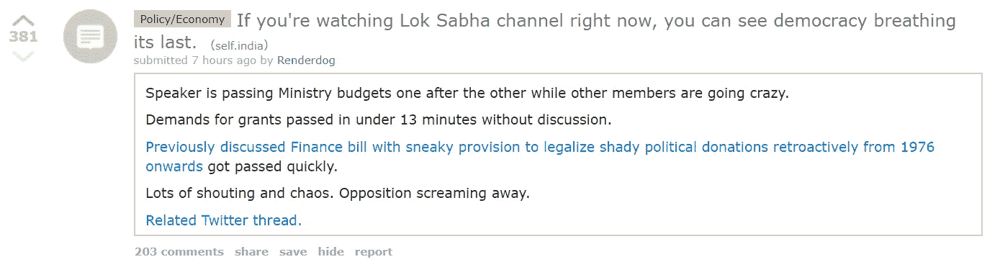

# 互联网还能把世界拉近吗？

> 原文：<https://medium.com/hackernoon/we-need-more-twitters-3a725f86d94f>

Connecting the world and maybe causing a nuclear way in the near future. Image courtesy: [http://bit.ly/2Ds7pQl](http://bit.ly/2Ds7pQl)

还是脸书永远地毁掉了这个梦想。

脸书说它的目标是让世界更加紧密。但我们意识到这反而让我们越来越疏远。通过展示更多强化我们想法的内容而不是挑战它们，通过满足我们自己的虚荣心，通过根据现有关系而不是兴趣将我们与人联系起来，脸书已经确保我们进一步退回到自己的茧中，而不是与新的和多样化的人联系。

> 在过去的 5 年中，创建的内容数量有了很大程度的增长。但是，探索这些内容的方式是否以同样的速度增长呢？

# 考虑 Instagram

每天都有新的内容产生——旅游博客发布新的旅游景点，骑自行车的人发布新的路线和旅游景点。人们之间的联系有很多有趣的使用案例——我可以和骑自行车的人联系，我可以和音乐人联系，我可以发现新的旅行地点。然而，这就是我的 Instagram discover 标签的样子。

Insta algo — show funny videos and hot women!

Instagram 中发现的缺乏导致了内容聚合器的兴起，这些内容聚合器帮助个人创作者接触到更多用户，并帮助用户在一个地方获得优质内容。如果你花时间在网上创作文章——例如“孟买十大看点”——搜索会把用户带到你的网站，你会获得用户(可能还有收入)。你会帮助用户找到在孟买最想做的 10 件事。在 Instagram 上，所有这些内容都被放在 S3 的仓库里，白白浪费掉了。

**快照地图示例:**

SnapMaps — find things happening around you

SnapChat 已经做了一些事情来解决发现问题——引入 SnapMaps 和 Instagram 风格的 discover 部分是其中的主要内容。地图可视化是发现你周围发生的事情的好方法。

最后，我们来到 Playstore 上的 discovery。

2017 年，大量新应用发布到 playstore。开发人员花费大量的时间和精力来创建和维护每个应用程序。然而，除了搜索之外，没有获得用户的好方法。除此之外，每个应用程序平均消耗 8mb 的数据来安装，并具有糟糕的保留。

直到最近，Playstore 才开始积极地创建新的类别，将类似的应用进行分组，并赋予它们可见性。

# 想想 Reddit:

Reddit 是互联网上唯一一个陌生人深入讨论随机问题的社区。有一个红迪网支持川普——https://www.reddit.com/r/The_Donald/

目前在印度流行的顶部，我们有一个关于 LokSabha 法案通道的线程。一个严肃的话题用合理的回答来讨论。TOI 评论是人们公开讨论话题的唯一可比平台。

总之，有很多应用程序可以更好地发现内容，讨论话题/问题，并忠实于连接世界的目标。

# 如果你喜欢我的文章，请多次点击鼓掌按钮！！

*可以关注我的* [*推特*](http://www.twitter.com/vernekard) *或者* [*领英*](http://www.linkedin.com/vernekard)