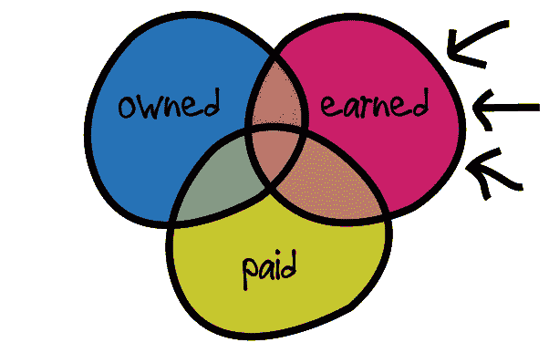
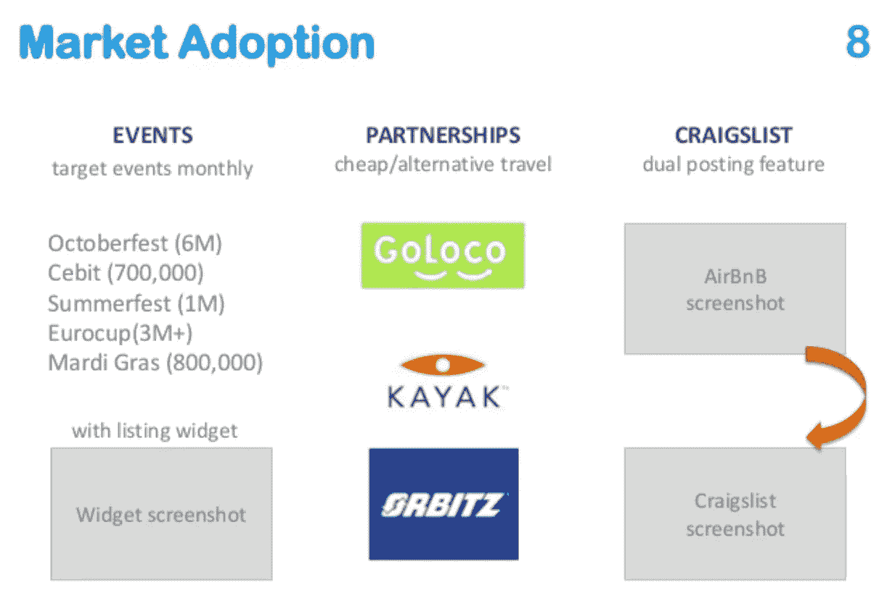
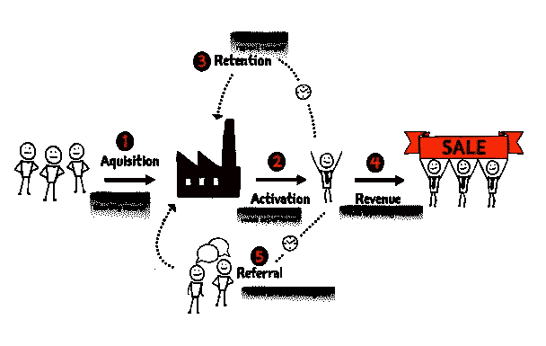
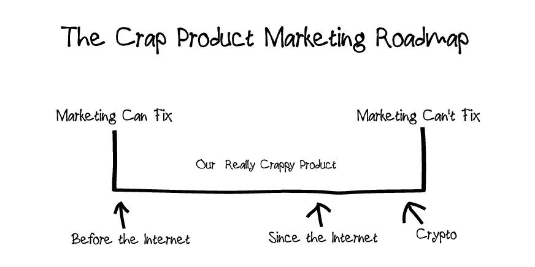

# 我们需要谈谈秘密营销

> 原文：<https://medium.com/hackernoon/we-need-to-talk-about-crypto-marketing-ed7144396a9c>

已故喜剧演员比尔·希克斯对营销人员进行了著名的抨击，他告诉他们:*“你的所作所为没有合理性，你是撒旦的小助手。好吧——自杀。”*

在骗局项目和过分热情的 ico 之后，希克斯对营销的蔑视在加密空间回荡，但营销本身并不是本质上的邪恶；此外，营销是一个被坏人利用的工具，毒害着其他所有人。

当麦当劳为他们最新的汉堡做广告时，这是否会因为社会认为麦当劳是垃圾食品而使营销变得糟糕？而当红十字会宣传捐款帮助叙利亚难民时，这样做营销好吗？

事实是，即使是希克斯也依靠营销来销售他的节目。他对营销的憎恨实际上是针对那些告诉你喝可乐会让你开心或者开宝马会让你有魅力的广告人。我知道它是如何运作的，我也参加过那些会议，道德沦丧的秃鹫们集思广益，向你推销更多你不需要的东西，但这不是拒绝营销的理由，因为道德原则是营销什么和如何营销的大门，而不是行为本身。

# **牵引困难**

任何企业家都知道，创业很难，最难的事情之一就是建立牵引力。没有牵引力就没有长期生存能力，营销是帮助企业家实现愿景的工具。

营销不仅仅是快速扩张一家公司，而是在你的产品旁边找到一个市场，为扩张做准备。初创公司通常会专注于工程，很少考虑营销，但从一开始就嵌入这一技能将确保产品更有可能找到市场。

任何企业(或代币经济)的目标都是首先生存下来，DappRadar 的使用率如此之低，为什么加密项目对营销如此反感？

**DappRadar Etheruem Application Stats**

但是我听你说比特币怎么样？比特币是去中心化的，比特币不需要营销，看看它是如何成长为一个拥有数百万霍德尔的逾 1000 亿美元网络的。但比特币过去和现在都依赖于营销，它只是使用不同的工具集来集中业务，我们可以通过观察营销人员如何分割他们的渠道来了解这一点:

*   **自有:**自己控制的渠道，如网站
*   **获得:**其他人谈论你的渠道，如社交媒体
*   **付费:**为 reach 付费的渠道，如谷歌

由于去中心化，比特币不拥有任何渠道，甚至连 Bitcoin.com、[@比特币](http://twitter.com/Bitcoin)推特账号等资产也不由比特币持有。它们不可能，因为没有中央权威机构来主张它们的知识产权。

除了 Roger Ver 支付广告费用，比特币几乎完全依赖口碑，这是一个盈利的媒体渠道。从博客到播客，再到人们告诉他们的朋友“嘿，比特币太棒了，你应该去看看，”比特币的增长是因为用户渴望传播这个词。

这就是营销，分散的营销。

# 为什么密码公司反对营销？

W 你是打算建立一个公司来充实自己，还是为了更高的目标建立一个新的分散经济；如果你正在筹集资金，你有责任为你的投资者创造一些可持续的东西。这就是为什么沙丘路上的任何球场都需要一个生长滑道作为其甲板的一部分。

建立它，他们就会来是一种谬论，在加密领域更是如此，在幻灯片上简单搜索一下，你就会发现一些最好的网络投资幻灯片在他们的推销中包含了增长幻灯片。备受推崇的 AirBNB 推介材料的第 8 张幻灯片强调了活动、合作伙伴关系和 Craigslist 是增长渠道，不管这些是不是最终神奇公式的一部分，最终导致他们建立了数十亿美元的业务，他们确实需要营销，毫无疑问，他们现在正在实施多渠道营销战略。

**AirBNB** Pitch Deck — Market Adoption Slide

# 互联网改变了游戏

答在互联网出现之前，广告要容易得多，你所要做的就是制造一个产品，发起一场运动，告诉每个人为什么你的产品如此神奇，在独立电视台或第四频道之间做出选择，然后坐下来，抽根雪茄，拍拍自己的后背，就能赚到钱。

> ***注:**在卫星电视出现之前，英国有两个地面电视频道可以播放广告

但是互联网出现了，毁了夏洛特街(纽约麦迪逊大道)的所有乐趣。我在我的行业辞职信中写道:[在线广告行不通](https://www.linkedin.com/pulse/online-advertising-does-work-peter-mccormack/)，我在信中强调了广告业在试图将传统创意活动转变为互动渠道时所面临的问题。

> “这种做出理性和明智决策的能力不断增强，进而改变了消费者的购买行为。情感品牌联系正被基于价格、质量和服务的功能关系所取代，削弱了广告影响消费者的能力。"

营销不再能卖一个蹩脚的产品，互联网是一个无情的地方，充满了评论和病毒运动，摧毁了产品和业务。尽管这并没有阻止广告人试图从互联网这块蛋糕上分一杯羹，但是你猜怎么着？他们搞砸了！扼杀互联网的横幅广告和跟踪脚本导致了广告拦截器和 Brave 等浏览器的抵制。

信息很清楚，我们不想要你的垃圾广告。

# 营销不仅仅是广告

营销不再仅仅是广告，而是顾客的全部体验:

*   **知名度:**营销、广告、公关
*   **转化:**产品演示、价格、转化优化
*   **留任:**入职、客户服务、产品开发

任何营销活动都必须考虑客户关系的整体，Ash Maurya 称之为客户工厂。作为 Eric Ries 开发的精益创业模式的姐妹，客户工厂是创建经济上可持续发展的企业的工具。

**Ash Maurya’s Customer Factory**

ico 们注意了，当你们的国债崩盘、跑道看起来越来越短的时候，如果你们无法创造一个可持续的客户工厂，那么只有一个结果。

如果你已经克服了对营销的恐惧，你承认你的“如果你建造它，他们就会来”战略是有缺陷的，你的几个电报包持有者不会创造一个可持续的业务，那么我们可以仔细看看你能做什么和你面临的相当大的挑战。

**请注意:**营销不会拯救蹩脚的产品或不存在的问题的解决方案，即使是伟大的产品也因为没能建立牵引力而失败了。但是现在，让我们假设你有一个很棒的产品，并且你已经解决了一个数百万人想要解决的问题。你的客户工厂是你创造牵引力的公式，从而生存并最终成长。

客户工厂是一种将客户旅程分成简单步骤的模型，我们邪恶的市场专家称之为漏斗。它使您能够专注于优化每个步骤，以确保最大的吞吐量。

让我们忘记你的朋友和少数早期加密采用者，我们的目标是大众市场。你的第一场战斗不是你的产品有多棒，而是说服潜在用户应该考虑你的产品的心理。正如阿什所说:

> “如果你不能让人们进入你的客户工厂，里面有什么也没用。”
> **延伸阅读—** [**顾客如何买东西的科学**](https://blog.leanstack.com/the-science-of-how-customers-buy-anything-84e72920e644)

将潜在客户从 A 点——他们没有您产品的货币现实——带到 B 点——他们需要并使用您产品的新现实，通过以下方式实现:

*   **获取(到达):**你独特的价值主张——能引起他们注意的信息，以及这些信息的位置
*   **激活(参与):**展示你的产品，解释他们当前的现实以及你的产品创造的新现实的好处
*   **收入(转换):**转换的价值交换，无论是货币还是衍生产品(我们的产品是免费的，但我们出售你的数据)

即使有一个伟大的产品，优秀的信息/位置，一个惊人的演示和一个伟大的价值交换，你仍然会面临两种对立的力量:

1.  **摩擦:**用户头脑中的负面声音告诉他们不需要这个
2.  **惯性:**另一个消极的小声音告诉他们这是太多的努力

只有回答以上所有问题，你才能创造销售。我知道，我说，销售，这听起来可怕的公司，无政府主义者会钉死我。很抱歉给你一个现实的湿鱼巴掌，但你的生存没有时间太冷静营销。

一旦你完成了一笔销售，你还没有完成，不，你的下一个工作是留住你的客户。即使你的产品超级惊艳，他们也可能会忘了或者不明白怎么用你的产品而放弃。你的工作是培养你和他们的关系，如果你做得很好，那么他们会成为你的拥护者，帮助你销售你的产品，双赢！。

# 为什么这对于加密公司来说更加困难

还记得之前我解释过在互联网出现之前，广告是如何变得更加简单的吗？好吧，让我告诉你氪石进化 2000 的警示故事，这是一个自行车锁，该公司声称它非常安全，不会被“断线钳、锯子、锤子和凿子”打破，非常安全，甚至超人也不能打破它。

…除了一个小问题，你可以用一支 Bic 笔打开它，使锁完全无用，随之而来的是一场遍及互联网的[破坏性病毒运动](https://www.wired.com/2004/09/twist-a-pen-open-a-lock/)。

互联网迫使公司提高产品竞争力，加密公司面临更严峻的挑战:

1.  **潜在市场:**与互联网相比，加密领域仍处于相对初级阶段。除非你已经建立了用户看不到加密层的东西，否则你将面临一个更小的可寻址市场，这意味着你的产品和客户工厂的每个方面都必须发挥最大潜力，以确保你能够建立可持续的牵引力。
2.  **摩擦:**和 crypto 的新摩擦点那么多。想象一下，有人想用你的超级新产品，但支付是用比特币。你不仅需要教育他们如何使用你的产品，而且他们需要学习如何购买密码，使用钱包，管理安全等等。唉，很可能这是一个大众市场的落点。
3.  **匿名:**还记得谷歌和脸书禁止加密广告的时候吗？尽管他们已经放松了规定，但人们的隐私意识越来越强，正如我提到的，广告拦截器和像 Brave 这样的浏览器都在隐藏广告，那么你如何接触到这些人呢？此外，许多分散式服务不需要账户，所以当你甚至不知道你在和谁说话时，你怎么能执行保留策略呢？

# 那么我们到底应该做什么？

正如我在我的文章[如何修复 ICO 市场](https://hackernoon.com/how-to-fix-the-ico-market-5bb9a7b7ae11)中所写的，让我们不要假装这些加密创业公司不是面临同样问题的科技创业公司:

*   你正在解决人们遇到的什么问题？
*   你将如何解决这个问题？
*   确保长寿的经济模式是什么？

即使您已经回答了这些问题，考虑到 crypto 面临的许多额外挑战，您的发展战略是什么？

即使你已经筹集了一大笔钱来雇佣工程师和建造很酷的东西，在某个时候，你也必须证明自己的增长和经济可行性，尤其是如果你筹集了风险资金。

营销是你业务的重要组成部分，将用户融入你的产品路线图，考虑他们是谁，你如何接触他们，为什么他们应该关心。如果你不考虑营销，或者正在纠结于使用数据，那么我给你的建议如下:

*   阅读埃里克·里斯的《精益创业》,尤其是关于成长的第 10 章
*   请阅读 Ash Maurya 的《攀登精益》
*   检查 Ash Maurya 的[精益画布](https://blog.leanstack.com/why-lean-canvas-vs-business-model-canvas-af62c0f250f0)和[客户力量画布](https://blog.leanstack.com/the-customer-forces-canvas-updated-5e743fbc859c)，并开始使用它们
*   不要认为你不需要营销

有坏的人，坏的公司，坏的产品和坏的营销策略，但营销本身并不坏，你忽视它，后果自负。

如果您有任何问题，请随时给我发电子邮件。你可能也喜欢[我的博客](https://www.whatbitcoindid.com/blog)或者我的加密播客[比特币做了什么](https://www.whatbitcoindid.com/podcast/)。

# 进一步阅读

*   [下面说说 ICO 营销的问题:16 种观点](https://hackernoon.com/lets-talk-about-the-problems-of-ico-marketing-16-opinions-ac08760af5ff)
*   [研究顾客如何购物的科学](https://blog.leanstack.com/the-science-of-how-customers-buy-anything-84e72920e644)
*   [牵引力是衡量一切的唯一标准](https://blog.leanstack.com/traction-is-the-one-metric-to-rule-them-all-6da55044a9e4)
*   [爱问题，而不是你的解决方案](https://blog.leanstack.com/love-the-problem-not-your-solution-65cfbfb1916b)
*   [网络广告不起作用](https://www.linkedin.com/pulse/online-advertising-does-work-peter-mccormack/)