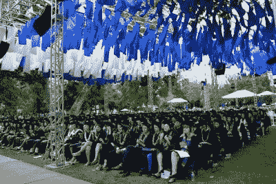

# 当我们试图构建保持性产品时，我们忽略了一件事

> 原文：<https://medium.com/hackernoon/we-overlooked-one-thing-when-attempting-to-build-retentive-products-62c55637aaee>

我一生中最隆重的时刻是我的大学毕业典礼。我父母从中国飞了 14 个小时。前一天领了鸭舌帽&长衫，买了毕业礼服，扎好流苏，戴上代表我们学校的学士帽，最后一次和班级一起走草坪。重复着我们开学那天走过的路。我最喜欢的教授在我等着拿毕业证的时候拥抱了我。当我走向总统时，有人叫我的名字。我握了握他的手，拿了毕业证，对着镜头笑了。眼泪。拥抱。骄傲。再见。这是我从幼儿园开始设想的里程碑。

我想知道如果没有这些事情，那一刻会是什么样子。没有礼服。不走。没有握手。没有光棍罩。没有花岗岩特种纸文凭。没有毕业戒指。如果我能点击一个写着“打印我的文凭”的按钮，嘣，几秒钟内就完成了。毕竟，我只需要一份证明我大学毕业的文件，这样我就可以得到一份办公室工作，让我的父母笑逐颜开，对吗？不会有喜悦的泪水；我都不记得了。

仪式时刻很重要。这些时刻让我们兴奋、鼓舞和激励。它们是极具影响力的时间点，我们无法忘记。然而，在制造科技产品时，我们很少谈论创造“仪式时刻”。相反，我们试图减少入职流程中的一个步骤，以优化用户体验或构建最佳算法来减少花费的时间。

但我们还没有充分讨论如何让我们的产品体验成为一种仪式感。它提高了用户忠诚度。它留住用户。它让用户想在你的产品上投入更多的时间和精力，因为他们真的想到达那个里程碑，或者一次又一次地重复那个时刻。**最重要的是，它让你的产品与众不同。别人解决问题。你的，除了解决问题，还创造了情感联系和难忘的瞬间。**我坚信创造礼仪时刻应该被视为一个同样重要的产品特性。它应该和我们的登录流、入职 NUX 和内容提要等一样受到关注。

# **好吧。你确信礼仪时刻很重要，但科技产品真的有礼仪吗？**

绝对的。

脸书友谊纪念日就是一个很好的例子。我不记得有多少次我会一遍又一遍地看那些视频，回忆往事，给我的朋友发信息问他/她周末过得怎么样。这实际上帮助我与朋友建立了更好的友谊，当然也让我更喜欢脸书。

《口袋妖怪 Go》里的孵蛋又是一个。花了 3 天时间，走了 15 英里，我的蛋终于孵化了。我想起了我轻拍那个大彩蛋，看到彩蛋一点一点的分解，看着那一缕光线从破碎的彩蛋里透出来，屏住呼吸想看看自己是不是得到了一个稀有的口袋妖怪时的兴奋，焦虑，好奇。Pokemon Go 没有立即向我显示“你得到了一只皮卡丘”，而是让这个过程变得极其缓慢。那是一次令人紧张的 30 秒体验，不断将我拉回 Pokemon Go，推动我走得更多，玩得更多，所以我可以一次又一次地重复那个激动人心的时刻。

哦，我怎么能忘记灵魂循环。整件事越积越多。我要有一个最喜欢的教练，记住他/她的时间，尽快预订，问播放列表是什么，预订我的幸运号码的自行车，提前 15 分钟穿着我的 SoulCycle 恤出现，然后出去玩。当我最喜欢的教练出现，微笑，与我击掌并开始播放时，以上所有的事情都需要在那一刻完成。人们经常很难准时出现在健身房并开始锻炼，但 SoulCycle 让它变得像获得 T Swift 演唱会的 VIP 通行证一样酷。#胜利。

在上述所有例子中，通过创造仪式性的时刻并将其嵌入到产品体验中，这些产品可以更好地留住用户，并帮助实现其产品目标，无论是花费的时间还是购买的美元。他们还把用户变成倡导者和有影响力的人，让更多的人加入这个团队。

# 你如何为你的产品设计礼仪时刻？

我想分享一些开始的想法，但如果你有更多的想法，一定要在下面评论。

**永远从你的目标开始，确定在实现你的产品目标的过程中哪个时刻是值得纪念的。**

对于 SoulCycle 来说，这一切都是为了留住客户，所以让用户在购买另一个类时感到兴奋是很重要的。SoulCycle 已经将购买体验变成了一个逐渐建立兴奋感的完整仪式。你需要预订自己的自行车，你被鼓励有一个最喜欢的教练，你应该询问播放列表。

对于 Pokemon Go 来说，目标是让用户继续使用它，花时间。这就是为什么在用户花费数小时步行并最终孵化他们的蛋之后，Pokemon Go 使用戏剧性的动画来使那一刻变得令人紧张。

对于一个消息应用来说，目标可能是激励人们发送更多的消息。因此，当你和你最好的朋友互相分享了 100 张 gif 时，这可能是一个解决问题的好时机。对于 TurboTax 来说，目标是让用户完成报税并支付税款。因此，当你离完成纳税申报过程只有一步之遥时，仪式性的时刻就可能发生。

**注重细节。把你自己想象成一个好莱坞导演，头脑风暴一下你如何将那一刻戏剧化。**

你能想出一些可以应用到产品体验中的创意技巧吗？让它变得有趣。让它充满感情。

*   动画？再说一次，蛋孵化动画相当不错。
*   某些音乐？Instagram 的超级变焦有很棒的音乐。
*   某些 UX 设计模式？HQ Trivia 的倒计时屏幕让我充满期待地焦虑。

*你能试着识别某些符号或名字来代表这一刻吗？当我们想到毕业典礼时，我们会想到礼服。当我们想到您产品中的“时刻 X”时，我们会想到 ____？*

*   当我和我最好的朋友互相分享了 100 张 gif 后，我们解锁了一个徽章，上面显示了我们“良好的疯狂友谊”？
*   当我离完成纳税申报只有一步之遥的时候，我可以使劲打一个写着“IRS”的袋子，因为我终于“快完成了”。
*   当我今年第 50 次去上我的巴雷课时，我如何才能让那第 50 次课像是在接受奥斯卡终身成就奖，以表彰我对巴雷的奉献？

*你能让你的用户知道这个仪式性的时刻，让他们互相谈论吗？这将进一步加强那一刻的强度。*

我被下面列出的两个时刻所激励。

*   那一刻，我分享了我的罕见的口袋妖怪孵化从我的 10 英里步行。两个朋友嫉妒了。他们表现出的嫉妒越多，我就越开心。
*   当你的朋友分享“与克里斯连续第 14 次”，标记 SoulCycle(她也发布了 14 次)时，你仍然每次都喜欢它。

# 分享你的想法

分享下面的例子，你遇到了使你使用的产品礼仪，并谈论如何帮助你的用户体验！