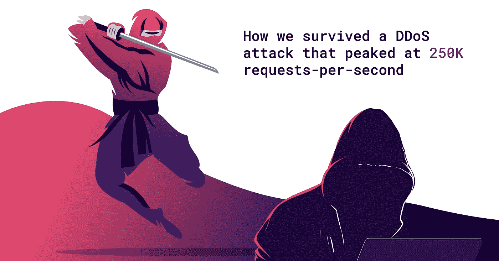

# 我们躲过了峰值每秒 25 万次请求的 DDoS 攻击。它花了我们 10 美元

> 原文：<https://medium.com/hackernoon/we-survived-a-ddos-attack-that-peaked-at-250k-requests-per-second-it-cost-us-10-b0bdfe028dd2>

随着对加密货币兴趣的激增，试图破解区块链相关业务的坏人已经有机可乘。自 2017 年下半年以来，该行业一直是受到 DDoS 攻击最多的第五大行业之一，而且看起来不会很快失去它的地位。安排一次黑市 [DDoS](https://hackernoon.com/tagged/ddos) 攻击的成本仅为每小时 7 美元，而受影响的公司可能会损失数千甚至数百万美元。

为了确保 [Crypterium](https://hackernoon.com/tagged/crypterium) App 做好抵御网络威胁的准备，我们已经决定不再等待潜在的攻击，而是率先向自己开战。换句话说，我们发起了自己造成的 DDoS 攻击，峰值为每秒 25 万个请求。

# **加密业务与网络犯罪**

分布式拒绝服务(DDoS)攻击对于网络罪犯来说是一个非常诱人的机会。通过用虚假流量使目标超载，他们可以使你的网站或应用程序不可用。复仇、政治、伪装……无论攻击背后的原因是什么，努力总是值得一试的。

卡巴斯基实验室[发现](https://www.radware.com/newsevents/mediacoverage/arranging-black-market-ddos-attack-as-little-as-7-dollars-per-hour)安排一次黑市 DDoS 攻击的成本可以低至每小时 7 美元；而受影响的公司可能会损失数千甚至数百万美元。一个例子是最近对加密货币生产平台 NiceHash 的网络攻击，导致 4700 个比特币被盗。与此同时，针对 Bitfinex 加密货币交易所的另一次 DDoS 攻击导致其损失约 4000 万美元。听起来不错，是吧？

随着攻击数量和凶猛程度的上升，DDoS 事件对加密行业构成了越来越大的威胁。2018 年 3 月，代码共享网站 GitHub 的流量[达到了每秒 1.35 兆比特。这是迄今为止记录的最强大的攻击。由于其足智多谋的防御，该网站仅关闭了几分钟，然后恢复正常。但是事情并没有就此结束。攻击企图通常与加密货币的交易量相关，一旦市场遇到更高的流动性，更有可能再次发生大规模攻击。因此，加密业务最好从准备好可靠的保护机制开始。](https://www.itnews.com.au/news/github-hit-with-largest-ever-ddos-attack-486152)

# **为什么要自杀？**

可能只有一种方法来检查你的网站或应用程序是否可以运行。是的，你猜对了——我们正在谈论自我施加的攻击，也就是压力测试。通常，此类测试由制造雇佣 DDoS 的外包公司进行。与现实生活中的攻击相反，攻击的“僵尸网络”是从一个特殊的云平台模拟的，任何风险都是可控的，远远超过其好处。

压力测试可以揭示 IT 基础设施的突破点及其在正常使用之外的稳定性潜力。换句话说，测试完成后，您知道您的系统可以处理任何遇到的情况，从 DDoS 攻击到成功的营销活动或产品发布后急切的客户涌入您的网站。

一个月后，Crypterium 将推出期待已久的功能，使[可以在任何 NFC 终端用 crypto](https://www.youtube.com/watch?v=-Q3ILm8of6Y) 支付，或者通过扫描二维码支付。这就是为什么我们在大发布前夕检查服务器的稳定性非常重要 Crypterium 的注册用户数量已经超过 40 万，预计将显著增加。

# **发生了什么**

进行的第一次攻击 Crypterium 被设计为针对其连接状态表，这些表存在于主机服务器中，是防御策略的基本要素。现在，跳过前面，没有不愉快的惊喜。

我们的知识产权属于亚马逊，它是托管云服务领域的绝对领导者。Amazon 针对常见的、最常见的网络 DDoS 攻击提供高级保护，自动击退这些攻击。使服务器更加可靠的是它能够抵御新型攻击。如果它显示一个不寻常的网络活动，它会在几分钟内做出反应。

第二次打击的目标是应用程序级别。这类攻击是最难防范的，因为它们模仿正常的用户行为，可能会被忽视，直到为时已晚。此外，该场景不再包括托管服务器的一部分，这意味着网站或应用程序必须使用自己的资源来处理每一个虚假请求。Crypterium 进行的应用级攻击峰值为每秒 25 万次请求。

“为了清楚起见:每秒 1000 个请求是大银行在大多数人拿到薪水的那天通常经历的。Crypterium 的首席技术官帕维尔·伊万诺夫说:“我曾经在一家最大的零售银行工作，即使是它的高峰时间数字也无法与 Crypterium 成功实现的目标相比。“在现实生活环境中，每秒 25 万次请求的攻击意味着有 1000 万用户同时试图访问该应用程序”——他补充道。

# **我们几乎免费击退了攻击**

Crypterium 的架构所基于的一个原则叫做“容器化”。为了理解这项技术，让我们更深入地了解细节。

本质上，容器是带有虚拟化操作系统的资源隔离的单功能服务。它们可以混合搭配，甚至重新分配来执行新的任务。容器的即插即用特性使它们在功能上更加灵活，并为管理员提供了对资源分配和扩展的更多控制。

现在把容器想象成快速增长的应用程序的微小部分。您肯定需要一个工具来保持它们同步，对吗？这就是容器编排平台有用的地方。

它们通过平均分配负载来帮助协调块。与基于硬件的解决方案不同，orchestrator 会自动对不断增长的工作负载做出反应，并打开所需的确切数量的容器来应对涌入。缓冲区溢出？别提了。微服务和编排引擎的结合可以消化任何数量的请求。如果没有流量，系统将缩减不必要的资源。

“使用这样的系统真的很划算。通常情况下，您不需要使用您拥有的所有服务，因此当没有额外流量时，orchestrator 会关闭它们，为您节省大量资金，因为您不必为您不使用的资源付费”——Pavel Ivanov 解释道。

因此，击退 DDoS 攻击几乎没花我们一分钱——Crypterium 只花了不到 10 美元。这笔钱刚好够支付用于处理垃圾邮件的额外资源。

# **如果我们击退进攻失败了怎么办？**

坦率地说，我们非常确定我们不会。但无论如何，运行攻击对我们来说至关重要，因为它让我们在接近真实生活的环境中测试应用程序。即使它确实存在漏洞，压力测试也会给我们一个修复漏洞的机会。

显然，攻击的演变预计不会很快停止，但如果公司遵循 Crypterium 防止 DDoS 的方法，他们将有机会提前应对危险。

# **关于地穴**

Crypterium 正在开发一个移动应用程序，它将把加密货币转换成你可以像使用现金一样轻松消费的货币。

在世界各地购物，在任何 NFC 终端用硬币和代币支付，或通过扫描二维码支付。在网上商店购物，支付您的账单，或者只是在几秒钟内可靠地跨境汇款，而且只需几分之一便士。

在 http://crypterium.com/[了解更多信息，并加入我们](http://crypterium.com/)[电报聊天](http://t.me/crypterium)的讨论。