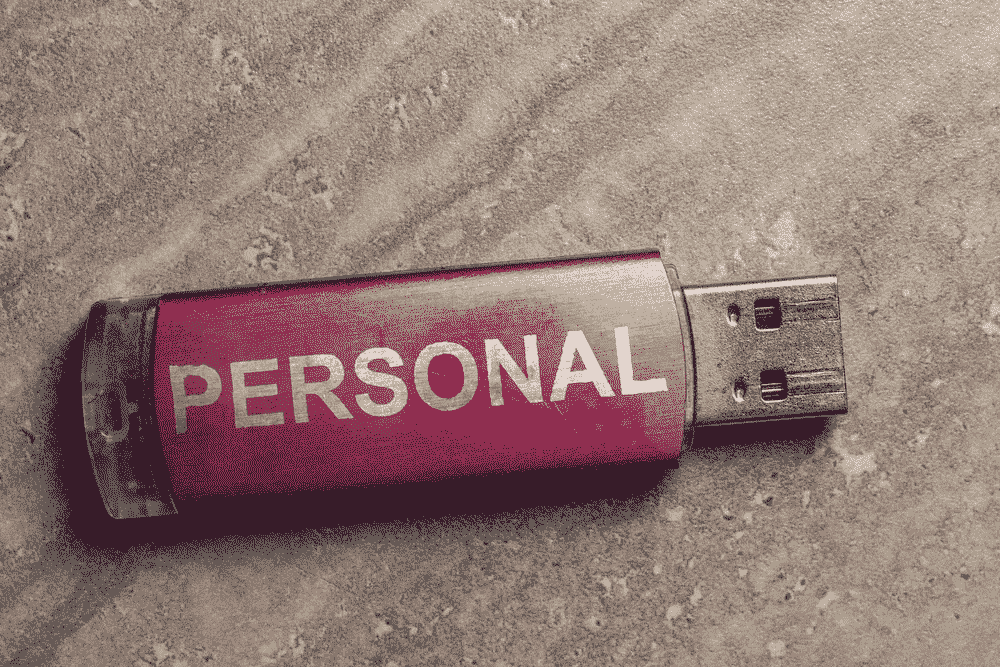

# 我们相信我们的手机和无数的公司会保守我们不会告诉最亲密朋友的秘密

> 原文：<https://medium.com/hackernoon/we-trust-our-phones-and-countless-corporations-to-keep-secrets-we-wouldnt-tell-our-closest-friends-35378a30dfee>

www.shutterstock.com

我们都有过朋友要求看我们手机的时候，我们开始有一个小小的恐慌发作。我们瞬间变成秘密行动指挥官，他们试图阻止敌对的外国间谍侵入主机。实际上，你朋友的手机没电了，他们只需要谷歌一下当地家得宝的营业时间——假警报，威胁解除了。

这是为什么呢？我们什么时候开始信任公司和他们创造的技术，这些技术包含了秘密、私人信息和让我们最亲密的朋友或所爱的人无意中发现的内容。

显然，我们对手机知道我们的事情感到很舒服，我们不一定想让我们的朋友知道，因为手机是没有生命的物体，没有能力判断我们，我们的朋友是人类，他们有能力告诉其他人我们有问题的搜索历史。

但这种思维模式没有认识到，有些公司确实可以在一天中的任何特定时间访问我们的位置、照片、联系人和最隐私的信息。事实上，我们心甘情愿地允许他们访问所有内容。只是为了交换使用他们的服务。

不管我们承认与否，这些公司背后都有真实的人。我们让他们躲在窗帘后面，但当他们需要打电话时，我们不愿意把我们的手机交给小时候喂过我们的人。

我们对完全陌生的人如此盲目的信任，真是疯狂。我们相信机器会保守我们不会告诉妻子和丈夫的秘密。在某些情况下——尤其是我们的妻子和丈夫。如果你在过去的五年里做过一些肮脏的事情，谷歌几乎可以肯定是赶时髦的。

你手机上的全球定位系统和每一个你提供位置信息的公司和应用程序——这对大多数人来说是一个惊人的数字——都知道你今天没有工作到很晚，尽管你的另一半认为你工作到很晚。

如果你是像我一样的安卓用户，我的朋友，谷歌已经得到了你想要的东西。整体骨瘦如柴。

从你曾经使用 Chrome 浏览器访问的每一个恶心的网站，到你曾经问过的每一个愚蠢的问题，一直到你在 YouTube 上查找的可笑的狗屎。谷歌偷窥了一下。不过别担心，它保证会保守你的秘密。它粉红色的上面有一颗樱桃。

Alexa 绝不会在你的朋友面前让你难堪。你的 iPhone 就像你最亲密的知己或军师。你信任的共同被告。根据我们相信他们会保密的信息，你至少会这么认为。

我们相信这些小玩意和制作这些小玩意的人，我们不会和律师或牧师分享这些小玩意。实际上，我们问这些设备和公司是否知道一个好的律师或牧师，如果需要的话。他们总是这样，不是吗？

谷歌推荐的律师让你的妹夫得到了比他同事告诉他的争吵、追救护车、诈骗更好的待遇。这就是为什么我们求助于这些设备来解决关于谁赢得了 1996 年赛扬奖的琐碎争论，或者得到一个关于全家人在电视上呆了多长时间的明确答案。因为它知道。似乎没有什么是他们不知道的。这也延伸到关于我们自己的最个人的细节，我们越来越少考虑它——因为它显然变得越来越普遍。

我并不是建议我们开始戴锡纸帽，或者亚历克斯·琼斯是明智的——我只是觉得讽刺和有趣的是，我们对信任拥有敏感信息的公司是如此的放心。然而，我确实认为这是我们应该努力保持更多意识的事情，因为我们生活在一个你永远不知道你的信息可能最终会在哪里的时代。