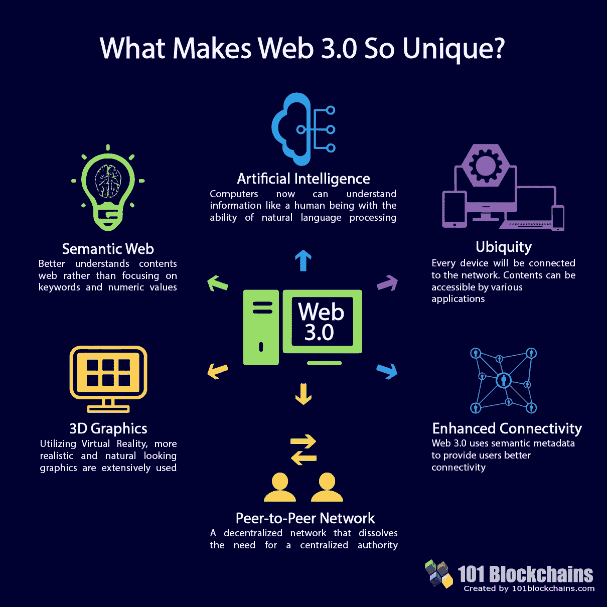
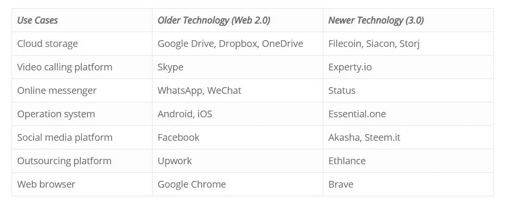
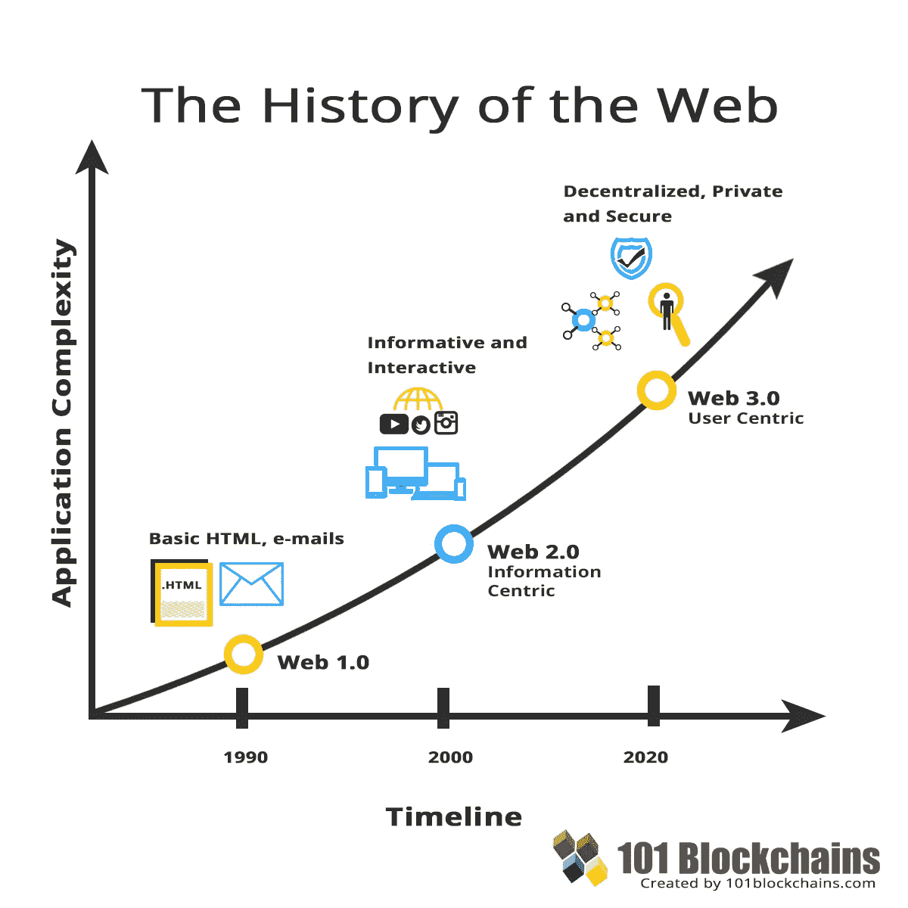
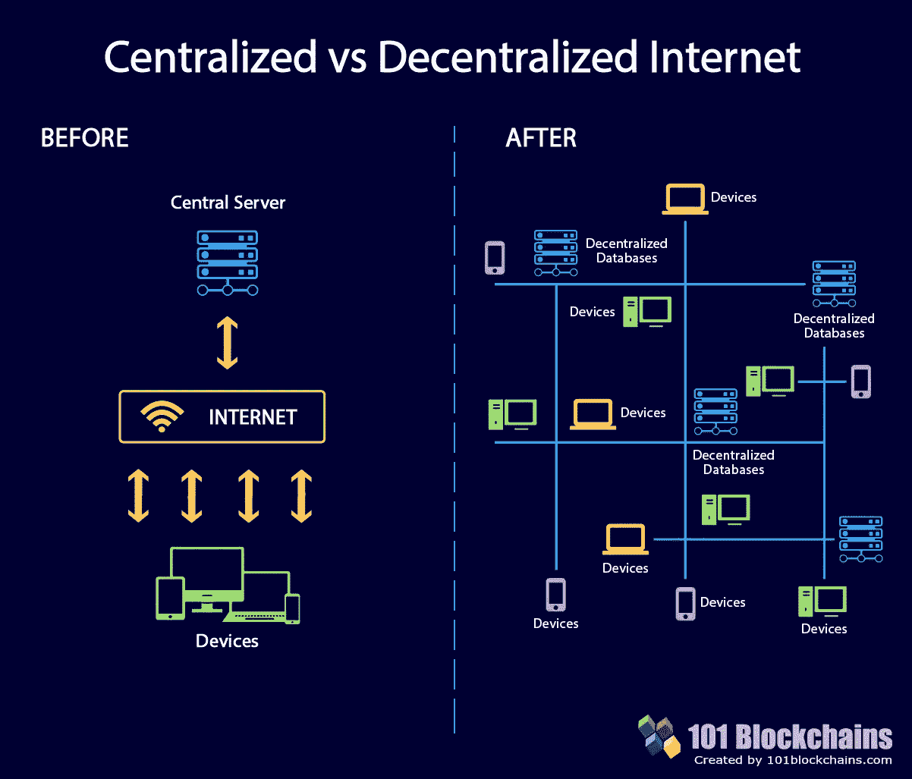
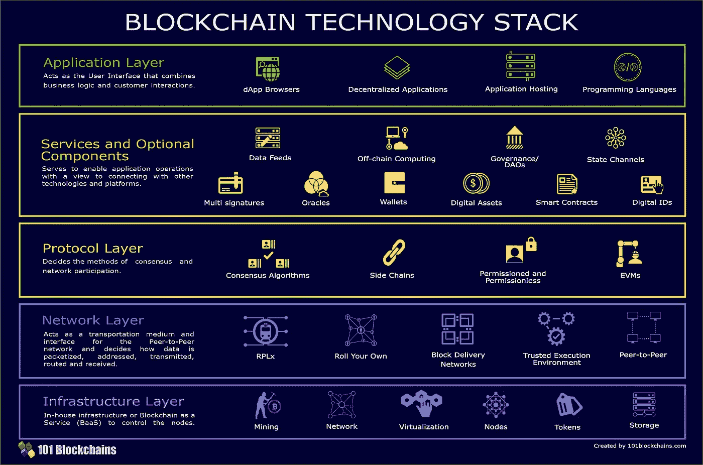
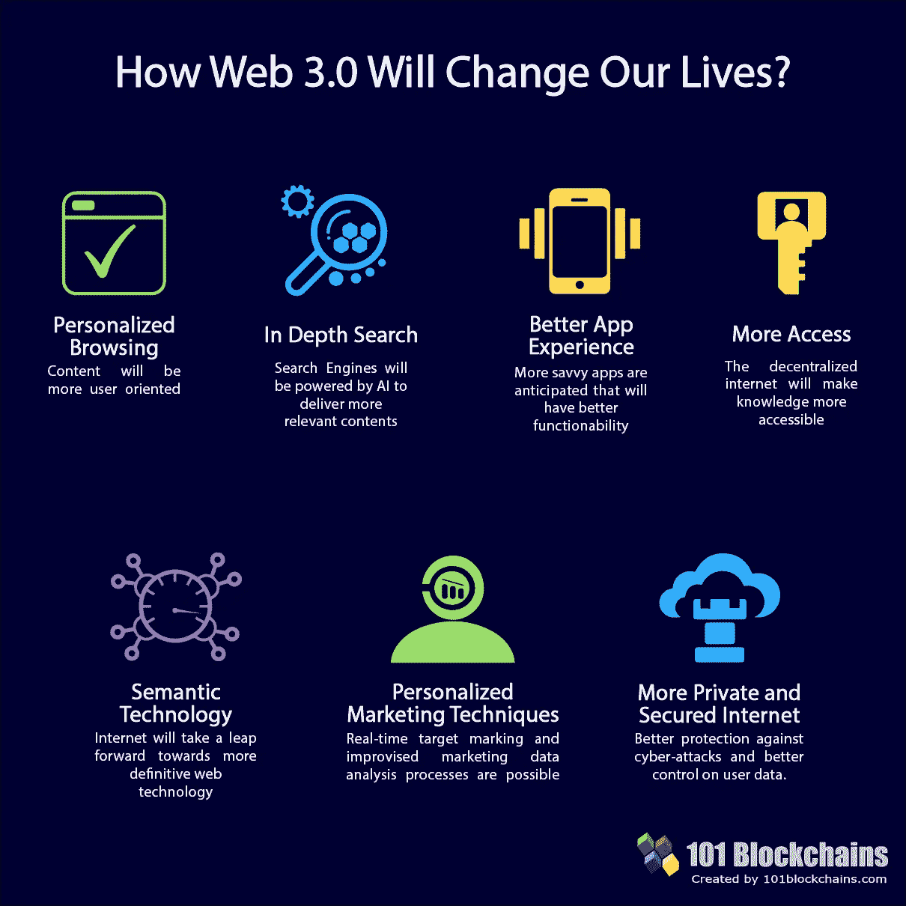

# Web 3.0 将由区块链技术栈提供支持

> 原文：<https://medium.com/hackernoon/web-3-0-will-be-powered-by-blockchain-technology-stack-626ce3f828c7>

Web 3.0 IT 堆栈仍然没有完全开发出来。但它即将推出全面行动。那么，Web 3 是什么？Web 1.0 和 2.0 有集中式服务器，而 Web 3.0 区块链堆栈有一个更加以用户为中心的分散式网络。一个透明和安全的互联网，致力于使事情更人性化。

新网络 Web 3.0 有六大显著特征。我们认为这些将帮助你更好地掌握整个概念。

credits to [101blockchains.com](https://101blockchains.com/web-3-0-blockchain-technology-stack/)

## Web 3.0 IT 堆栈将如何工作？

变化越大，社会适应的时间就越长。毫无疑问，Web 3 IT 堆栈是复杂的，普通人将需要开发人员的时间和精力。Web 2.0 非常用户友好，人们使用起来很舒服。

尽管专家说人们会很乐意接受这项技术，因为在过去的 20 年里，人类越来越喜欢这项技术。我们将不得不使用 dApp 浏览器来使用新的应用程序。这些应用迟早会取代旧的技术。例如，看看下表。

Credits to [101blockchains.com](https://101blockchains.com)

这些只是几个 [web3 例子](https://101blockchains.com/web-3-0-examples/)。将会有更多的应用程序取代今天所有的大牌。这些应用必须与以垄断方式统治市场的市场领导者作战。自然，与之前的相比，这些应用将拥有更好和更先进的功能。只有时间能证明他们是否足够优秀，是否能赢得纯洁之战。

然而，Web 2.0 不会完全消失。例如，在更智能的通信平台出现后，电子邮件并没有消失。他们就是无法赢得与更好的技术的斗争。

## Web 平台之间的基本差异

Web 1.0 有一个艰难的开端。人们不接受互联网，因为它很贵，设备也很少。如今，几乎每个人都有一部可以上网的手机。当时，具有互联网连接的设备非常罕见。专家们通常称之为只读时代。大多数内容都是由专业人士策划的，人们只会阅读这些数据。

更简单的技术是可行的。谷歌还是一个未出生的孩子。人们会使用雅虎！或者阿尔塔维斯塔。这些搜索引擎关注域名来判断搜索结果的相关性。为了在人与人之间共享文件，Napster 和 BitTorrent 很流行。网络既不是社会性的，也不是语义性的。我们可以称之为“简单的网络”。网站只有超链接和书签功能，而且都是静态的。你只能浏览内容，不能给出任何反馈或评论。用户和服务器之间没有通信。

Web 2.0 具有读写 Web 内容的能力。静态网站已经被交互式动态网站所取代。博客比以往任何时候都受欢迎。维基百科是一个开放的图书馆，在那里你可以找到所有的知识。对于用户来说，即时消息变成了一件普通而自然的事情。

它们不是简单的网络，而是通常被称为“社交网络”。它有更好的互动性。它可以流视频；各种应用程序已经在这里。为了更好的营销设施和更多的销售，每个传统商店都转变成了网上商店。

Image Credits [101blockchains.com](https://101blockchains.com/web-3-0-examples/)

## 从集中到分散

Web 2.0 和 Web 1.0 的最大缺陷之一是基于客户端-服务器的架构。所以，你想清楚了，我们在互联网上的所有个人资料，基本上都是储存在一台存储量巨大的电脑里。没有富加兹，也没有富加兹！所有的数据都归任何私人公司所有。所以，这个场景对我们的隐私构成了严重的威胁。

这种中央集权制在过去几年里引起了相当大的争议。例如，你可以想到脸书的数据泄露和苹果的 i-Cloud 黑客攻击。太多敏感数据泄露给了公众。企业巨头正以多种方式控制着我们的生活。

另一方面，分散式网络没有数据泄露的威胁。没有人有权管理你的个人数据。不会有任何集中的服务器。所有的数据将分布在整个网络上。如果能上网，你的数据可以储存在冰箱或烤面包机里。这就是[区块链技术](https://101blockchains.com/ultimate-blockchain-technology-guide/)的真正魅力——一个专注于人性化的去中心化、安全和私有的网络。

Credits to [101blockchians.com](https://101blockchains.com/ultimate-blockchain-technology-guide/)

## 向数据民主转变

从 1990 年开始，点对点连接就很精确了，然而，当我们开始使用共享程序如 Tor Browser 或 BitTorrent 时，它的名气越来越大。

随着加密货币的革命，区块链正在将这一基础设施提升到一个全新的水平。现在，我们可以从典型的集中式系统转向分散式数据结构。

在最新的 web3 中，我们正在重新设计互联网的数据基础设施。然而，重要的是要知道，区块链并不是这背后的唯一技术，在去中心化的 web 堆栈中还有许多其他服务。

主要原因是，区块链应用程序堆栈对于存储大量数据来说不是那么理想，因为它仍然存在可伸缩性问题，而且没有那么多隐私。

## Web 3 技术堆栈中的一般基础结构变化

新的 Web 3.0 区块链技术堆栈的基础设施与以前的不同。这种转变是巨大而细致的。但从客户机-服务器属性向去中心化 web 转变的过程不会很激进。

它仍处于成熟期。因此，过渡将首先是创建一个部分去中心化的网络，然后完全转换到去中心化。然而，你也应该考虑这样一个事实，即使它们更加安全，它们也比以前慢得多。

然而，即使未来会更加分散，但这并不意味着我们会完全忘记中央集权制。他们也有额外津贴，我们绝对可以利用它们。

## 架构的 5 层

Credits to [101blockchains.com](https://101blockchains.com)

我已经定义了这一层的前几层。应用层将拥有 dApp 浏览器、应用托管、dApps、业务逻辑和用户界面。

层的第二阶段基本上进入技术层。这一层涵盖了创建和运行 dApps 层的所有重要工具。它通常涵盖数据馈送、链外计算、治理(DAO)、状态通道和侧链。值得一提的是[智能合约](https://101blockchains.com/smart-contracts/)，因为它们完全摆脱了中间人。你将不必处理信任问题，并能够以一种无冲突的方式交换你的贵重物品，如金钱、股票或财产，甚至代币。

协议层涵盖了不同的共识算法、参与要求、虚拟机等等。区块链使用共识算法来确保节点达成一致。

## Web 3.0 将如何改变我们的生活？

Credits to [101blockchains.com](https://101blockchains.com)

IT 行业的大佬们现在都在玩信息垄断。随着我们进入信息时代，信息的价值肯定会暴涨。面对这些公司，Web 3 IT 堆栈将会大受欢迎。它将权力下放，更加民主。我们很快就会看到日常生活的变化。

加密货币已经与联邦银行和政府展开了一场战斗。世界上第一部区块链手机就在这里。感谢富士康。平台将变得不可信。人们的个人信息将不再成为出售的产品。

我们已经见证了我们周围的变化。瑞士的楚格市已经在一个以太坊区块链上注册了所有市民的 ID。

由于版权问题，像海盗湾这样的网站已经遭到了各国政府无数次的打击。但是这个网站在普通用户中非常受欢迎。政府已经关闭了许多域名。因此，像海盗湾这样的网站将不会受到政府如此强有力的行动的影响。

用户现在可以睡个好觉，因为他们的私人信息将由于结构的增强加密而更加安全。去中心化会让叛逆的黑客更开心。

各种应用程序将接管主要网站，如脸书、Instagram、Twitter、Google drive 和流行的浏览器。分散式应用将成为明日之物。

简而言之，我们所知道的互联网世界将会改变它的本质。

## 结束语

在区块链的世界里，我们得到一个更新版本的网络系统是很正常的。这一过程仍在进行中，并有许多改进，我们仍然可以期待更好的数字体验。

让我们看看未来在等着我们。

资源和链接:

[企业区块链专家认证(CEBP)](https://academy.101blockchains.com/courses/blockchain-expert-certification)

[免费区块链课程](https://academy.101blockchains.com/courses/enterprise-blockchains-fundamentals)

[区块链课程](https://academy.101blockchains.com/)

[区块链网络研讨会](https://101blockchains.com/blockchain-webinars/)

[区块链认证](https://academy.101blockchains.com/collections/blockchain-certifications/)

*原载于 2018 年 8 月 7 日 101blockchains.com***。**