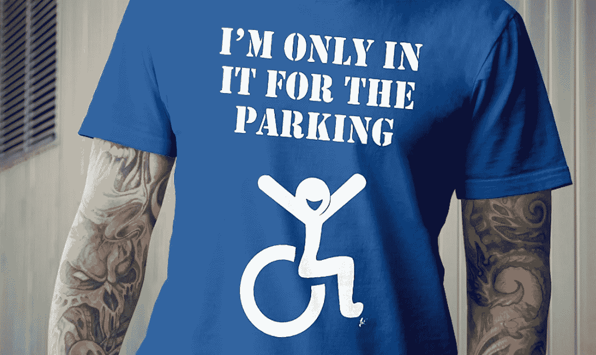

# 网页可访问性:时髦词还是现实？

> 原文：<https://medium.com/hackernoon/web-accessibility-buzzword-or-reality-c265ec82aa03>

Everyone wants the benefits of accessibility, but nobody wants to do the work

eb 可访问性。蒂姆·伯纳斯·李爵士意想不到的私生子，一个劣质的 12 英寸单色屏幕变黑了(再也没有回来)，还有一只带着老鼠跑了的猫。猫回来了，但当我们再次找到鼠标时，史蒂夫·乔布斯决定我们都应该戳我们的屏幕。

倒回到 1991 年 8 月 6 日——这对[雪花一代](https://en.wikipedia.org/wiki/Generation_Snowflake)来说似乎是很久以前的事了，除了…