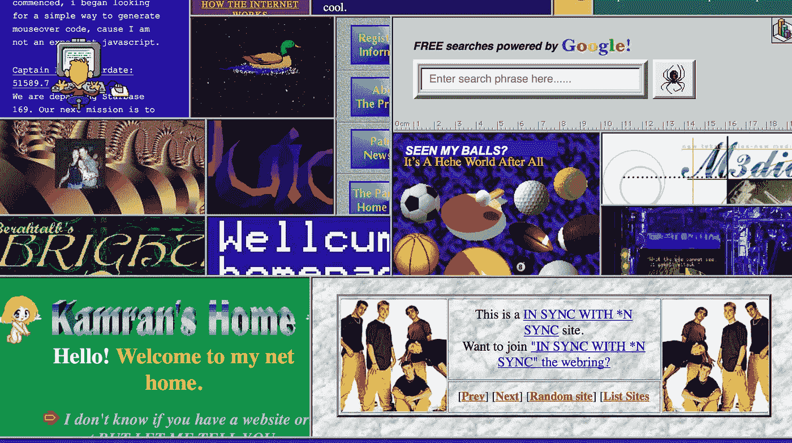

# 从头开始创建 Web 组件——带回 Blink 标签

> 原文：<https://medium.com/hackernoon/web-components-from-scratch-bringing-back-the-blink-tag-783743a0589e>



如果你不知道，有一种新的 web 开发模式即将出现。在“web 组件”的旗帜下，正在开发各种 web 浏览器规范。Web 组件旨在标准化大多数主流 JavaScript 框架已经在做的事情——提供一组工具，允许开发人员创建新的类似 HTML 元素的类来实现定制的应用程序逻辑。这些组件有可能通过 HTML 属性公开 API，就像真正的元素一样，并在许多应用程序中重用，最终解决前端代码重用的问题。

如果你还没有意识到，这个过程是非常痛苦和缓慢的，标准上的分歧，笨拙的 API，以及糟糕的性能减缓了采用。对我来说，谷歌搜索“web 组件”的最高结果之一是这篇名为[Web 组件](https://dmitriid.com/blog/2017/03/the-broken-promise-of-web-components/)的破碎承诺的文章。Google Polymer framework 试图通过提供一个理想化版本的 web 组件 API 来解决这个问题，并强行让它在所有现代浏览器中工作。他们已经取得了一些成功，但是甚至他们的主要开发者传道者也承认[失信者有点道理](https://robdodson.me/regarding-the-broken-promise-of-web-components/)。

那么，我们这些前端开发人员或涉猎者该何去何从呢？我在过去曾赞美过 Polymer，我仍然认为它提供了理想的 web 开发体验，尽管它可能不是大多数新的 web 应用程序的正确解决方案。为了真正感受底层技术的发展，我们应该用 VanillaJS 实现一个 web 组件。

在 20 世纪 90 年代末和 21 世纪初,`<blink>`标签是受人喜爱的设计元素。大多数浏览器都有 native 标签，它会使包含在标签中的内容隐藏起来，并在一定时间间隔内显示出来，这样用户就会注意到它。例如，一个人可以给自己的在线商店添加一个促销信息，用鲜红的衬线文字显示“销售”。这个高贵的标签受到了如此多的诽谤，以至于它已经远远落伍了，甚至导致通常坚忍不拔的 Mozilla 开发者网络发布了可能是有史以来最具敌意的文档页面。像弗兰肯斯坦博士一样，我们的目标是让它起死回生，不管后果如何。

为了在 ES6 中创建自定义元素，我们将首先创建一个扩展内置`HTMLElement`类的类。然后，我们可以使用`customElements` API 在浏览器中注册它。

```
class XBlink extends HTMLElement {}customElements.define('x-blink', XBlink);
```

为什么是`x-blink`？自定义元素的名称中必须有一个破折号，这样它们的名称就不会与没有破折号的内置元素冲突。因此，大多数定制元素都附加了某种前缀，所以它们仍然可以使用简单的一个单词的标记名。前缀`x-`也常用于非标准 HTTP 头来区分它们。这就是我们为什么对这个标准的采用如此缓慢感到惊讶的地方。

这种形式的元素什么也不做，什么也不显示。为了让它显示其子节点，我们必须附加一个插槽。slot API 允许我们定义放置在元素中的内容应该在我们的内部或“影子”DOM 树中的什么位置显示。blink 标签没有自己的结构，所以内部 DOM 将只包含我们放入槽中的内容。要添加它，我们首先必须附加一个 shadow DOM，出于某种原因我们将其声明为 open，并创建 slot 元素。

```
class XBlink extends HTMLElement { constructor() {
    super();
    this.attachShadow({ mode: 'open' })
      .appendChild(document.createElement('slot'));
  }
}customElements.define('x-blink', XBlink);
```

现在，如果我们在页面中包含这个脚本并使用标签，我们应该会看到正常显示的文本。

```
<x-blink>I'll blink if I like</x-blink>
```

现在真的让它眨眼。定制元素为“生命周期回调”保留了方法名，这意味着开发人员可以编写在某些关键时刻运行的函数，通常是在创建或销毁元素时。当我们的元素被创建时，我们想要分派一个 interval 函数来显示和隐藏标签的内容。为了避免标签在隐藏时自行调整大小，我们将修改不透明度属性来实现这一点。

```
connectedCallback() { this.style.opacity = '1';
  this.interval = setInterval(() => {
    this.style.opacity = this.style.opacity === '1' ? '0' : '1'
  }, 500);
}disconnectedCallback() {
  clearInterval(this.interval);
}
```

现在，我们的标签在闪烁！我们带回了一位网络早期的老朋友。然而，我们还没有使用 web 组件的全部功能。为了使我们的组件可重用，它应该公开一个 API，这样用户就可以配置它，而不必重写。500 毫秒的闪烁速度可以在 HTML 属性中公开，然后用户可以根据他们的 UX 需求将其设置为更快或更慢。

要做到这一点，我们可以简单地从我们的`connectedCallback`内部调用`this.getAttribute`，就像我们处理从继承而来的`HTMLElement`的对象实例一样。如果我们找不到该属性，让我们设置一个默认值 500 毫秒，但是如果我们找到了，就使用它。HTML 属性总是字符串，所以我们将尝试解析它，不是因为我们必须这样做，而是为了避免[愚蠢的类型强制错误](https://www.youtube.com/watch?v=et8xNAc2ic8)。

```
connectedCallback() {
    this.speed = parseInt(this.getAttribute('speed'));
    this.speed = isNaN(this.speed) ? 500 : this.speed;
    this.style.opacity = '1'; this.interval = setInterval(() => {
      this.style.opacity = this.style.opacity === '1' ? '0' : '1'
    }, this.speed);
  }
```

就是这样！我们创建了一个自定义元素，可通过属性进行配置，完全基于新兴的浏览器标准。您可以看到为什么像 Polymer 这样的框架想要在此基础上添加模板语法和数据绑定引擎，以便实际构建 web 应用程序。web 组件是可重用浏览器代码的终极解决方案吗？谁知道呢。现在，他们看起来和我们复活的眨眼标记一样好，但是情人眼里出西施。

如果你想用`x-blink`让自己的网页变得漂亮，完整的示例代码可以在 [CodePen](https://codepen.io/tmlbl/pen/ddPeYV) 上找到。