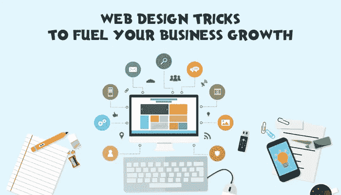

# 网页设计技巧推动你的业务增长

> 原文：<https://medium.com/hackernoon/web-design-tricks-to-fuel-your-business-growth-22bfad5902ee>

发展业务不是小菜一碟。它需要从产品创造到发展计划，发展营销策略，最后到你的网站的努力。

一个设计良好的网站本身就足以在访问者的心目中建立一个值得称赞的你的品牌/业务/服务的形象。除此之外，一个好的网站设计肯定会让访问者在你的页面上停留更长时间，而一个糟糕的网站设计会立刻让他们失去兴趣。

Web Design Tricks to Fuel Your Business Growth

首先，没有人喜欢花时间在一个缓慢、低效或者没有原创设计的网站上。因此，当涉及到决定一个品牌是否值得信任时，一个有响应性和交互性的网站设计排名靠前。

这就是投资网站设计如此重要的原因。所有成功的品牌和企业都会投入大量的时间、精力和金钱来设计一个简洁而精致的网站。甚至你的品牌/企业也可以利用 [**顶级网页设计公司**](https://www.goodfirms.co/directory/country/top-web-design-companies/ca) 的服务，为你的企业获得最佳收益。

首先，让我们看看一个精心策划的网站设计能做些什么:

*   准确描绘品牌形象
*   让用户感到舒适和放心
*   为用户提供他们需要的所有信息
*   清晰地将注意力吸引到重要的行动呼吁上
*   将流量转化为销售线索
*   为您的企业创造收入

此外，如果所有这些方面都满意的网站将是一个互动和用户友好的网页。现在，这样的网页设计有可能将访问者转化为长期客户。创建这样一个网站，基本的和第一步是创建一个响应网站。

那么，什么是响应式网站设计呢？

响应式网站设计包括设计一个适合任何屏幕的网站——智能手机、台式机、笔记本电脑或平板电脑。

此外，响应式网站的设计方式是，无论用户在什么设备上浏览，所有页面、操作和功能都是可访问的。

所以，现在你已经计划设计一个响应式网站。接下来呢？

# 有许多技巧和提示可以让你的网站设计脱颖而出。让我们来看看实现这一目标的一些重要技巧:

# **1)视差滚动**

面对如此多的网站，抓住任何用户的注意力都是一项艰巨的任务。

所以，如果一个用户访问你的网站，发现他必须付出很多努力，比如点击每个子菜单来导航，用户很快就会转到下一个网站。

这就是视差滚动派上用场的地方。

有了视差滚动，用户甚至不用点击按钮就可以浏览网站。

那么，视差滚动到底是什么？

在网页设计中，视差滚动指的是使用视觉效果和 2D 滚动来建立 UX 的层次感和深度感。

为了实现这一点，使用了独特的前景和背景设计。他们的移动速度是不同的，因此他们可以通过滚动条传达一个无缝的在线故事。

虽然有各种各样的方法，但一般来说，背景移动的速度比前景慢得多，以在整个页面上描绘这种错觉。

最棒的是，用户甚至不用动一根手指就能访问页面。它用不同层次的深度和动画感刺激用户，因此更有吸引力。此外，它具有吸引力和视觉吸引力。

只需轻轻一扫，用户就可以轻松浏览页面。用户不必费力去访问页面，这意味着更多的客户保留率。

此外，使用视差滚动将使优先化和管理你的内容可见性变得容易。

# **2)视频登陆页面**

根据 [**Statista**](https://www.statista.com/statistics/272835/share-of-internet-users-who-watch-online-videos/) 的一份报告，去年全球视频消费在 65%到 95%之间。

这说明网络视频消费在上升。所有的大品牌和企业都利用了这一趋势，并为他们的网站创建了视频登陆页面。

毫无疑问，书面内容和图像在网页设计中仍然具有相关性，但有了视频登陆页，转化率会更好。因此，它们越来越受欢迎，成为传递信息的有力媒介。

因此，在你的网站设计中加入视频，以获得最大的利益并产生潜在客户。

但是，不要为了整合视频而嵌入任何旧的或过时的视频。这样做弊大于利。嵌入视频，说明品牌必须提供什么产品/服务。

您可以将视频作为网页上的直接行动号召，或者在您的主页上创建身临其境的自动播放视频。

# **3)自定义排版**

文本越清晰，客户在网页上停留的时间就越长。好的排版让阅读变得轻松，而糟糕的排版会让用户厌烦。

你的网页所使用的字体应该让用户能够很容易地浏览和阅读整个网站。

无聊的普通字体被用于网站设计的日子已经一去不复返了。利用独特的字体将为你的品牌建立一个身份，并使你的网站具有互动性。

您可以在设计徽标时使用字体设计，或者在主菜单、子菜单或中间内容中使用字体设计，以引起对重要参数的注意。

不要使用难以阅读的新奇字体。使用有可识别字母的字体。

此外，使用自定义排版并不意味着您可以使用几种不同的字体。过多的样式和尺寸会让网站看起来不专业，没有结构。

嗯，排版是网页设计的一个非常重要的方面。它使网站内容具有可读性、易读性和可理解性。

排版应该能够建立一个坚实的框架。糟糕的排版选择会分散注意力，破坏布局。甚至一个小小的 [**网页设计错误**](https://uxplanet.org/10-deadly-web-design-sins-and-how-to-stay-away-from-them-367fea1dad13) 都会影响你的排名和页面访问量。

## **尾注:**

一个精心策划和有策略的网站设计有潜力培养一个忠诚的消费者群体，这反过来将有助于你的业务成倍增长。

虽然一个吸引人的网站设计很重要，但是不要忘记网站的真正目的。网站产生的转换越多，你的生意产生的收入就越多。

秘诀是在设计你的网站时把客户体验放在第一位。网站设计应该让潜在客户可以很容易地与你联系。

所以，结合这些网站设计技巧，让你的生意突飞猛进！