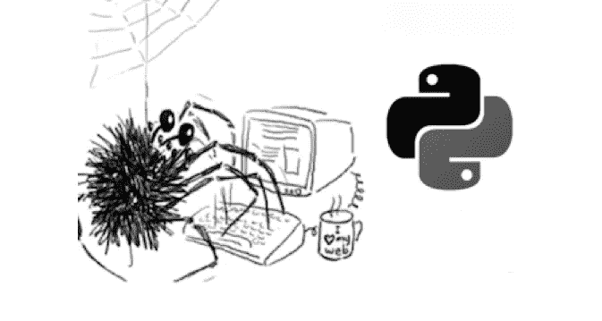
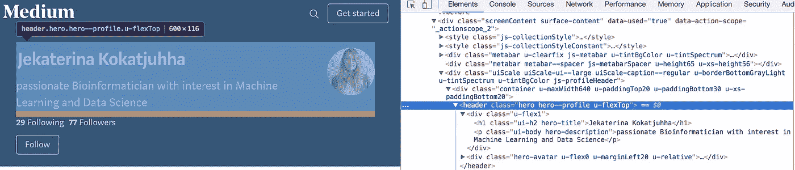

# Python 网页抓取教程:技巧和窍门

> 原文：<https://medium.com/hackernoon/web-scraping-tutorial-with-python-tips-and-tricks-db070e70e071>



[https://www.kdnuggets.com/2018/02/top-news-week-0129-0204.html](https://www.kdnuggets.com/2018/02/top-news-week-0129-0204.html)

我正在搜索航班机票，注意到机票价格在白天波动。我试图找出买票的最佳时间，但是网上没有任何有用的信息。我构建了一个小程序来自动从网络上收集数据——所谓的刮刀。它在预定日期提取我的特定航班目的地的信息，并在价格降低时通知我。

> 网络抓取是一种通过自动化过程从网站中提取数据的技术。

我从这次网络抓取的经历中学到了很多，我想分享一下。

这篇文章是为那些有兴趣了解与网页抓取相关的常见设计模式、陷阱和规则的人准备的。本文给出了几个**用例**和一组典型的**问题**，比如**如何不被检测到**、 **dos** 和**不要**，以及**如何加速(并行化)**你的刮刀。

一切都将伴随着 **python 片段**，这样你就可以直接开始了。本文档还将介绍几个有用的 python 包。

# **用例**

有许多原因和用例可以解释为什么您想要抓取数据。让我列举其中一些:

*   从网上零售商的页面中找出你想买的衣服是否打折了
*   [通过抓取页面比较几个服装品牌的价格](https://towardsdatascience.com/data-driven-lingerie-shopping-6dc61c57f97f)
*   机票的价格在一天中可能会有所不同。人们可以在旅游网站上搜索，一旦价格降低，就会感到恐慌
*   分析行动网站，回答这样一个问题:起拍价应该低还是高，以吸引更多的投标人，或者拍卖时间越长，最终出价越高

# 辅导的

教程的结构:

1.  可用的软件包
2.  绝对码
3.  陷阱
4.  该做的和不该做的
5.  加速—并行化

在我们开始之前:**善待服务器；你不想让一个网站崩溃。**

# 1.可用的包和工具

web 抓取没有通用的解决方案，因为每个网站上存储数据的方式通常是特定于该网站的。事实上，如果你想收集数据，你需要了解网站的结构，要么构建自己的解决方案，要么使用高度可定制的解决方案。

然而，您不需要重新发明轮子:有许多软件包为您做了最多的工作。根据您的编程技能和您的预期用例，您可能会发现不同的包或多或少有些用处。

**1.1 检查选项**

大多数时候，你会发现自己在浏览网站的 HTML 。您可以通过 bowser 的“inspect”[选项](https://www.lifewire.com/get-inspect-element-tool-for-browser-756549)轻松完成。



网站上保存我的名字、头像和描述的部分叫做`hero hero--profile u-flexTOP`(这个媒体称其作者为‘英雄’多有趣啊):保存我名字的< h1 >类被称为`ui-h2 hero-title`，描述包含在< p >类`ui-body hero-description`中。

你可以在这里阅读更多关于 [HTML 标签](https://www.w3schools.com/tags/)，以及[类](https://www.w3schools.com/html/html_classes.asp)和[id](https://www.w3schools.com/tags/att_global_id.asp)[的区别。](https://www.quora.com/What-is-the-difference-between-class-and-id-in-HTML)

**1.2 刺儿头**

有一个独立的现成的数据抽取框架叫做**[](https://scrapy.org/)****。除了提取 HTML 之外，这个包还提供了很多功能，比如导出格式数据，日志记录等等。它也是高度可定制的:在不同的进程上运行不同的蜘蛛，禁用 cookies 和设置下载延迟。它也可以用于使用 API 提取数据。然而，对于新程序员来说，学习曲线并不平坦:你需要阅读教程和例子来开始。******

**一些网站使用 cookies 来识别机器人。由于大量的抓取请求，网站可能会超载。**

**对于我的用例来说，这太“开箱即用”了:我只想从所有页面中提取链接，访问每个链接并从中提取信息。**

****1.3 有要求的美丽组合****

****BeautifulSoup** 是一个库，允许你以一种漂亮的方式解析 HTML 源代码。除此之外，您还需要一个**请求**库来获取 url 的内容。然而，你应该注意其他的事情，比如错误处理，如何导出数据，如何并行化 web scraper，等等。**

**我选择了 BeautifulSoup，因为它将迫使我找出 Scrapy 自己处理的许多东西，并希望帮助我更快地从错误中学习。**

# **2.绝对码**

**开始刮一个网站很直接。大多数时候，你会发现自己在网站上查看 [HTML](https://www.w3schools.com/html/html_intro.asp) 来获取你需要的课程和 id。假设我们有一个如下的 html 结构，我们想要提取`main_price`元素。注意:`discounted_price`元素是可选的。**

```
<body>
<div id="listings_prices">
 <div class="item">
  <li class="item_name">Watch</li>
  <div class="main_price">Price: $66.68</div>
       <div class="discounted_price">Discounted price: $46.68</div>
   </div>
   <div class="item">
  <li class="item_name">Watch2</li>
  <div class="main_price">Price: $56.68</div>
   </div>
</div>
</body>
```

**基本代码是导入库，执行请求，解析 html，然后找到`class main_price`。**

**[https://gist.github.com/jkokatjuhha/02af3a28cf512ee8a3096273850fe029](https://gist.github.com/jkokatjuhha/02af3a28cf512ee8a3096273850fe029)**

**有可能`class main_price`出现在网站的另一部分。为了避免从网页的任何其他部分提取不必要的`class main_price`,我们可以先处理`id listings_prices`,然后才找到所有带有`class main_price`的元素。**

# **3.陷阱**

****3.1 检查机器人. txt****

**网站的抓取规则可以在 [robots.txt](http://www.robotstxt.org/robotstxt.html) 文件中找到。在主域后面写 robots.txt 就可以找到，比如`[www.website_to_scrape.com/robots.txt](http://www.website_to_scrap.com/robots.txt)`。这些规则确定网站的哪些部分不允许自动提取，或者允许机器人请求页面的频率。大多数人对此并不在意，但即使你不打算遵守这些规则，也要尽量尊重它们，至少看看这些规则。**

****3.2 HTML 可以作恶****

**HTML 标签可以包含 id 和/或 class。HTML id 指定了一个唯一的 id，而 HTML 类是非唯一的。类名或元素的更改可能会破坏您的代码或产生错误的结果。**

**有两种方法可以避免这种情况，或者至少得到提醒:**

*   **使用特定的`id`而不是`class`，因为它不太可能被改变**
*   **检查元素是否返回`None`**

**[https://gist.github.com/jkokatjuhha/392744085cec10b6000a1f82adb462fe](https://gist.github.com/jkokatjuhha/392744085cec10b6000a1f82adb462fe)**

**然而，因为有些字段是可选的(比如我们的 HTML 示例中的`discounted_price`),所以相应的元素不会出现在每个列表中。在这种情况下，您可以计算这个特定元素返回 None 的次数占列表数的百分比。如果是 100%，您可能需要检查元素名称是否被更改。**

****3.3 用户代理欺骗****

**每次你访问一个网站，它都会通过[用户代理](https://en.wikipedia.org/wiki/User_agent)获取你的[浏览器信息](https://www.whoishostingthis.com/tools/user-agent/)。有些网站不会向您显示任何内容，除非您提供用户代理。此外，一些网站为不同的浏览器提供不同的内容。网站不想阻止真正的用户，但是如果你用同一个用户代理每秒发送 200 个请求，你会看起来可疑。一种解决方法可能是生成(几乎)随机的用户代理或者自己设置一个。**

**[https://gist.github.com/jkokatjuhha/083c1b5e14e64b3b1ff734bb45b859be](https://gist.github.com/jkokatjuhha/083c1b5e14e64b3b1ff734bb45b859be)**

****3.4 超时请求****

**默认情况下，请求将无限期等待响应。因此，建议设置超时参数。**

**[https://gist.github.com/jkokatjuhha/64cecefa0bf31c2b21111373c11fcc66](https://gist.github.com/jkokatjuhha/64cecefa0bf31c2b21111373c11fcc66)**

****3.5 我被屏蔽了吗？****

**频繁出现的[状态代码](https://en.wikipedia.org/wiki/List_of_HTTP_status_codes)如 404(未找到)、403(禁止)、408(请求超时)可能表明您被阻塞了。您可能需要检查这些错误代码，并进行相应的处理。
另外，准备好处理请求中的异常。**

**[https://gist.github.com/jkokatjuhha/a33467fae4c9f7fac64f067501b484ac](https://gist.github.com/jkokatjuhha/a33467fae4c9f7fac64f067501b484ac)**

****3.6 仪表板旋转****

**即使你随机化你的用户代理，你所有的请求都将来自同一个 IP 地址。这听起来并不反常，因为图书馆、大学和公司只有几个 IP 地址。但是，如果有非常多的请求来自同一个 IP 地址，服务器可以检测到它。
使用共享的[代理，VPN 或者 TOR](https://www.privateinternetaccess.com/pages/tor-vpn-proxy) 可以帮你变鬼；).**

**[https://gist.github.com/jkokatjuhha/a4df4078aa1f86846511332c472fadbf](https://gist.github.com/jkokatjuhha/a4df4078aa1f86846511332c472fadbf)**

**通过使用共享代理，网站将看到代理服务器的 IP 地址，而不是您的 IP 地址。VPN 将您连接到另一个网络，VPN 提供商的 IP 地址将被发送到网站。**

****3.7 蜜罐****

**蜜罐是检测[爬虫](https://en.wikipedia.org/wiki/Web_crawler)或刮刀的手段。**

**这些可以是“隐藏”链接，用户看不到，但可以被抓取器/蜘蛛提取。这样的链接将有一个 CSS 样式设置为`display:none`，它们可以通过背景的颜色来混合，甚至可以从页面的可见区域中移出。一旦你的爬虫访问这样一个链接，你的 IP 地址可以被标记为进一步的调查，甚至立即被阻止。**

**另一种发现爬虫的方法是添加具有无限深度目录树的链接。则需要限制检索页面的数量或限制遍历深度。**

# **4.须知**

*   **在抓取之前，检查是否有可用的公共 API。公共 API 提供了比 web 抓取更容易、更快(也更合法)的数据检索。查看为不同目的提供 API 的 [Twitter API](https://developer.twitter.com/en/docs) 。**
*   **如果您收集了大量数据，您可能会考虑使用数据库来快速分析或检索这些数据。跟随[这篇教程](http://zetcode.com/db/sqlitepythontutorial/)学习如何用 python 创建本地数据库。**
*   **要有礼貌。正如这个答案建议的那样，建议让人们知道你在抓取他们的网站，这样他们可以更好地回应你的机器人可能引起的问题。**

**同样，不要通过每秒发送数百个请求来使网站超载。**

# **5.加速—并行化**

**如果您决定并行化您的程序，请小心您的实现，以免造成服务器崩溃。请务必阅读**该做的和不该做的**部分。查看并行化与并发性、处理器和线程的定义[这里](https://stackoverflow.com/questions/3044580/multiprocessing-vs-threading-python)和[这里](https://code.tutsplus.com/articles/introduction-to-parallel-and-concurrent-programming-in-python--cms-28612)。**

**如果您从页面中提取大量信息，并在抓取时对数据进行一些预处理，那么每秒发送到页面的请求数可能会相对较低。**

***对于我收集公寓租金价格的另一个项目，我在收集时对数据进行了大量的预处理，结果是每秒 1 次请求。为了收集 4K 的广告，我的程序会运行大约一个小时。***

**为了并行发送请求，你可能想要使用一个[多重处理](https://docs.python.org/2/library/multiprocessing.html)包。**

**假设我们有 100 个页面，我们想给每个处理器分配等量的页面来处理。如果`n`是 CPU 的数量，您可以将所有页面均匀地分块到`n`容器中，并将每个容器分配给一个处理器。每个进程都有自己的名称、目标函数和要使用的参数。之后可以使用进程的名称将数据写入特定的文件。**

***我给我的 4 个 CPU 分配了 1K 的页面，每秒产生 4 个请求，并将抓取时间减少到大约 17 分钟。***

**[https://gist.github.com/jkokatjuhha/7927b27cf7a831c48e223b7c06fbd401](https://gist.github.com/jkokatjuhha/7927b27cf7a831c48e223b7c06fbd401)**

# **刮的开心！**

**[](http://buymeacoff.ee/YqodIpL)**