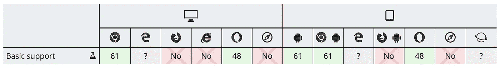
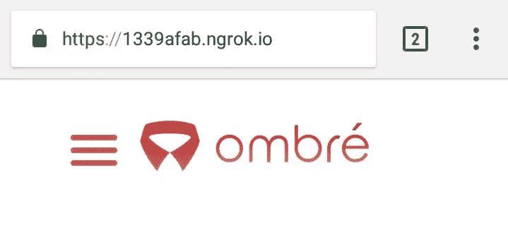
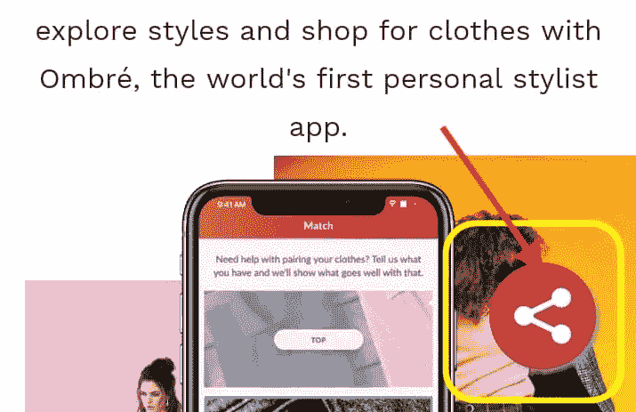
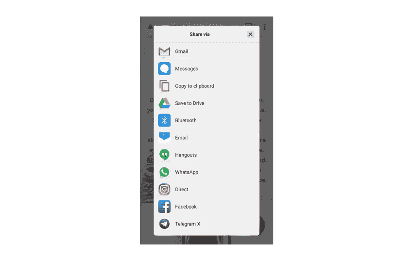

# Web 共享 API 教程——最酷但简单

> 原文：<https://medium.com/hackernoon/web-share-api-the-coolest-but-simple-e3bb7ec9bb02>

如今**网站世界**上最酷的[功能之一是网络共享](https://hackernoon.com/tagged/features) [API](https://hackernoon.com/tagged/api) ，这个功能提供了在网站上共享内容的能力，就像我们在本地应用程序上共享动作一样。

如果以前我们依靠像 **AddThis** 或 **ShareThis** 这样的小部件来共享网页内容，那么现在这个小部件已经可以被这个功能取代了。在我个人看来，Web Share API 提供的功能要好得多。

遗憾的是，这一功能只能在谷歌 Chrome 平台上享受，我真的希望未来所有的浏览器都能在他们的平台上实现这一功能。以下是更多细节:



Browser compatibility

# 如何使用 Web 共享 API

## 1.您的网站必须在 [HTTPS](https://www.chromium.org/Home/chromium-security/prefer-secure-origins-for-powerful-new-features) 提供服务

如果您正在开发过程中，并试图使用 https://来尝试您已经应用的功能，我推荐使用来自[http://serveo.net](http://serveo.net)的服务，只需在命令行中输入一条命令，您的网站就可以直接使用 https://服务，无需安装或注册，非常简单:

```
ssh -R 80:localhost:3000 serveo.net
```



I’m using ngrok already, need to do installation and registration 😭😭😭

## 2.您只能调用 API 来响应用户操作

您只能调用 API 来响应用户操作，比如单击(例如，您不能调用`navigator.share`作为页面加载的一部分)。

```
<button onclick="shareThis()" id="share">Share This</button><script>
function shareThis() {
  //call navigation.share();
}
</script>/**
* jQuery
*/
$("#share").click(**function**() {
  shareThis();
});
```



Invoke Web Share API on Share Button press.

我发现了一个很好的资源来处理 Web 共享 API:

Web Share API handling



Final Result!

# 结论

Web Share API 是谷歌 Chrome 提供的一个很酷的功能，但它不能在 Safari 等其他浏览器中实现。我建议你为其他浏览器提供额外的功能(例如，添加这个，分享这个，或者创建手动功能)，这样你的网站访问者仍然可以分享你页面上的内容。