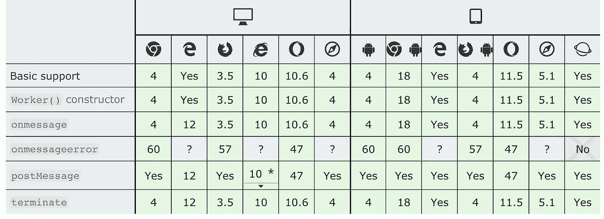
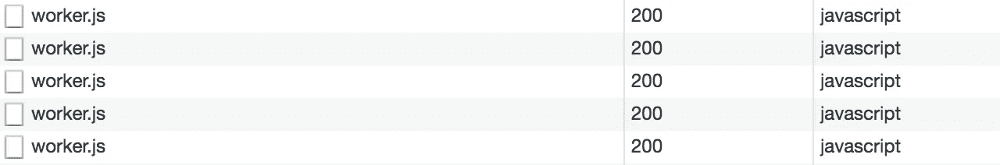

# React + Redux 应用程序中的 Web Workers

> 原文：<https://medium.com/hackernoon/web-workers-in-react-redux-application-129274e84a4e>


Photo by [Ben Konfrst](https://unsplash.com/photos/aysgVUqJaMw?utm_source=unsplash&utm_medium=referral&utm_content=creditCopyText) on [Unsplash](https://unsplash.com/?utm_source=unsplash&utm_medium=referral&utm_content=creditCopyText)

*在后台线程中运行脚本，在不干扰用户界面的情况下执行任务。*

我们都知道 JavaScript 代码在单线程中执行。这意味着代码将一行一行地执行，如果一个特定的任务需要很长时间才能完成，那么其他的事情都会被推迟到这个任务完成之后。如果我们想摆脱主要的威胁，网络工作者是怎么一回事。

# ☝️ **你应该知道的事情**

几乎所有浏览器都支持 Web Workers。为了更好地控制错误处理和向后兼容性，进行检查是一个更好的方法。

```
if (window.Worker) {

  ...

}
```



只创建一个实例，每次调用`new Worker('worker.js')`都要加载`worker.js`文件。所以，你可能会在网络上看到类似的东西。



# 反应+还原

用 Redux 更新存储很简单。因此，我们将有一个位置或一个文件，在那里我们创建一个工人实例，导出它并监听`onmessage`事件，当数据来自工人时，我们将调度一个事件。

在`worker.js`中，如果我们需要导入一些脚本到全球工人范围，我们可能会`importScripts`。在 Web Worker 中，你可以使用 [XMLHttpRequest](https://developer.mozilla.org/en-US/docs/Mozilla/Tech/XPCOM/Reference/Interface/nsIXMLHttpRequest) ，所以在下面的例子中，我导入了 [axios](https://github.com/axios/axios) 并将其用于 XHR 调用。`onmessage`每当有新消息通过 worker 冒泡时，就会调用 listener。方法向 worker 的内部作用域发送消息。

使用工作实例。导入已经存在的 Worker 并使用您想要传递给 Worker `worker.js`的数据调用`postMessage`方法

# 结论

Web Workers 是一个强大的 API，你绝对应该使用它。这是很好的背景同步，预取数据，光线跟踪。使用 web workers 会对 web 应用程序的性能产生重大影响。

# 📃有用的链接

*   [使用 Web Workers](https://developer.mozilla.org/en-US/docs/Web/API/Web_Workers_API/Using_web_workers)
*   [工人界面](https://developer.mozilla.org/en-US/docs/Web/API/Worker)
*   [使用 JavaScript Web Workers 进行计算](https://johnresig.com/blog/web-workers/)
*   [使用 Web Workers 加速您的 JavaScript 应用程序](https://blog.teamtreehouse.com/using-web-workers-to-speed-up-your-javascript-applications)
*   [网络工作者规范](https://html.spec.whatwg.org/multipage/workers.html)

👏**感谢您的阅读。欢迎提出建议、意见和想法**👍

**如果你喜欢这个，鼓掌，跟着我上** [**中**](/@shystruk)**[**推特**](https://twitter.com/shystrukk)**[**github**](https://github.com/shystruk)**与你的朋友分享**😎****