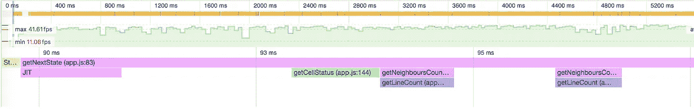

# WebAssembly，旅程

> 原文：<https://medium.com/hackernoon/webassembly-the-journey-a069d6ea18a>

大家好，我正在写一系列的帖子来展示我学习 WebAssembly 的旅程。我希望不久能带来更多这方面的文章。


在 2015 年的 BrazilJs conf 上，我观看了 Javascript 的创造者 [BrendanEich](https://medium.com/u/bcf2eaa79e8c?source=post_page-----a069d6ea18a--------------------------------) 的闭幕主题演讲，他谈到了 Js 的诞生、成长和发展。了解他的人都知道，他最著名的一句名言是“*永远赌 JS* ”，但在他演讲的最后，他说了一句让我难以忘怀的话:

> **一直赌 Js & WASM**

那是我第一次接触这个名字，但是 WebAssembly 是什么？这项技术试图解决的问题是什么？在那一刻，我开始了回答所有这些问题的旅程。

# 我们的概念证明

为了更好地理解这项技术，我和我的朋友兼开发人员 [Elia Maino](https://medium.com/u/7fb5087df4e4?source=post_page-----a069d6ea18a--------------------------------) 一起开发了一种算法，可以让我们比较 WASM 相对于普通 JS 的性能。

为了证明我们的概念，我们选择了 John Conway 的生命游戏作为本次概念验证的问题。这是一个零玩家游戏，有一些简单的规则。

*   世界是一个矩阵，每个单元可以有两种状态:`ALIVE`或`DEAD`。
*   唯一的外部输入是初始状态
*   当前单元与其水平、垂直和对角相邻单元的相互作用决定了特定单元的状态。
*   少于两个活邻居的活细胞死亡。
*   一个有两个或三个活邻居的活细胞可以存活到下一代。
*   具有三个以上活邻居的活细胞死亡。
*   正好有三个活邻居的死细胞变成活的。

因此，这里的计划是创建一个大矩阵，用随机值(0 或 1)填充它，发送这个初始状态并呈现结果，然后计算下一个状态并再次呈现它，重复最后一步几次。

我们计划用三种策略实现这个解决方案: **Vanilla JS、WebAssembly 和 Web workers** 。我们的算法在所有方法上的时间复杂度是 **O(n*m)** 其中 **n** 是我们世界的宽度，而 **m** 是它的高度。由于渲染对于所有方法来说都是相同的代码，所以我们不会在结果测量中考虑它。

# 香草 JS

该方法的基础架构在于创建新游戏，生成并发送第一状态(填充 0 和 1 的矩阵)给它。组件`game`存储这个状态并返回一个函数`next`,该函数在被调用时返回下一个状态。在这种情况下，我们从我们的`environment.js`文件中调用 getNextState()函数，这是普通的 JS 实现。

```
...const next = game(
  document.getElementById('game'),
  COLUMNS,
  LINES,
  createGameMatrix(LINES, COLUMNS), // generates the initial state
  strategy(
    STRATEGY,
    COLUMNS,
    LINES,
    initialConfig
  ) // Defines which strategy to use to calculate the next state
);...function loop() {
  next().then(() => {
    requestAnimationFrame(loop);
  });
};loop();
```

在`environment.js`组件中，我们不断地将问题分解成小的专门功能。这将有助于更容易地触发浏览器 JIT 编译器优化。我们将在下一篇文章中讨论这些优化。这些函数计算上面、旁边和下面的邻居的当前状态，覆盖所有边界的拐角情况。



The average speed of this state calculation varied from 9 to 4ms for a matrix of 800x450.

你可能想知道下一个状态的计算有这么多变化的原因，或者为什么有这么多函数？要回答这些问题，我们需要向您展示 JS JIT 编译器是如何工作的，以及这是如何让 JS 变得如此之快。[但这是下一篇文章](/p/dfa4081a6ffb)的主题。

# 链接

*   本文葡萄牙语版:[https://medium . com/@ WMS bill/web assembly-a-jornada-f 5 AEC 56 c 507 f](/@wmsbill/webassembly-a-jornada-f5aec56c507f)
*   Brendan Eich 年巴西闭幕主题演讲:[https://www.youtube.com/watch?v=bM79WQ9iMZQ](https://www.youtube.com/watch?v=bM79WQ9iMZQ)
*   约翰·康威生活的游戏:[https://en.wikipedia.org/wiki/Conway's_Game_of_Life](https://en.wikipedia.org/wiki/Conway's_Game_of_Life)
*   我们的 PoC Github 回购:[https://github.com/eliamaino-fp/webassembly-js](https://github.com/eliamaino-fp/webassembly-js)