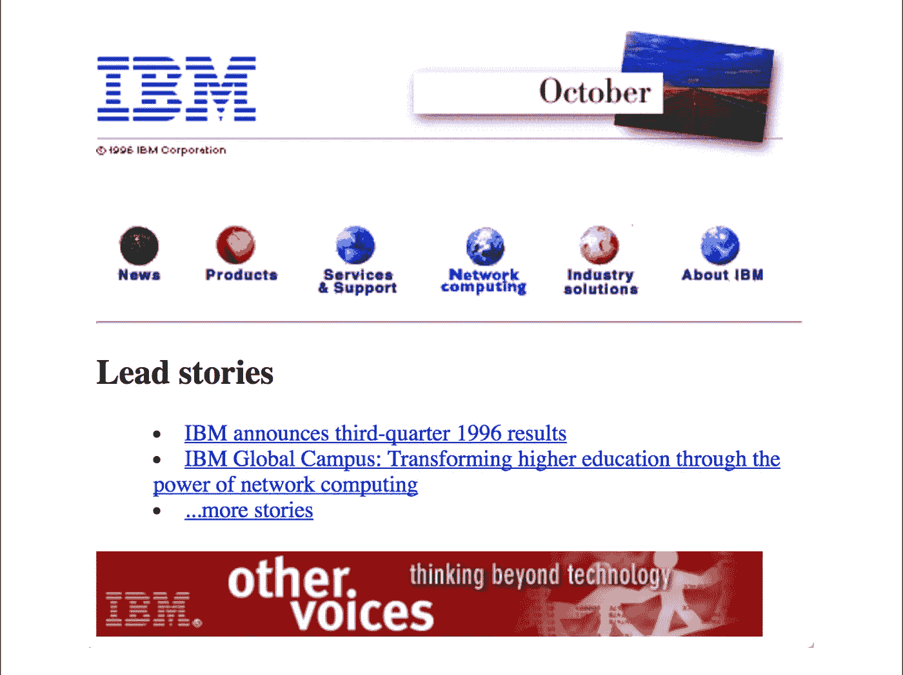
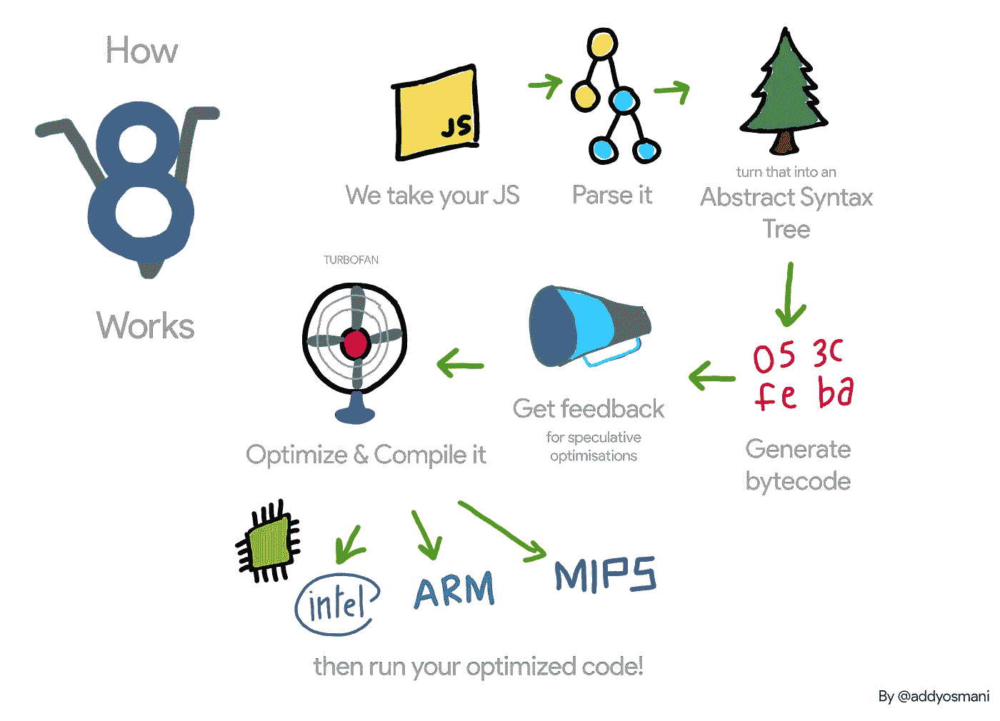

# WebAssembly，旅程— JIT 编译器

> 原文：<https://medium.com/hackernoon/webassembly-the-journey-jit-compilers-dfa4081a6ffb>

这是关于我们 WebAssembly 之旅的系列文章的第二部分。如果你从这篇文章开始，你可能想从[那里](/p/webassembly-the-journey-a069d6ea18a)开始。


[在上一篇文章](/p/webassembly-the-journey-a069d6ea18a)中，展示了我们测量 WebAssembly 的动机和概念验证，并解释了我们在 Vanilla JS 中的实现。为了继续理解为什么 WebAssembly 在理论上比 JavaScript 更快，我们需要先了解一点 JavaScript 的历史，以及是什么让它今天如此之快。

# 一点历史

JavaScript 由 Brendan Eich 于 1995 年创建，目标是成为一种设计者可以轻松实现动态界面的语言，换句话说，它不是为了快速而构建的；它的创建是为了在 HTML 页面上舒适而直接地添加行为层。



When JavaScript was introduced, this was how the internet looked.

最初，JavaScript 是一种解释语言，使启动阶段更快，因为解释器只需要读取第一条指令，将其翻译成字节码并立即运行。对于 90 年代的互联网需求，JavaScript 做得非常好。当应用程序开始变得更加复杂时，问题就出现了。

在 2000 年的十年中，像 Ajax 这样的技术使 web 应用程序变得更加动态，2004 年的 Gmail 和 2005 年的 Google Maps 是 Ajax 技术的一个趋势。这种构建 web 应用程序的新“方式”最终会在客户端编写更多的逻辑。在这个时候，JavaScript 必须在他的性能上有一个飞跃，这发生在 2008 年谷歌和它的引擎 V8 的出现，它立即将所有的 JavaScript 代码编译成字节码。但是 JIT 编译器是如何工作的呢？

# JavaScript JIT 是如何工作的？

总之，在加载 JavaScript 代码后，源代码被转换成一种称为抽象语法树或 AST 的树表示。之后，根据引擎/操作系统/平台，要么编译该代码的基线版本，要么创建字节码进行解释。

**分析器**是另一个需要观察的实体，它监视并收集代码执行数据。我将简要描述它是如何工作的，同时考虑到浏览器引擎之间的差异。

第一次，一切都通过解释者；这个过程保证代码在 AST 生成后运行得更快。当一段代码被多次执行时，作为我们的`getNextState()`函数，解释器失去了性能，因为它需要一遍又一遍地解释同一段代码，当这种情况发生时，分析器将这段代码标记为**热**并且**基线编译器**开始工作。

## 基线编译器

为了更好地说明 JIT 是如何工作的，从现在开始我们将使用下面的代码片段作为例子。

```
function sum (x, y) {
  return x + y;
}[1, 2, 3, 4, 5, '6', 7, 8, 9, 10].reduce(
  (prev, curr) => sum(prev, curr),
  0
);
```

当探查器将一段代码标记为热代码时，JIT 会将这段代码发送给基线编译器，后者会为这部分代码创建一个存根，同时探查器会继续收集关于这段代码使用的频率和类型的数据(以及其他数据)。当这个代码段被执行时(在我们假设的例子`return x + y;`中)，JIT 只需要再次获取这个编译过的代码段。当一个热代码以相同的方式(类似相同的类型)被调用多次时，它被标记为**热**。

## 优化编译器

当一段代码被标记为热代码时，**优化器编译器**会生成这段代码的更快版本。只有在一些假设的基础上，优化器编译器才会做出类似代码中使用的变量类型或对象形状这样的假设。在我们的例子中，我们可以说`return x + y;`的热代码将假定`x`和`y`都被类型化为`number`。

问题是当这个代码遇到了这个优化编译器没有预料到的事情，在我们的例子中是`sum(15, '6')`调用，因为`y`是一个`string`。当这种情况发生时，分析器认为它的假设是错误的，将所有内容都丢弃，再次返回到基本编译(或解释)版本。这个阶段被称为**去优化**。有时这种情况发生得如此频繁，以至于优化版本比使用基本编译代码要慢。

一些 JavaScript 引擎对优化尝试的数量有一个限制，当达到这个限制时就停止优化代码。其他如 V8，当它知道很有可能会优化失败时，会使用试探法阻止代码被优化。这个过程叫做**捞出**。

因此，总的来说，JIT 编译器的阶段可以描述为:

*   从语法上分析
*   编制
*   优化/去优化
*   执行
*   垃圾收集工



Example of JIT phases on V8 by [Addy Osmani](https://medium.com/u/2508e4c7a8ec?source=post_page-----dfa4081a6ffb--------------------------------)

JIT 编译器带来的所有这些进步使 JavaScript 比 2008 年在谷歌 Chrome 上出现之前更快，现在的应用程序更加健壮和复杂，这要归功于 Javascript 引擎的速度，但什么会使我们获得与 JIT 引入时一样的性能飞跃呢？我们将在下一篇文章中讨论它，那时我们将使用 WebAssembly，以及是什么使它可能比 JavaScript 更快。

## 链接

*   本文葡萄牙语版本:[https://medium.com/p/eef572899b5c](/p/eef572899b5c)
*   JIT 编译器速成班(em inglês):[https://hacks . Mozilla . org/2017/02/a-crash-course-in-just-in-time-JIT 编译器/](https://hacks.mozilla.org/2017/02/a-crash-course-in-just-in-time-jit-compilers/)
*   JavaScript 启动性能(em inglês):[https://medium . com/reloading/JavaScript-Start-up-Performance-69200 f43b 201](/reloading/javascript-start-up-performance-69200f43b201)
*   JavaScript 再入门(JS 教程):[https://developer . Mozilla . org/en-US/docs/Web/JavaScript/A _ re-introduction _ to _ JavaScript](https://developer.mozilla.org/en-US/docs/Web/JavaScript/A_re-introduction_to_JavaScript)