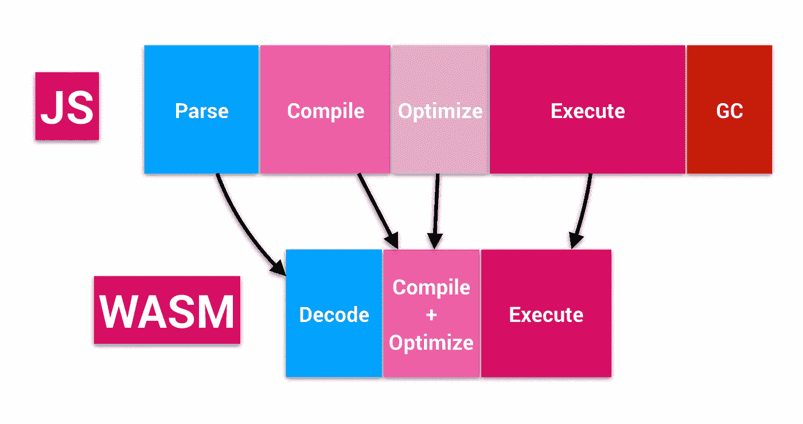

# WebAssembly，旅程——WASM 是什么？

> 原文：<https://medium.com/hackernoon/webassembly-the-journey-what-is-wasm-caf9871108aa>

本文是关于我们 WebAssembly 之旅的系列文章的第三部分。如果你从这篇文章开始，你可能想从[开始。](/p/webassembly-the-journey-a069d6ea18a)

在上一篇文章中，我们介绍了 JavaScript 是如何发展的，以及实时编译器(JIT)是如何在这种语言中工作的，从而加快了 JS 的执行速度。这个解释为我们比较 JavaScript 和 WebAssembly 的性能提供了基础。但是什么是 WebAssembly 呢？

## 什么是 WebAssembly？

WebAssembly 或 WASM 是一个二进制格式的**编译器目标**(编译器生成的代码)，它允许我们在浏览器上执行 C、C++和 Rust，性能接近本机代码。

WebAssembly 的一个令人兴奋的方面是，它不是 JavaScript 的替代品，而是与 JavaScript 一起工作。同时，这种组合可以提供类型化/编译语言的性能和 JavaScript 的灵活性。使用 JavaScript 上的 WebAssembly API，您可以在 JS 应用程序上加载模块 WASM，并在它们之间共享功能。

在上一篇文章中，在理解了 JavaScript 有多快之后，我们想知道哪种技术可以帮助我们实现 2008 年 JIT 带来的同样的性能飞跃。WebAssembly 就是这种技术。但是为了理解 WASM 代码为什么比 Javascript 更快，我们需要分析 JavaScript 引擎在概念上是如何处理这两者的。

*   **加载时间:**Javascript 代码下载比 WebAssembly 代码慢。它比较慢，因为`.wasm`格式是二进制的，正因为如此，它比`.js`类似的代码更紧凑。
*   **解析器:**不需要解析. wasm 代码。相反，浏览器解码 WASM 文件比解析 JavaScript 代码花费的时间少，因为 wasm 代码已经更接近机器码了。众所周知，解析 1MB 的 JavaScript 代码可能需要 1 秒钟；[二进制 AST 提议](https://github.com/binast/ecmascript-binary-ast)可以缓解 JavaScript 解析速度慢的问题，但这是另一篇文章的主题。
*   编译/优化。wasm 代码在生成二进制代码时得到优化，从而消除了在执行时间上花费时间的需要。JavaScript 不会发生这种情况，在 JavaScript 中，浏览器优化程序，而 JiT 编译器执行程序。WASM 上的编译时间仍然更快，因为这些预先的优化是在 WebAssembly 源代码上完成的。除此之外，浏览器正在实现流式 WASM 编译器，这将使编译时间比下载时间更快。
*   **执行:**正如上一篇文章所解释的，执行阶段不仅仅与代码执行有关。它包括 JIT 编译器进行的所有推测性优化，这是因为 JavaScript 代码的不可预测性。相反，wasm 代码不需要这些优化，因为它是从静态类型代码中生成的。它还使浏览器花费更少的内存，因为分析器不需要维护一个包含代码执行统计信息的表来优化它。
*   GC: We Assembly 还没有垃圾收集器。

为了形象化起见，JavaScript 和 WebAssembly 代码之间的生命周期比较理论上可以如下图所示:

Theoretically comparison between JavaScript and WASM code life cycle.

## 关于 WebAssembly 的常见误解

这些是我在人们讨论这个话题时看到的最常见的误解:

*   **WASM 是 JavaScript 杀手:** WebAssembly 不是用来取代 JavaScript 的。它的创建是为了完善性能对 web 应用程序至关重要的环境。
*   **WASM 是一种新的编程语言:**值得一提的是，WASM 是一种中间格式，二进制，是其他语言如 C、C++和 Rust 的编译器目标。尽管 wasm 有一个文本表示，但人们并不希望在它上面编程，因为人们并不希望在汇编中编码。
*   只有 C 或 Rust 程序员可以编写 WASM 代码:一旦 WebAssembly 增加了新的功能，对其他语言的支持就会到来，比如*垃圾收集器*。此外，还有一些新语言的项目，甚至是编译到 WASM 的 JavaScriot 的子/超集。

正如我们在上面和以前的文章中看到的，理论上 WASM 比 JavaScript 快，但是实际上它是怎样的呢？这是我们将在下一篇文章中发现的。

# 链接

*   什么是 web assembly:[https://developer . Mozilla . org/en-US/docs/web assembly/Concepts](https://developer.mozilla.org/en-US/docs/WebAssembly/Concepts)
*   二进制 AST，JS 提案说明:[https://github.com/binast/ecmascript-binary-ast](https://github.com/binast/ecmascript-binary-ast)
*   Javascript 启动性能:[https://medium . com/reloading/JavaScript-start-up-performance-69200 f43b 201](/reloading/javascript-start-up-performance-69200f43b201)
*   turbo script——编译成 https://github.com/01alchemist/TurboScript WASM 的 Javascript 超集:
*   Walt—web assembly 的 JavaScript 语法:[https://github.com/ballercat/walt](https://github.com/ballercat/walt)