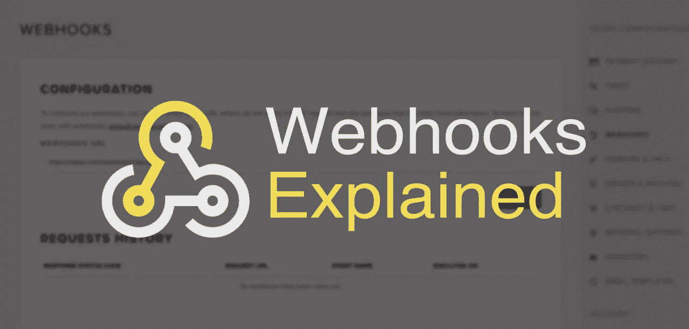
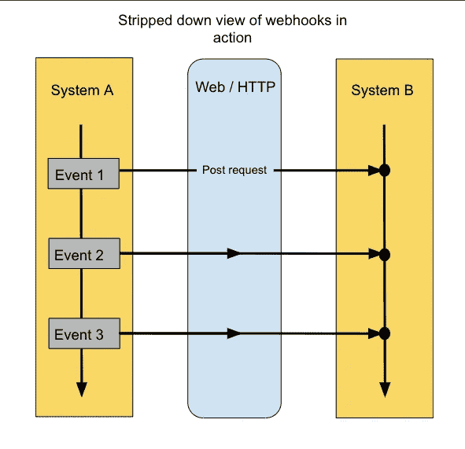
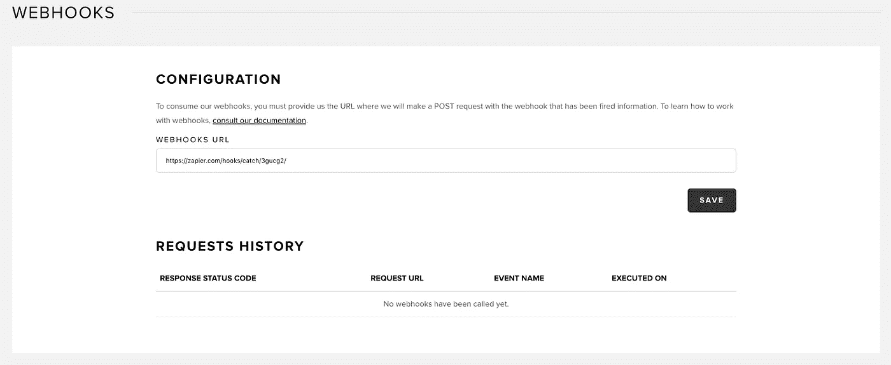
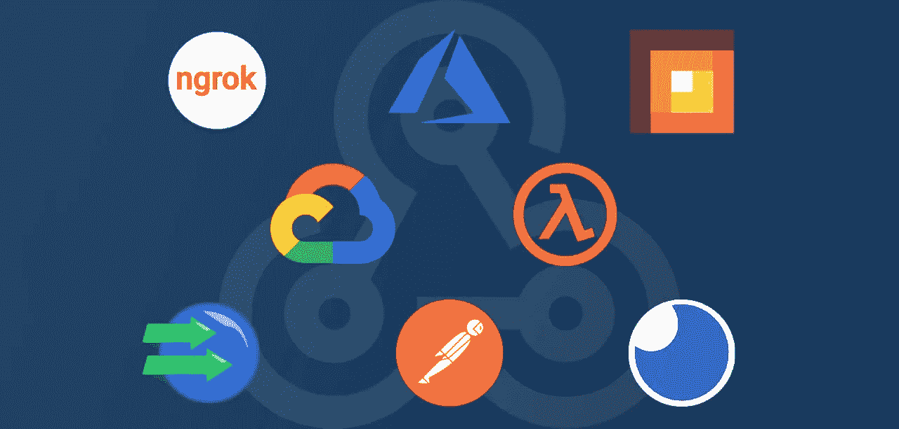
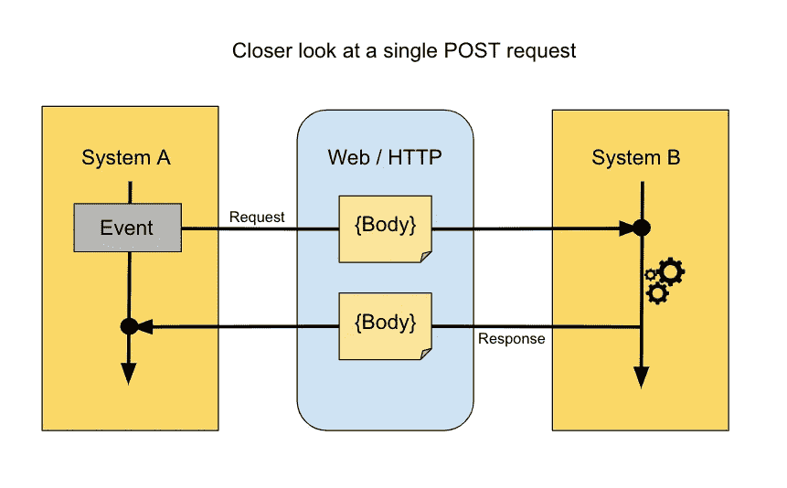

# Webhooks 解释了:它们是什么以及如何使用它们

> 原文：<https://medium.com/hackernoon/webhooks-explained-what-they-are-how-to-use-them-862169b82755>

Photo by [JJ Ying](https://unsplash.com/photos/PDxYfXVlK2M?utm_source=unsplash&utm_medium=referral&utm_content=creditCopyText) on [Unsplash](https://unsplash.com/search/photos/link?utm_source=unsplash&utm_medium=referral&utm_content=creditCopyText)

我们的神经系统真是一个奇迹。

想象一下我们的大脑……不断地向我们的身体传递信息。当我们需要吃饭、睡觉或把手从炉子上拿开时，会通知我们。

你能想象必须有意识地问你的大脑你是饿了、受伤了还是累了吗？

生活会变得不可收拾。

好消息是同样的自动化和通知系统也可以成为你的网络开发项目的核心。

一种方法是使用 webhooks。你可能经常使用它们，甚至不知道它们到底是什么。在这一点上，你甚至可能会把它们[和 API](https://snipcart.com/blog/apis-integration-usage-benefits)混淆。

因此，今天让我们花点时间来解释什么是 webhooks，以及如何利用它们来提升您的开发水平。

你会在这篇文章中发现什么:

*   webhook 定义
*   现实生活中的 webhook 示例
*   webhooks 集成的开发流程
*   开发工具列表
*   (略微)高级功能

相信我，戴夫·学徒，webhooks 会改变你的生活。

# 什么是 webhooks？

直截了当地说: **webhooks 是应用程序之间自动通信的一种方式。**

*   MailChimp 使用 webhook 将用户从您的网站注册到您的时事通讯中。
*   Paypal 用它来告诉你的会计应用程序你的客户什么时候付钱给你。
*   Shopify 提供 webhooks 来更新你的商务系统，这样你就不必手动输入新的交易细节。

类比很有用——我能想到的最简单的编程比较是 [**观察者模式**](https://en.wikipedia.org/wiki/Observer_pattern) 。

以**浏览器通知**为例。

当事件发生时，浏览器(主体)通知用户(观察者)，比如收到一封电子邮件。

观察者主体的这种动态性使得在事件驱动的系统中利用异步性变得非常容易。一旦你掌握了这一点，管理有大量用户交互的用例就容易多了。

不是用户*轮询*服务器询问状态是否改变，用户只能说:“嘿，你知道吗？你告诉我什么时候状态变了”。

**这种互动效率更高，但一开始设置和理解起来有点困难。**

让我们把这些知识转移到我们最初的主题:webhooks。

观察者模式可以在任何*事件驱动系统*中实现，但是 webhooks 仅限于****web**。这意味着它们必须通过 web 协议进行通信——几乎所有情况下都是 HTTP。**

> **事件驱动架构是一种促进事件的产生、检测、消费和反应的软件。事件可以定义为“状态的重大变化”**

# **webhook 是如何操作的？**

**您可以通过注册 URL 来注册一个 webhook，以便在给定事件发生时进行通知。这第一步通常通过 UI 或 API 来完成。**

**创建的路由包含事件发生后要执行的逻辑。**

**这样，系统不必知道需要执行什么的性质，它只需要跟踪要通知的路线。**

****

**它非常强大，因为一切都保持解耦。通过所选 URL 接收通知的系统 B 不仅知道另一个系统上发生的事件，而且还可以对其做出反应。**

**保存逻辑的路由必须可以通过 HTTP POST 请求访问。**

> **POST 请求是允许通过 HTTP 在请求体中传输信息的方法。**

**为什么特别要求张贴？正是因为它使您能够在请求中包含正文。它通常是一个简单的 JSON 对象，但也可以是一个 XML 文档(这总是在 webhook 文档中指定的，所以在开始尝试之前阅读它总是有好处的)。**

**直接在正文中，您会发现识别发生了什么事件的信息(见下面的第二个图形)。此外，它会告诉你哪个用户触发了它，在什么时间，以及更多的事件具体信息。**

**Webhooks 功能强大，因为它们可以是公共的，也可以是私有的。**

***Private* 这里的意思是只有特定系统的账号拥有者才能注册一个 webhook。在野外，任何人都无法追踪账户的活动。**

# **现实生活中的 webhook 示例**

**所有这些如何转化为现实生活？**

**让我们通过一个特定的 Snipcart [事件](https://docs.snipcart.com/webhooks/introduction)来展开 webhook 是如何操作的。对于我们面向开发者的购物车，webhooks 用于在购物车中发生事件时通知其他应用程序，例如新订单。**

> **注意:我在这里使用 Snipcart 的 webhooks 作为例子，因为我对它们了如指掌，但是这个例子适用于大多数 webhooks。**

**这个例子突出显示了`order.completed`事件。**

**你可以在这里看到[事件的`body`，也经常被称为`payload`。](https://docs.snipcart.com/webhooks/order-events#order-completed)**

**我现在不会创建一个服务器来运行任何实际的逻辑——我只是假设我有一个服务器。这里的目标是理解信息是如何流动的，以及它是如何被触发的(不是练习我们的服务器设置技能)。**

**假设您创建了一个名为`/completed`的 HTTP 服务器路由，并在 Snipcart 仪表板中注册了该路由:**

****

**所谓的 webhook **就是**包含要执行的逻辑的路由，在 Snipcart 的仪表盘中添加路由就是我们所说的“注册 webhook”**

**目前的关键问题是:**“这是如何触发的？”****

**好吧，让我们假设我是一个参观你的商店的顾客。我逛了一会儿，决定买一件产品。我经历了整个结账过程，订单通过。**

**Snipcart 的服务器可以快速检查是否注册了任何 webhook。在这里，`/completed`路线需要得到通知。为此，您可以创建一个包含订单信息的 HTTP 请求，并将它直接发送到 URL。**

**好了，Snipcart 这边的工作完成了；为您询问的事件通知您。**

**这很简单，但力量在于你从通知中得到什么。**

**这里的要点是要理解，因为您可以在通知之后执行您的逻辑，所以它不是静态的。它让你有机会在没有任何人类互动的情况下立即采取行动。**

**假设刚刚发生了一个`order.completed`事件，那么您可以使用 Snipcart 的[折扣 API](https://docs.snipcart.com/api-reference/discounts) 创建一个新的折扣代码，并通过电子邮件将新代码发送给刚刚从您的网站购买产品的客户。**

**可能性是无穷的。你甚至可以制作可定制的 t 恤，比如说，一旦下了订单，顾客的名字就会自动印在上面。**

**我希望你开始掌握 webhooks 的力量！**

# **webhooks 集成的开发流程**

**现在你已经知道它们是如何操作的了，下面是我个人的 webhook 开发流程，这样你就可以了解开发在现实生活中是什么样子。我还将与您分享我最喜欢的工具，帮助您启动旅程，同时在开发过程中节省大量时间。**

**首先要做的是:**

*   **正如我前面提到的，**总是事先阅读 webhook 文档。这听起来像是一个愚蠢的暗示，但老实说，当你开始感到舒适时，你可能会觉得你可以跳过这一步，从长远来看，这可能会花费你相当长的时间。****
*   **然后，**您需要检查事件是否真的被发送了**。 *RequestBin* 是一个方便的工具。您创建一个端点并将该端点注册为您的 webhook。该工具将收集发送到该路由任何请求，以便您可以检查它们。这是确认您可以注册路线并充分接收事件数据的简单方法。**

**这样做的时候，最好检查数据(请求体)是否对应于文档中显示的正确对象。一旦所有的事情都被确认，你就可以开始着手开发逻辑了！**

*   ****启动的一个简单方法是从本地开始**。你将能够在一个受控的环境中使用你想要的技术。但是，你很快就会碰到一个问题。您实现的逻辑在您的计算机上，外界无法访问。在保持安全的同时打开电脑的首选工具是 *ngrok* 。老实说，我认为每个开发人员都应该了解它，这对你的网站开发来说是一个巨大的价值。**
*   **现在，我通常不会打开一个现成的公共路径，因为在开发的时候我的逻辑并不是无懈可击的。因此，**我将模拟请求**来代替。为此，我将使用*邮递员*，或者街区里的新小子*失眠*。这两个都是简单但功能强大的 REST 客户端，可以让您手动伪造一个 HTTP 请求。不用等待实际的第三方事件触发您的逻辑，您将能够手动触发它。**

**如果您使用 RequestBin，正如前面所建议的，您将能够复制真实事件的主体来创建您的本地事件。这使得整个过程不那么做作，因为您将使用实际数据来测试您的逻辑。你可以自由地继续你的发展，只要你认为你有什么，就直接从邮递员那里发送伪造的请求。这样你的迭代会很快，你可以随时得到反馈。**

*   **一旦你对你所拥有的感到满意，你应该使用 ngrok 来测试实时数据。一旦一切测试正常，那就是你想要托管你的逻辑的时候了。有几种方法可以做到这一点:**

1.  **通过托管一个成熟的服务器。整个过程取决于使用的技术，所以我不会在这里涵盖如何操作。**
2.  **通过使用无服务器功能。因为 webhooks 逻辑通常保持简单明了，所以对他们来说这是一个完美的案例。重要的玩家有 *Webtask.io* 、 *AWS Lambda* 、*谷歌云*和 *Azure* 。**

> **无服务器功能在网络生态系统中越来越多的被使用，所以我肯定会仔细看看。如果您有兴趣更好地了解无服务器功能是如何运行的，请从[这里]开始(https://snipcart . com/blog/web task-baas-server less-tutorial)。**

# **Webhook 开发工具概述🛠️**

****

**这个列表重新组合了我在上一部分提到的工具。**

*   **Webhooks 的文档——特定于每个 webhook。**
*   **[RequestBin](https://requestbin.fullcontact.com/) — HTTP 请求检查器。**
*   **[ngrok](https://ngrok.com/) —安全本地测试。**
*   **[邮递员](https://www.getpostman.com/)或[失眠](https://insomnia.rest/)——休息客户。**
*   **[Webtask.io](https://webtask.io/) ， [AWS Lambda](https://aws.amazon.com/lambda/) ，[Google Cloud](https://cloud.google.com/functions/)&[Azure](https://azure.microsoft.com/en-ca/services/functions/)—无服务器功能。**

# **(稍微)高级 webhook 特性**

**我想我们有进展了，对吧？**

**可能是时候揭开我隐藏的细节了，不要让你太困惑。这些是稍微复杂一点的概念，但是如果你继续开发 webhook，它们会很快出现在你的面前。**

**webhooks 的一个显著的、强大的特性是，它们不仅通过 HTTP POST 发送通知，还可以用更多的信息来响应相同的请求。之前的例子不需要答案。然而，如果我们注册了，比方说，一个航运网络挂钩，它将是没有用的，没有回应。**

****

**例如，使用 Snipcart 的 [shipping webhook](https://docs.snipcart.com/webhooks/shipping) ，当有人为他的订单获取运费时，就会通知路线。期望然后得到运费回来作为一个答案。**

**这样，你是一个没有任何第三方参与，通过编程处理运费。如果您有各种定制运输规则要应用，这将非常有用。**

**过程和以前一样，但是您需要通过返回您希望在界面中显示的费率来回应请求。在这种情况下，费率必须在 JSON 对象或 XML 中定义。一旦最初的通知者得到答案，新的数据就可以用在他的流程中——在本例中，显示购物车中的运费。**

> **请记住，有些网页挂钩需要一个答案，有些不需要。如果它需要一个，而您没有提供，那么进程将一直闲置，直到请求超时，从而导致大量的等待时间。所以，请务必先阅读文档。；)**

****另一个低级 webhook 的特点是*认证*。您可能希望验证通知程序的身份，而由通知程序来提供验证方法。**使用 Snipcart，每个 webhook HTTP POST 请求都有一个名为“HTTP_X_SNIPCART_REQUESTTOKEN”的头条目。**

**您可以使用该字段的值来确保它确实来自 Snipcart。**

**为此，您只需在`https://app.snipcart.com/api/requestvalidation/{your_request_token}`使用您的 API 密钥向 Snipcart 的服务器发送一个新请求，它就会回答您令牌是否有效。**

**验证不是强制性的，但是为了安全起见，我强烈建议这样做。**

# **结束语**

**我希望这能成为关于 webhooks 的一篇全面的介绍性文章。我真正希望你从中得到的是他们能给你的开发游戏带来的好处。这概括起来就是更高的效率、扩展应用的能力以及轻松访问外部功能。**

**回到文章的第一部分，我使用了观察者模式的比喻。实际上，我的例子更接近于发布-订阅模式。对每个人来说，差异并不明显，解释它们的微妙之处超出了范围，但我认为如果你对这个话题感兴趣的话，分享一下[这篇关于这个话题的精彩文章](https://hackernoon.com/observer-vs-pub-sub-pattern-50d3b27f838c)会很棒。**

**关于 webhooks 我错过了什么？你认为它们是网站开发的重要组成部分吗？下面评论里讨论一下吧！**

***我最初在* [*Snipcart 博客*](https://snipcart.com/blog/what-are-webhooks-explained-example) *上发表了这篇文章，并在* [*我们的时事通讯*](https://us5.list-manage.com/subscribe?u=c019ca88eb8179b7ffc41b12c&id=3e16e05ea2) *上分享了它。***