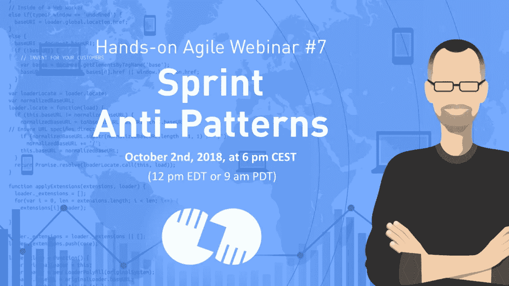
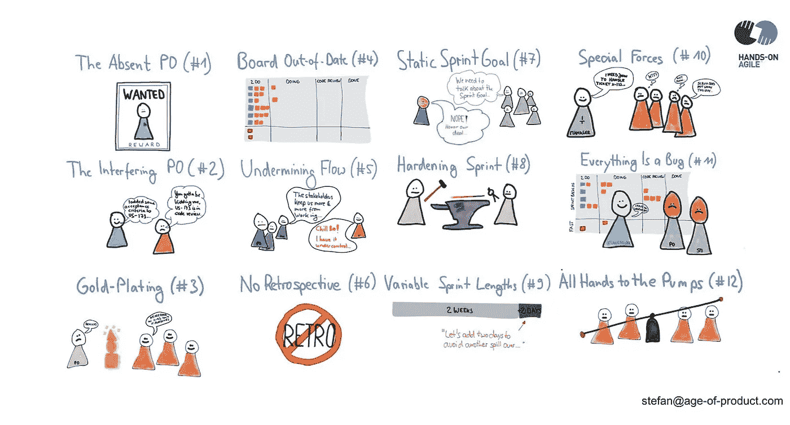

# 网络研讨会#7: Scrum Sprint 反模式

> 原文：<https://medium.com/hackernoon/webinar-sprint-anti-patterns-2fa8e6a27f2f>

# TL；DR:网络研讨会#7: Scrum Sprint 反模式

第七次实践敏捷网络研讨会 Scrum Sprint 反模式分析了 Scrum 团队通过避免典型的 Sprint 反模式来提高效率的 12 种方法。了解更多关于镀金，提供 Y 而不是 X，旷工，兼职，组织人而不是工作流。

# 更新 2018–10–30:在线研讨会 Scrum Sprint 反模式的重播已经发布

网上研讨会的视频现已发布:

**注意**:如果浏览器不能自动录像，点击这里直接在 Youtube 上观看[网上研讨会 Scrum sprint 反模式的重播。](https://www.youtube.com/watch?v=BfUxdqW0GOs&feature=youtu.be)

## 如果你喜欢这篇文章，帮我一个忙👏👏 👏多次—您的支持对我来说意味着一切！

***如果你更喜欢邮件通知，请*** [***注册我的每周简讯***](https://age-of-product.com/subscribe/?ref=Food4ThoughtMedium) ***，加入 19786 位同行。***

# 网上研讨会 Scrum Sprint 反模式:插曲

*   **第一集**涵盖了缺席的产品负责人:这意味着在 sprint 期间没有对开发人员的反馈，从而增加了无法达到 sprint 目标的风险。最好的产品待办事项清单细化不应该预先回答所有的问题——那样会太细，因此是浪费。一个成功的 sprint 完全是关于产品所有者和开发团队之间的实时协作。
*   第二集讲述了干涉的产品负责人:你可以改变 sprint backlog——如果开发团队同意的话——因为 sprint backlog 不是静态的。但是，产品所有者不能单独改变它，例如，增加它的范围。(如果您想考虑放弃当前的 sprint 作为其 sprint backlog 的变更，那么 sprint 取消是这个规则的例外。)
*   **第三集**涵盖了范围拉伸或者镀金:开发团队通过给 sprint backlog 项目添加不必要的工作来增加 sprint 的范围。例如，开发团队在没有事先咨询产品负责人的情况下扩大了一项任务。这种无知可能导致资源分配有问题，从而危及 sprint 目标的实现，并造成浪费。
*   **第四集**涵盖了过期的 sprint 板:开发团队没有及时更新板上的票，以反映他们当前的状态。无论是物理电路板还是数字电路板，它对于协调团队工作都至关重要。透明度是日常 Scrum 期间检查和适应的关键:谁需要帮助，我们实现 sprint 目标的计划是否仍然有效？一个最新的公告板也是 Scrum 团队与其利益相关者沟通的一个组成部分。一个不是最新的董事会将会影响利益相关者对 scrum 团队的信任:“如果他们已经不能解决一些棘手的问题，他们将如何交付软件？”信心的恶化可能会导致利益相关方采取反制措施。结果(管理)钟摆可能会摆回传统方法。从 Scrum 到 PRINCE II 的路是用废弃的木板铺成的。
*   **第五集**讲述了破坏 Scrum Master 的流程:Scrum Master 允许涉众在冲刺阶段扰乱开发团队的流程。例如，就开发团队的准入而言，SM 有一个自由放任的政策。或者 SM 不反对管理层邀请工程师作为主题专家参加随机会议。或者 scrum master 允许涉众或管理者将日常的 scrum 变成一个报告会议。
*   **第六集**涵盖了跳过的回顾:所有的 Scrum 事件对于团队的成功都是必不可少的——你不能跳过一个事件。初级 Scrum 团队可能会试图跳过回顾，以争取更多的时间来实现冲刺目标。接受这个“交易”的 Scrum Master 只是一个头衔上的 Scrum Master。这个提议已经表明了这个团队需要一个回顾会有多重要。
*   **第七集**涵盖了静态冲刺目标:根据 Scrum 指南，随着更多的了解，产品负责人和开发团队之间可能会澄清和重新协商范围。静态的冲刺目标是不存在的。
*   第八集讲述了强化冲刺:Scrum 团队决定进行一次强化或清理冲刺。这是一个简单的问题:在 Scrum 中没有所谓的强化冲刺。让我们重温一下 Scrum 指南:质量目标不会降低。因此，强化 sprints 通常是开发团队或(工程)组织采用敏捷原则程度较低的标志。如果你遇到这种反模式，问问你自己:开发团队是跨职能的吗？或者 QA 仍然是一个功能性的、非敏捷的筒仓？因此，建议强化 sprint 违反了 Scrum 的核心要素:坚持完成的定义。
*   第九集涵盖了可变的冲刺长度:scrum 团队将冲刺长度延长了几天，以满足冲刺目标。这个扩展只是烹饪敏捷书籍的另一种方式。请记住:sprint 的目标是在可用的时间内交付让客户满意的工作软件。停止欺骗自己，解决根本问题——为什么冲刺的结果没有及时达到冲刺的目标？—在下一次回顾展期间。
*   **第十集**讲述了特殊的 Scrum 力量:一个经理直接给工程师分配具体的任务，绕过产品负责人。或者，经理从 Scrum 团队中移除一名工程师来处理这样的任务。这种行为不仅违反了核心的 Scrum 原则。这也表明管理者不能放弃指挥和控制实践。他或她继续微观管理下属，尽管 Scrum 团队可以以自组织的方式完成任务。这种行为表现出一定程度的无知，可能需要更高管理层的支持才能应对。
*   **第十一集**讲述了“一切都是错误”的利益相关者黑客:利益相关者试图通过将任务重新标记为“严重错误”来加快他们问题的交付首先——不错的尝试！尽管如此，Scrum 主管应该解决涉众的问题，并指导他们“与 Scrum 团队进行有益的互动”正如佐科·威林克喜欢说的那样:领导力不是你宣扬的东西，而是你漏过的东西。当你这么做的时候:也要注意利益相关者试图通过直接把小任务交给开发人员来偷偷完成它们。
*   第十二集涵盖了所有人都全力以赴的时刻:管理层在危急情况下暂时放弃了 Scrum。这是对敏捷实践不信任的典型表现，是由命令控制思维助长的。可以说这是一个航海的好天气。最有可能的是，取消 sprint 并开始一个新的 sprint 来解决手头的问题也能解决这个问题。
*   **最后一集**总结了 sprint 反模式的肮脏一打:从镀金，交付 Y 而不是 X，到旷工，兼职，组织人而不是工作流。不要错过接下来的动手敏捷迷你系列，订阅这个 Youtube 频道。

# 📺加入 Youtube 上的 825 多名敏捷同行

现已在 Youtube 产品年龄频道上发布:

*   🛑 [Scrum Sprint 反模式](https://el2.convertkit-mail.com/c/preview/3wcphkh6/aHR0cHM6Ly93d3cueW91dHViZS5jb20vd2F0Y2g_dj1CZlV4ZHFXMEdPcyZmZWF0dXJlPXlvdXR1LmJl)
*   [敏捷失败模式 2.0](https://www.youtube.com/watch?v=-RXQLVhIuJg&t=6s)
*   [产品所有者反模式](https://www.youtube.com/watch?v=VnopIzbRJ8k&t=12s)

# ✋不要错过:加入 4100 多个强大的“动手敏捷”Slack 社区

我邀请你加入[“手把手的敏捷”Slack 社区](https://goo.gl/forms/LObbRtSF9vvxN3CL2)，享受来自世界各地的敏捷实践者的快速增长、充满活力的社区带来的好处。

如果你现在想加入，你现在所要做的就是[通过这个谷歌表格](https://goo.gl/forms/LObbRtSF9vvxN3CL2)提供你的证书，我会帮你注册。对了，**免费的。**

# 🎓你还想这样多读书吗？

好吧，那么:

*   📰*加入 19786 位同行和* [*报名我的每周简讯*](https://age-of-product.com/subscribe/?ref=Food4ThoughtMedium)
*   🐦*关注我的* [*推特*](https://twitter.com/stefanw) *订阅我的博客* [*产品时代*](https://age-of-product.com)
*   💬*或者，免费加入* [*Slack 团队【动手敏捷】的 4100 多位同行。*](https://goo.gl/forms/XIsABn0fLn9O0hqg2)

[网络研讨会#7: Scrum Sprint 反模式](https://age-of-product.com/scrum-sprint-anti-patterns/)首次发表于 Age-of-Product.com。