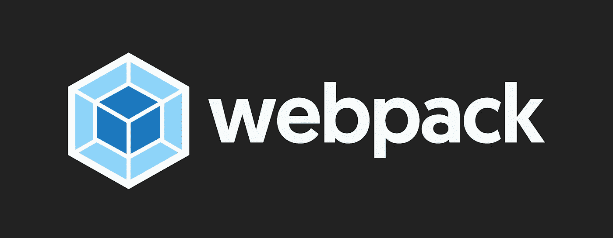
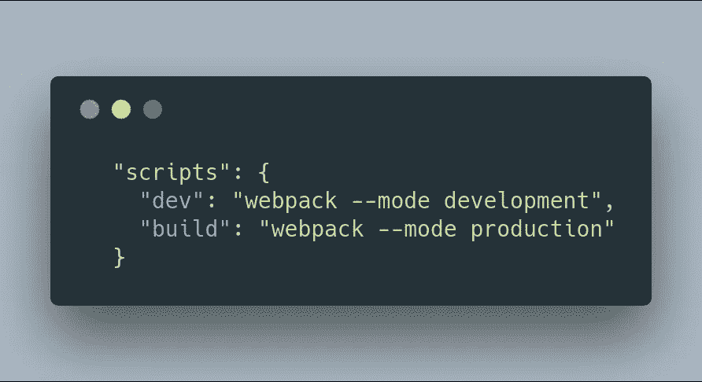
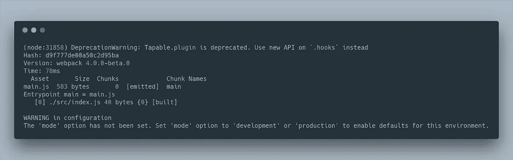

# Webpack 4 教程:所有你需要知道的，从 0 Conf 到生产模式

> 原文：<https://medium.com/hackernoon/webpack-4-tutorial-all-you-need-to-know-from-0-conf-to-production-mode-d32759d0dc2d>



webpack 团队正在努力开发下一代流行的模块捆绑器: **webpack 4** 。

以下帖子是一个活生生的**对 webpack 4** 的介绍。一旦有新的消息，我会及时更新。请继续关注我的博客了解更多！

# 作为零配置模块捆绑器的 webpack 4

webpack 功能强大，有很多独特的特性，但是它的一个痛点是**配置文件**。

在中型到大型项目中，为 webpack 提供一个配置并不是一件大事。没有一个就活不下去。然而，对于较小的应用程序来说，这有点烦人，尤其是当你想启动一些玩具应用程序的时候。

这就是为什么[包裹获得了很大的牵引力](https://www.valentinog.com/blog/tutorial-react-parcel-bundler/)。

Sean 和 webpack 团队将改变这一点: **webpack 4 默认情况下不需要配置文件**！

让我们试试看。

创建一个新目录并移入其中:

```
mkdir webpack-4-quickstart && cd $_
```

通过运行以下命令初始化 package.json:

```
npm init -y
```

现在我们来看看 webpack 4。

```
npm i webpack --save-dev
```

我们还需要 **webpack-cli** ，它是一个独立的包:

```
npm i webpack-cli --save-dev
```

现在打开 [package.json](https://docs.npmjs.com/files/package.json) 并添加一个构建脚本:

```
"scripts": { 
   "build": "webpack" 
}
```

关闭文件并保存。

尝试运行:

```
npm run build
```

看看会发生什么:

```
ERROR in Entry module not found: Error: Can't resolve './src' in '~/webpack-4-quickstart'
```

webpack 4 正在寻找**中的入口点。/src** ！如果你不知道这是什么意思，去看看我之前写的关于从吞咽到网络包转换的文章。

简而言之:**入口点**是 webpack 寻找的文件，用来开始构建您的 [Javascript](https://hackernoon.com/tagged/javascript) 包。

在 webpack 的早期版本中，入口点必须在名为 webpack.config.js 的配置文件中定义。

但是从 **webpack 4 开始，不需要定义入口点**:它需要**。/src/index.js** 为默认！

测试新功能很容易。创建`./src/index.js`:

```
console.log(`I'm a silly antry point`);
```

并再次运行构建:

```
npm run build
```

您将在`~/webpack-4-quickstart/dist/main.js`获得捆绑包。

什么？等一下。没有必要定义输出文件？没错。

在 **webpack 4 中，既不需要定义入口点，也不需要定义输出文件**。

我知道对很多人来说这并不令人兴奋。Webpack 的主要优势是代码拆分。但是相信我，拥有一个零配置[工具](https://hackernoon.com/tagged/tool)可以加快速度。

所以这里是第一个消息: **webpack 4 不需要配置文件**。

它会在**看起来。/src/index.js** 作为默认入口点。而且，它会把**里的捆绑吐出来。/dist/main.js** 。

在下一节中，我们将看到 webpack 4 的另一个好特性:**生产和开发模式**。

# webpack 4:生产和开发模式



拥有两个配置文件是 webpack 中的常见模式。

典型项目可能包括:

*   用于开发的**配置文件**，用于定义 webpack 开发服务器和其他东西
*   用于生产的**配置文件，用于定义 **UglifyJSPlugin** 、sourcemaps 等**

虽然更大的项目可能仍然需要 2 个文件，但在 webpack 4 中，您不需要一行配置就可以完成。

为什么

webpack 4 引入了**生产**和**开发**模式。

事实上，如果你注意一下`npm run build`的输出，你会看到一个很好的警告:



*尚未设置“模式”选项。将“模式”选项设置为“开发”或“生产”以启用此环境的默认值。*

那是什么意思？让我们看看。

打开 [package.json](https://docs.npmjs.com/files/package.json) 并如下填充脚本部分:

```
"scripts": {
    "dev": "webpack --mode development",
    "build": "webpack --mode production"
  }
```

现在试着跑:

```
npm run dev
```

且看一看**。/dist/main.js** 。你看到了什么？是的，我知道，一个无聊的包裹…没有缩小！

现在试着跑:

```
npm run build
```

且看一看**。/dist/main.js** 。你现在看到了什么？一个**缩小的捆绑**！

是啊！

**生产模式**支持开箱即用的各种优化。包括缩小，范围提升，摇树等等。

另一方面，开发模式针对速度进行了优化，只不过提供了一个未缩小的包。

那么下面是第二个消息:webpack 4 引入**生产**和**开发**模式。

在 webpack 4 中，您不需要任何配置就可以完成！只需定义`--mode`标志，您就可以免费获得一切！

敬请期待！更多即将推出…

这是对 webpack 4 的生动介绍。敬请关注 [*我的博客*](https://www.valentinog.com/blog/webpack-4-tutorial/) *了解更多！*

# webpack 4:资源

教程的 Github repo = >[web pack-4-quick start](https://github.com/valentinogagliardi/webpack-4-quickstart)

我知道已经有一个很棒的 webpack 列表，但这是我的:一个关于 webpack 4 的很棒的资源列表=> [awesome-webpack-4](https://github.com/valentinogagliardi/awesome-webpack-4)

*原载于 2018 年 1 月 19 日*[*www.valentinog.com*](https://www.valentinog.com/blog/webpack-4-tutorial/)*。*