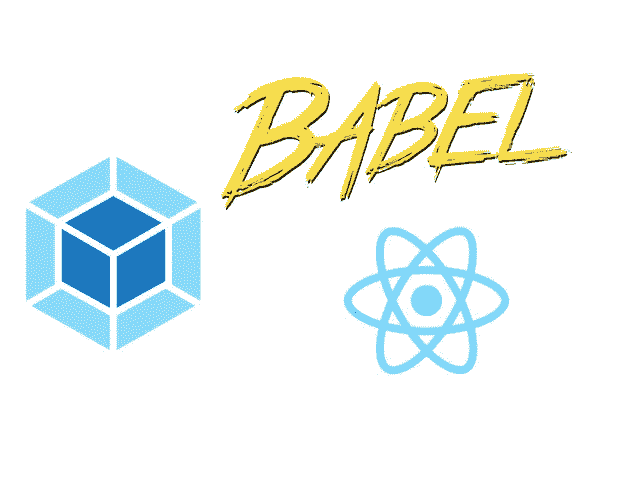
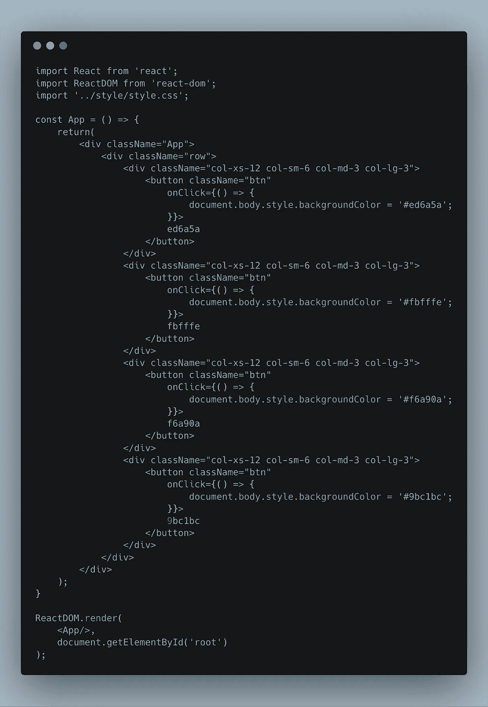

# Webpack、Babel 和 React 从零开始——但为什么呢？

> 原文：<https://medium.com/hackernoon/webpack-babel-and-react-from-scratch-but-why-889a385ff32f>



Webpack, Babel, and React

在研究生院和其他事情之间，我一直在深入挖掘 JavaScript 生态系统。作为一个热爱 React 的人，我对*的 create-react-app* 产生了好奇。在您的命令行上使用一个简单的*NPM install-g create-React-app*，您将能够安装最流行的 React starter pack。然而，你有没有想过 *create-react-app* 是如何工作的？或者他们如何让这些应用在网络请求相对较小的浏览器上快速运行？也许也许在运行 *npm run build* 之后捆绑和生成静态文件是如何发生的？这些东西耐人寻味。在这些开源项目的神秘面纱下，是简单的代码行，你我都可以学习和理解。

我决定在 webpack 和 babel 的帮助下从头开始构建一个 React 应用程序，并将其部署到 Netlify。你可以查看我的 GitHub 回购[这里](https://github.com/jsphbtst/react-webpack-simple)。我还在这里部署了静态站点来实现[。](https://agitated-hoover-cdafcd.netlify.com/)

对于这个项目，我们将制作一个简单的 React 应用程序，通过点击按钮来改变网页的背景颜色。开始在脑海中想象那会是什么样子。我们需要基于类的组件还是功能组件？onClick 会怎么做？你需要国家吗？

当你在考虑这些事情的时候，是时候设置 webpack 和 babel 了。确保您的计算机上安装了 Node，并遵循以下命令。这将包括创建一个名为 *react-webpack-simple* 的新文件夹——或者您真正想要的任何名称——并运行 *npm init* 。继续安装下面列出的库。

```
mkdir react-webpack-simple
cd react-webpack-simple
npm init
npm install --save-dev @babel/core @babel/preset-env @babel/preset-react babel-loader
mkdir src
cd src
touch index.html index.js
cd ..
```

*Babel-core* 用于将 ES2015+代码转换成向后兼容版本的 JavaScript。@ *babel/preset-env* 和 *@babel/preset-react，*则是一组分别支持 babel 和 react 功能的插件——它们在后台为我们做了很多繁重的工作。最后， *Babel-loader* 传输我们的 JavaScript 代码，给出我们已经设置好的所有预置。

转到您的目录的根目录，在我们的例子中是 *react-webpack-simple，*并创建一个名为*的文件。babelrc* 。在这个文件中，我们将定义 Babel 将使用的所有预设。如上所述，那就是 *@babel/preset-env* 和 *@babel/preset-react* 。


*.babelrc*

太好了！我们正朝着完成这个项目最难的部分缓慢前进——相信我，反应是最容易的部分。现在在根文件夹中创建一个名为 *webpack.config.js* 的新文件。这是 Webpack 的配置文件。记住，在它的核心，Webpack 只是一个模块捆绑器。不同的项目有不同的目标，这需要不同类型的方法来为生产中的文件提供服务。我们希望 css 文件在主 html 文件中有一个样式标签吗？我们要启用缓存吗？这是所有奇迹发生的地方。

但是首先，webpack 有一些你需要熟悉的核心概念——你可以在[文档](https://webpack.js.org/concepts/)中读到它们。入口，顾名思义，是 webpack 开始构建其内部依赖图的入口点。任何不是进口的东西，在我们的例子中，在*。/src/index.js* 将不会是该图的一部分。确保您的 JavaScript 文件和其他文件被正确导入。另一方面，输出是 webpack 转储它创建的所有包的地方。由于 webpack 只能理解 JavaScript 或 JSON，所以必须有一些函数或“中间件”来帮助 webpack 理解静态图像、css 文件等内容。这些“中间件”是在加载器中定义的，webpack 将使用这些“中间件”来理解这些非 JavaScript 和 JSON 文件，以便正确地将这些文件放入内部依赖图中。最后，插件通过在捆绑过程、资产管理和其他方面提供帮助来帮助加载程序。

```
// Install these dependencies before writing webpack.config.jsnpm install --save-dev html-webpack-plugin mini-css-extract-plugin react react-dom
```

下面的 *webpack.config.js* 文件就是上面理论的应用。VENDOR_LIBS 包含了我们在 react 应用程序中需要的所有库。我们创建这个数组是因为我们不想马上加载所有的库——那样会耗尽网络请求。相反，如果我们按需加载这些库会更好。

*【姓名】。您看到的[chunkhash].bundle.js* 格式是用于缓存的。为了增加用户体验，我们不希望我们的用户每次加载我们的站点时都下载应用程序中使用的依赖项。如果所述依赖关系以某种方式被缓存，那么每次访问时加载网站会更快，因为我们的用户在过去已经下载了那些依赖关系。如果我们进行更新，那么用户只需要下载新版本，而不是从头开始。


webpack.config.js

在模块部分， *babel-loader* 用于传输 JavaScript 代码。还记得我说过的非 JavaScript 代码吗？HTML 和 CSS 文件是非 JavaScript 文件，所以 *html 加载器*和 *css 加载器*被用来帮助处理这些文件。测试只是意味着如果一个文件以[在此插入扩展名]结尾，webpack 将使用[在此插入加载程序]。例如，如果一个文件以 *html* 结尾，webpack 将使用 *html-loader。*

在插件部分， *HtmlWebpackPlugin* 用于从 HTML 文档导入 JavaScript 文件——每次构建项目时，手动更新脚本标记的名称(注意那些散列值)会很麻烦。同时，*minicsextractplugin*用于为导入 CSS 文件的每个 JavaScript 文件生成单独的 CSS 文件。最后，*网络包。DefinePlugin* 用于为生产准备我们的项目——React 在生产和开发中的表现不同。

还和我在一起吗？我们要做的最后一个 webpack 配置是使用 npm 下载 *rimraf* 和 *webpack-dev-server* 。rimraf 是一个库，它可以让我们删除以前的构建文件，并用新的替换它们。这样，我们就不会因为旧的构建文件和新的构建文件而使我们的工作空间变得混乱——那样会变得令人困惑。webpack-dev-server 用于开发目的，因为每次代码更改都会自动刷新浏览器，使开发变得更容易，而不是每次都构建您的项目并不时打开*index.html*。另外，将 package.json 的*脚本*修改为如下内容。 *npm 运行构建*将创建构建文件，而 *npm 运行启动*将启动开发服务器。

```
// Don't forget to run npm install --save-dev rimraf webpack-dev-server first
"scripts": {
    "clean": "rimraf dist",
    "start": "webpack-dev-server --open --mode development",
    "build": "NODE_ENV=production npm run clean && webpack -p"
}
```

在所有这些修补之后，你的文件夹结构应该看起来像这样。注意, *dist* 文件夹包含我们的构建文件。当我们输入 *npm run build* 命令时，这个文件夹会自动生成。


Your folder structure

从现在开始就很简单了。*index.html*包含以下代码:


如果你以前用过 *create-react-app* ，那么带有*根* id 的 **div** 标签应该看起来很熟悉。注意这篇文章不是关于学习 React，因为我假设你已经知道如何使用这个框架。下面是我们将使用的 React 代码。它使用 Bootstrap 3 并在 DOM 上呈现四个按钮，每个按钮对应不同的背景颜色变化。



这是一个漫长的过程，但值得努力！进入终端，输入 *npm run build，*将 *dist* 文件夹中的*index.html*文件拖放到你首选的 web 浏览器中，你应该就可以了！我在 Netlify 中部署了我的项目，正如我在这篇博文中提到的，这允许我只需将我的静态文件拖放到 dist 文件夹中，等待几秒钟，就可以看到它被部署了。

展望未来，我将从头开始构建更多这样的应用程序，以研究所有正在发生的事情。我们在这里建立的是一个静态网站，不使用后端服务器。我将构建的下一个项目将包括一个节点后端，也许还包括套接字，以使它实时。迭代的过程意味着添加更多的功能，但也意味着更多的研究，以了解我到底在做什么。学习永不停止。