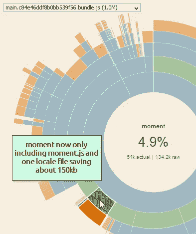

# Webpack 捆绑包分析——所有 React、Angular、Vue 应用程序开发人员的必要步骤！

> 原文：<https://medium.com/hackernoon/webpack-bundle-analysis-a-necessary-step-for-all-react-angular-vue-application-developers-fe6564fa62ca>

如果您试图创建一个现代的高性能 web 应用程序..那么很有可能你正在直接或间接地使用 Webpack！

你在用 [CRA(创建-反应-应用)](https://github.com/facebookincubator/create-react-app/)来反应吗？你正在使用 [Angular-CLI](https://github.com/angular/angular-cli/) 启动你的 Angular 应用程序吗？您是否正在使用 [Vue-cli](https://github.com/vuejs/vue-cli) 来初始化您的 Vue 应用程序？

如果你对以上任何一个问题的回答是肯定的，那么你正在后台使用 webpack！

webpack 遵循其解析逻辑并生成包。捆绑的过程非常灵活，可以适应各种 js 文件和捆绑格式，如 cjs、es 模块、amd、umd 等。然而，由于这种灵活性，如果您不知道要向 webpack 发送什么类型的模块，副作用可能是意外地捆绑更多的代码。**这就是为什么——我们 webpack 的用户应该分析并深入了解我们的捆绑包中真正包含了什么。**

我们应该询问每个模块的存在及其适用性，它在特定包中的存在以及跨包的存在等。但通常情况下，中等复杂程度的角度应用很容易包含 1000–1500 个模块，因此..如果一个人试图浏览生成的模块，他/她将会失去几天的时间！

幸运的是，webpack 自带了自己的`--json`选项和[分析器](https://webpack.github.io/analyse/)来让你自己可视化 json。有几个非常[有用的](https://chrisbateman.github.io/webpack-visualizer/) [插件](https://github.com/th0r/webpack-bundle-analyzer)也提供了它们自己的可视化，我发现这对理解我的包的内容非常有用！今天，我将介绍我的一次应用程序捆绑包调优体验！

所以—当我被要求帮助提高应用程序的性能时，我被告知主页需要 40 秒才能响应！对我来说，这有点太慢了。而且首页其实并没有很多内容，应该用*那么*长！

# 迭代 0

于是我开始分析。接下来是一系列的截图和修复建议..

我首先创建了一个 json 文件，并将其加载到 Chris bateman 的可视化工具中。

这是我看到的报告！

Iteration 0— AS-IS code analysis

有了这些信息，我可以立即看到我实现更好的 TTI 的第一个机会。4.2MB 软件包。我向[解释了我的团队使用 LazyLoading 技术](https://alligator.io/angular/lazy-loading/)的路线，很快我得到了一个新的代码。我还检查了应用程序的网络选项卡，发现网络服务器没有使用 gzip [内容编码头](https://httpd.apache.org/docs/2.4/mod/mod_deflate.html)..网络服务器配置的一个非常基本的步骤。我指示我的团队解决这个问题。

# 迭代 1

新的图表如下。

First improvement — 6 bundles instead of one. main bundle is now 1/3 of the original size!

现在，我想集中精力并理解主包中的内容。虽然从 4.2MB 到 1.8MB(非 gzip)是一个很大的改进，但我仍然觉得在第一页下载 1.8MB 仍然是相当多的代码。因此，我在上面截图的下拉列表中选择了 main bundle，并检查了该 bundle 中的内容。下面是我看到的…

## 我的观察:

1.  总体而言，97%的代码来自 node_modules(本质上是库)
2.  Angular 的各种模块占用了 55%的空间，大约 1MB。
3.  Moment.js locales 文件夹占用了 150KB
4.  Lodash 在多个模块中添加，每个模块占用 50–70KB。
5.  D3 是通过`import * as d3 from 'd3';`导入的，这意味着我们包含了整个 D3.js 库，即使我们没有使用所有的特性。
6.  整个应用程序的 16%(或 300 kb)——显示在 node_modules 下的实际上是应用程序样式表，它是主包的一部分。我不确定样式表是否应该那么大。

所以我决定进一步调查款式..

经过检查，我发现我的每个样式表文件都非常大，每个文件有 35kb 以上！我还看到我们在主包中包含了不相关的样式表。

在这个节骨眼上，我打开编辑器，开始检查 SCSS 的文件。我立即看到一个不正确的 scss 导入被添加到所有 SCSS 文件的顶部，导致每个 SCSS 文件如此之大。

我也通过检查其他包确认了这个问题！

Other bundles also were showing large file sizes for scss files.

我要求我的团队首先优先修复 SCSS 导入，因为它影响了所有的包。

# 迭代 2

下一次迭代立刻变得更好。

All the bundles now have 1–3% CSS code — which is somewhat to my expectation.

现在，我要求我的团队专注于移除 momentjs 语言环境、lodash 树抖动、D3 树抖动和 Angular AOT 编译，以便 Angular 编译器不会包含在应用程序代码库中。

新建筑现在真让我满意！

open each image to see specific improvements.

## 实现上述改进的配置修复摘要

*   对于 Lodash —我们只需要将`lodash-webpack-plugin`添加到 webpack 配置中。
*   对于 momentjs——我们需要使用`context-replacement-plugin`来仅[包括我们想要的特定时刻的地点](https://github.com/jmblog/how-to-optimize-momentjs-with-webpack)。
*   对于 D3 —我们需要从 D3 导入特定的导入(适用于 D3 v4+)。
*   对于 AOT 版本—最新版本的 Angular-CLI `ng build --prod`已经支持 AOT。

作为总结，下表显示了第一个页面包的大小随着迭代的进行而下降..

By final iteration — first page download size came down by 90%!

# 主要改进

**迭代 1** — SCSS 进口固定。web 服务器中添加了 GZip 内容编码

**迭代 2** — Momentjs，D3，Lodash 修复，AOT 编译

# 更多改进想法

*   不要使用 D3+C3/nvd 3/酒窝组合，至少在你的主页上。在撰写本文时， [C3](https://github.com/c3js/c3/blob/master/package.json#L41) [nvD3](https://github.com/novus/nvd3/blob/master/package.json#L24) 不使用 D3 v4，因此不能使用 D3 v4 采用的 ES 模块。这意味着，您可以通过 D3+C3/nvD3 组合轻松地将大约 150kb 添加到您的捆绑包中。我宁愿推荐[chart ist](https://gionkunz.github.io/chartist-js/)——一个非常小的(10kb)基于 SVG 的图表库(至少在主页上)。
*   类似地，我们真的应该尝试去掉 moment 并使用 [date-fns](https://github.com/date-fns/date-fns/) 库..这是一个漂亮的日期操作库，并提供 es 模块，因此它节省了 JS 文件的大小。现在 moment.js 的时钟是 51kb，没有树摇动的可能。
*   尽快升级 Angular-CLI v1.5 和 angular v5.0+以利用 Angular CLI 的[构建优化器](https://blog.angular.io/version-5-0-0-of-angular-now-available-37e414935ced)功能进一步压缩您的软件包。
*   升级到 Webpack 4(当可用的时候)通过[大](https://twitter.com/TheLarkInn/status/938188174794223616) [余量](https://twitter.com/TheLarkInn/status/938198701738147841)来提升你的树摇！

# 总结:

*   Webpack 是一个非常棒的超级灵活的捆绑库。但是人们必须注意通过 webpack 捆绑的是什么类型的库。
*   这可能会对应用程序包的大小产生很大的影响，从而影响第一个页面的加载和解析时间。
*   有多种工具可以帮助您可视化 webpack 的 json 输出，并得出优化策略。

# 连接

请在[媒体](/@dharapvj)、[推特](https://twitter.com/dharapvj)上鼓掌、评论、关注，保持联系，进行精彩的技术对话！