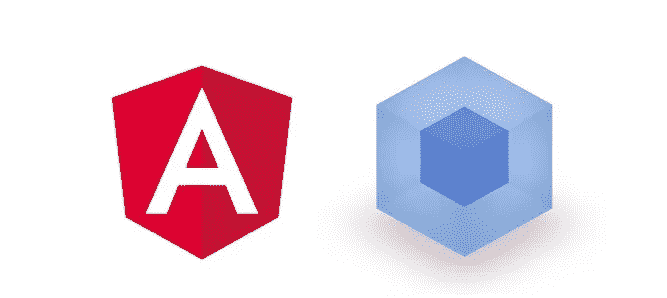
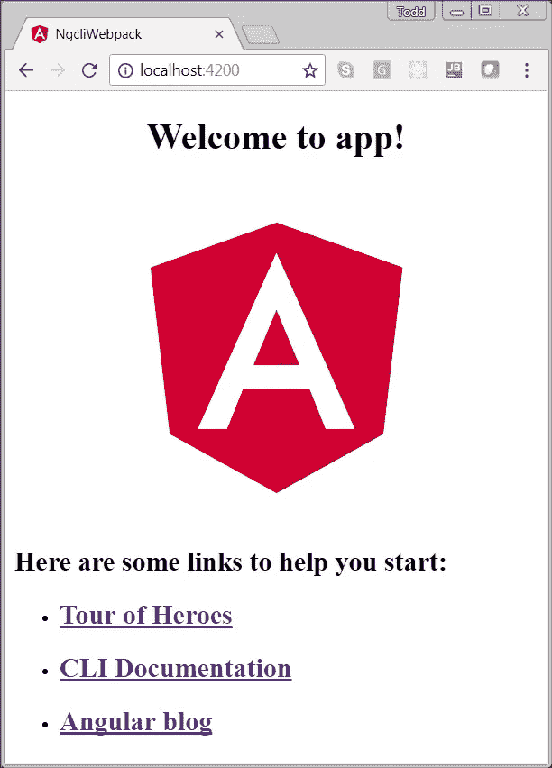

# 面向 Angular 开发者的 webpack

> 原文：<https://medium.com/hackernoon/webpack-for-angular-developers-c8584a60e627>

## 理解 webpack 与 Angular CLI 的关系



首先， [webpack](https://webpack.js.org/) 的人会用小写字母拼写，我也会。

在这个故事中，我们将探索:

1.  **Angular CLI** 和 **webpack** 之间的“秘密”关系
2.  一些 webpack 基础知识
3.  使用 **Angular CLI** 创建 Angular seed 应用程序，允许我们配置 **webpack**

# 入门指南

我假设你对 [npm](https://www.npmjs.com/) 和 [Angular CLI](https://cli.angular.io/) 有所了解。你不需要成为一名专家，但是你至少应该具备如何使用 npm 安装包的[工作知识。另外，你至少应该熟悉](https://docs.npmjs.com/getting-started/installing-npm-packages-globally)[角度快速入门](https://angular.io/guide/quickstart)。

在我们开始之前，请确保您已经在全球范围内安装了 Angular CLI。您可以通过在命令行中键入以下命令来进行检查:

```
ng -v
```

在撰写本文时，最新版本是 1.7.1。如果你需要安装**角度控制器**，你可以这样做:

```
npm install -g @angular/cli
```

让我们创建一个新的 Angular 项目，名为: **ngcli-webpack**

```
ng new ngcli-webpack
```

要运行您的应用程序:

```
cd ngcli-webpack
ng serve
```

将浏览器指向:`http:\\localhost:4200`以查看其工作情况。

**注意**:如果您使用的是 Internet Explorer，您需要在 **src/polyfills.ts** 中取消对导入的注释。



# Angular CLI 和 webpack

webpack 功能强大。它是[难以置信的可配置](https://webpack.js.org/configuration/)。然而，这种能力和灵活性可能会导致一个相当陡峭的学习曲线。

了解 **webpack** 是使用现代 JavaScript 框架(如 [React](https://reactjs.org/) 和 [Angular](https://angular.io/) )的主要障碍之一。Angular 团队中的好人希望让人们更容易开始使用 Angular。

他们通过在 **Angular CLI** 中嵌入 **webpack** 来做到这一点。现在，作为 Angular 开发人员，你不需要了解任何关于 webpack 的知识。Angular CLI 隐藏了所有 webpack 复杂性。然而，这种简单性是以灵活性为代价的。通过使用 Angular CLI，您将失去配置和定制 webpack 的能力。

# webpack 基础知识

根据 [webpack 网站](https://webpack.js.org/):

> *webpack* 是一个用于现代 JavaScript 应用的*静态模块捆绑器*

在 webpack 中，您可以配置以下内容:

*   **条目【webpack 应该启动的模块**
*   **输出【webpack 发出它创建的*包***
*   加载器:让 webpack 不仅仅处理 JavaScript 文件
*   插件:执行各种各样的任务，比如缩小

您可以在 webpack 配置文件中设置所有这些，该文件通常命名为: **webpack.config.js**

## 那么 webpack.config.js 在哪里呢？

“但是等等 Todd，我刚刚搜索了我的整个 Angular 项目，没有 webpack.config.js。你确定 Angular CLI 仍然使用 webpack 吗？”

好吧，你说的没错，我们 Angular 项目里没有 **webpack.config.js** 。并且，一些健康的怀疑是一件好事。但是，让我们快速看一下，并验证 Angular 确实依赖于 webpack。

在我们的项目中，我们可以在这里找到 Angular CLI 的本地副本:`node_modules\@angular\cli`

在该目录中，您应该看到 Angular CLI 的 **package.json** 文件。打开它，看看依赖项，你会看到 **webpack** 、 **webpack-dev-server** 等等。例如:

此外，在 node_modules 中，您可以看到这些基于 webpack 的依赖项确实被安装了。比如:`node_modules/webpack`

因此，我们看到 Angular CLI 实际上正在使用 **webpack** ，但它对我们来说只是一个黑盒。如果你不是 webpack 专家，这是很棒的。但是，如果你已经花时间来提高你的网络包技能，这可能是你无法接受的。别担心，Angular CLI 为我们提供了一个解决方案。

# 使用 ng 弹出功能访问 webpack 配置

一旦我们使用 Angular CLI 生成了种子应用程序，我们就可以使用`ng eject`切换到本地 webpack 方法

在我们的应用程序运行的根目录中:

```
ng eject
```

这将执行以下操作:

1.  基于当前构建，在项目的根目录下生成一个 webpack.config.js 文件。
2.  在**中将`ejected`标志设置为真。angular-cli.json** 。
3.  更新 package.json 中的脚本以基于 webpack 而不是 Angular CLI 运行。

# 弹出后运行

您应该在弹出后进行 npm 安装:

```
npm install
```

现在，如果我们想看到我们的应用程序运行，我们不能再使用 **ng serve** 。我们需要使用:

```
npm run start
```

如果我们查看我们的 package.json，我们可以看到这个脚本实际上转换为:

```
webpack-dev-server --port=4200
```

所以我们仍然可以去`http:\\localhost:4200`查看我们的应用程序在开发服务器上运行。

如果我们尝试使用 ng serve 或 ng build 或任何特定于 ng 项目的东西，我们会得到一个错误:

```
ng build
An ejected project cannot use the build command anymore.
```

警告:一旦使用 ng eject，就无法取消弹出，也没有简单的方法来返回使用 Angular CLI 进行类似于`ng generate`的操作。你必须做一些事情，比如创建一个新的 Angular 项目，然后将所有的源代码复制到其中。

# 摘要

使用 Angular CLI，您现在能够轻松创建由 Angular CLI 构建的种子应用程序，该应用程序具有您一直想要的完全可配置的 webpack.config.js。但是请记住:

> 权力越大，责任越大。
> ——斯坦·李