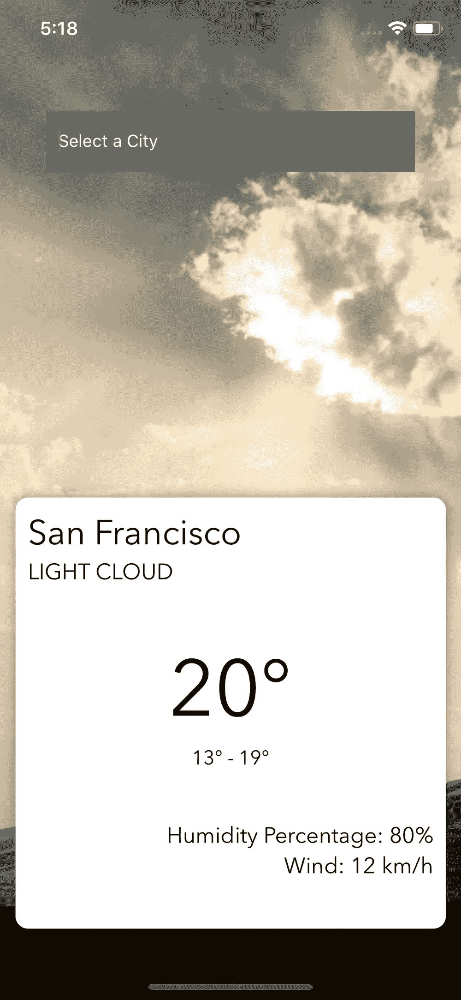
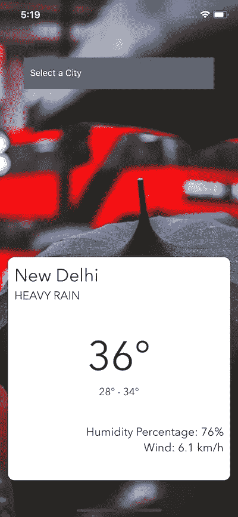
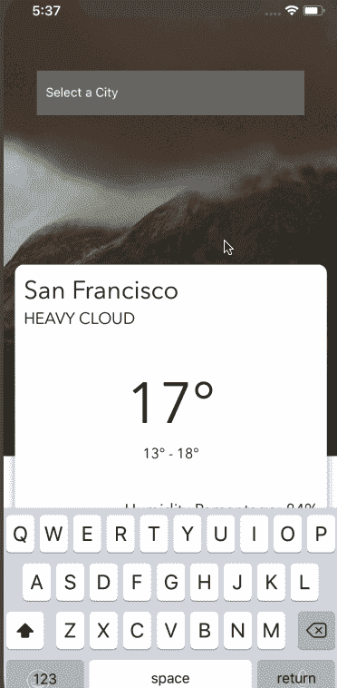

# React Native 第 2 周:构建天气应用程序

> 原文：<https://medium.com/hackernoon/week-2-with-react-native-building-a-weather-app-ca50fcfcb1e1>

# 第 2 周与⚛️本土反应📱

这篇文章应该在上周末发表。我度过了一个繁忙的周末，找不到时间写它，也没有精力完成它。上周，我在第一篇文章中[公开宣布，我已经重新开始学习并获得使用 React Native 的经验。这篇文章是那篇文章的延续。](/@amanhimself/starting-over-with-react-native-aff0dbdf5909)

本周，我在旅程中又前进了一步。我完成了[斯潘塞·卡莉](https://medium.com/u/1ec17560bf99?source=post_page-----ca50fcfcb1e1--------------------------------)的[如何设置一个新的 React 本地项目](https://learn.handlebarlabs.com/courses/enrolled/253279)。这个课程讲述了建立一个最简单的应用程序的绝对基础，在这个过程中我学到了一些东西，比如:

*   在 MAC 上配置 iOS 模拟器
*   林挺与埃斯林
*   更漂亮:使用代码格式化工具
*   排除故障

不过，我已经熟悉了 lint 和 prettier 的过程，因为我在日常工作流程中使用了它们。调试和其他模块在开始时熟悉起来是一件令人愉快的事情，并且会给出事情的一个整体方面，这样当你以后试图使用它们时就不会失去耐心。此外，斯潘塞是一个冷静的教练，有舒缓的声音。我喜欢他的教学方法。

# eslint-配置🛠

我将与 ESLint 的林挺流程向前推进了一步。我开发了一个名为[eslint-config-aman his](https://www.npmjs.com/package/eslint-config-amanhimself)的小型 npm 模块，使用它的好处是，现在我不必设置和配置我从头开始的所有其他 React-Native 项目。使用 lint 工具的其他优势如果您熟悉 web 编程，则不需要介绍。

我个人建议你在项目中使用 ESLint，不仅是 React Native，还有你选择使用的任何其他 JavaScript 库或框架。它确实带来了编写代码的一致性，并避免了编译时出现微小的错误。

 [## amandeepmittal/eslint-config-aman Ishi

### eslint-config-aman Ishi-⚛️+📱React 本地和 Expo 应用程序的 ESLint 配置

github.com](https://github.com/amandeepmittal/eslint-config-amanhimself) 

这个工具是完全开源的，节省了我和你的大量时间，如果你决定使用它。至少试一试。我想让你知道，如果我们能让这个工具更好，让每个人受益，我对贡献者开放。

# ⛅️天气预报卡

接下来，我开发了一个小应用程序，使用第三方 API 获取城市天气，并以卡片的形式显示一组数据。这是它看起来的样子。

我在构建这个应用程序时使用的主要元素如下:

*   背景图像(使用`ImageBackground`
*   输入文本值
*   从 API 获取天气数据`[https://www.metaweather.com/api/](https://www.metaweather.com/api/)`
*   显示数据的卡片视图界面

背景图像会根据从 API 获取的天气类型进行相应的更改。在这个过程中，我还学习了一些关于使用 React Native 的`Platform` API 以及如何提升卡片风格的知识，这在 iOS 和 android 上是不同的。

为移动设备开发不同于为网络开发应用。在移动领域，有很多不同的元素需要使用和处理。例如，在下面的屏幕中注意两件事。一个是一个小十字按钮，可以一次删除输入框中的文本(RN API 只支持 iOS，我确信 android 可能有解决方案，但我还没有试过)。接下来是`KeyboardAvoidingView`，它自动在视图中重新定位键盘(或任何其他 UI 元素)以显示最大显示元素。

KeyboardAvoidingView Example

在这个过程中，我还了解到创建一个定制组件并不难，但在`npm`上发布 React 原生应用却是一项艰巨的任务。我正在使用的这个应用程序中的卡片视图可以作为一个单独的组件在这里找到:

 [## amandeepmittal/react-native-simple-卡

### react-native-simple-卡- ⚛️ +📱React 本地和 Expo 应用程序的简单卡片视图。

github.com](https://github.com/amandeepmittal/react-native-simple-card) 

为了设置和构建这个项目，我使用了 *Create-React-Native-App* ，这是另一个很棒的开源工具，可以快速启动 React 原生项目。

我和 React Native 度过了愉快的一周。我试着尽可能多的花时间。*🙏感谢你阅读这篇文章。这整个项目可以在 Github 上找到:*

 [## amandeepmittal/天气卡

### React Native 中的天气卡 UI

github.com](https://github.com/amandeepmittal/weather-cards) 

本周我还在 React Native 上发表了另一篇文章:

 [## React Native:如何设置你的第一个应用程序

### React Native 是一个用 JavaScript 构建移动应用程序并利用 Reactjs 的框架。它使用原生用户界面…

medium.com](/@amanhimself/react-native-how-to-setup-your-first-app-a36c450a8a2f) 

*本系列的上一篇文章:*

 [## 从 React Native 开始

### 2018 年初🚀

medium.com](/@amanhimself/starting-over-with-react-native-aff0dbdf5909) 

如果你想听到更多我的消息，请考虑报名。