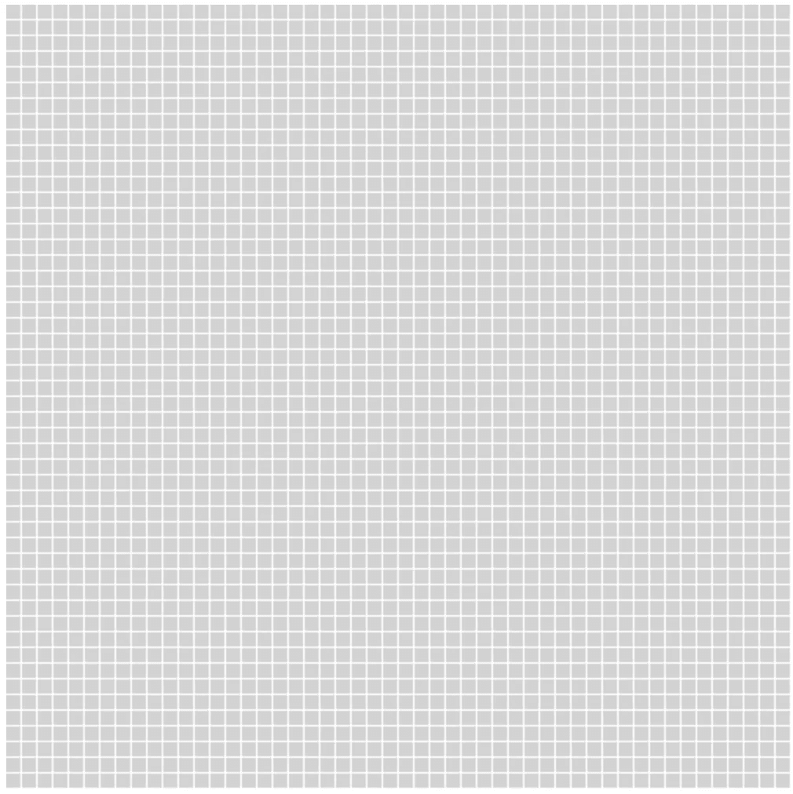
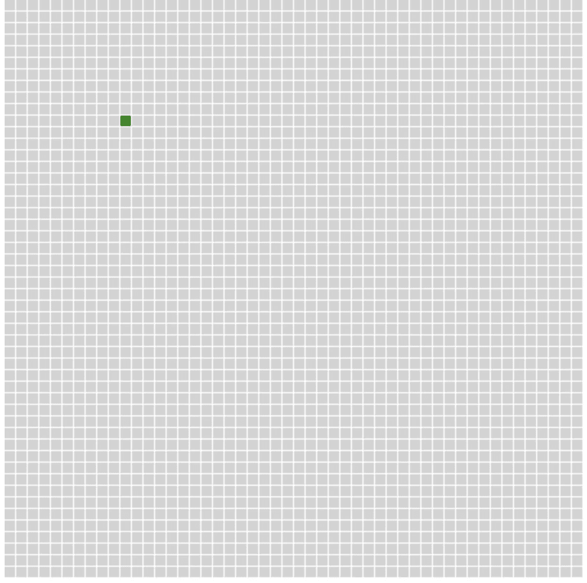
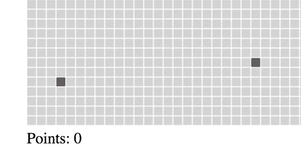
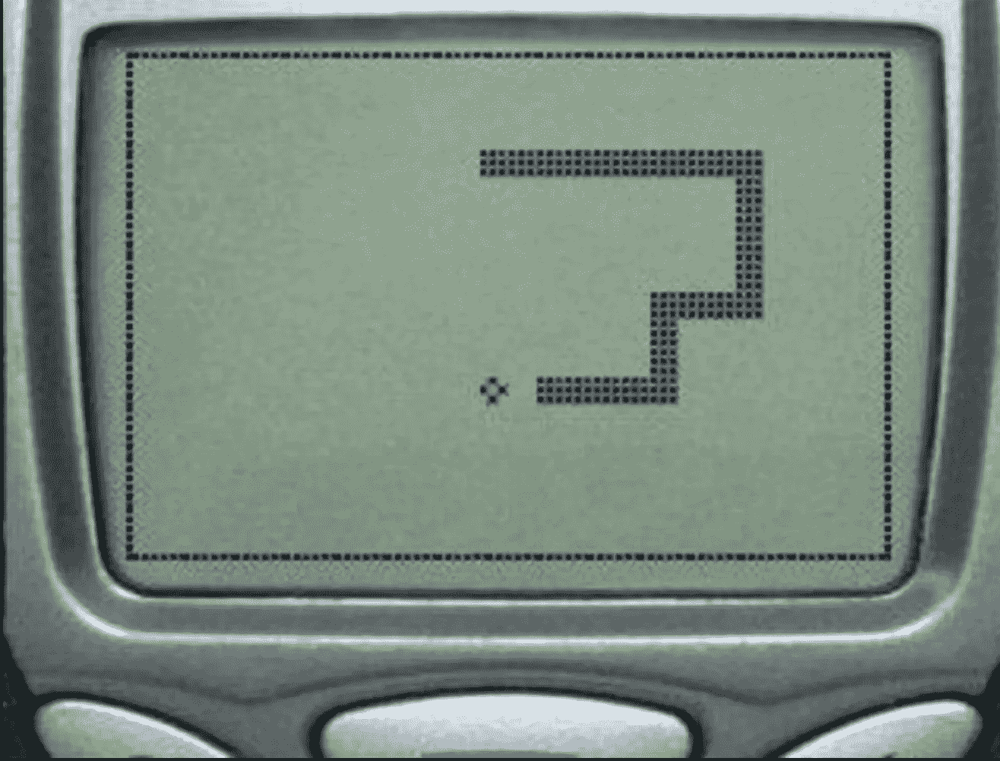

# 周末项目:普通 Js 中的经典蛇

> 原文：<https://medium.com/hackernoon/weekend-project-classic-snake-in-plain-js-33911f1d6417>

经典的贪吃蛇游戏是一个不错的周末项目，本教程展示了游戏使用 html5 画布创建。你可以试试[成品游戏 a codepen](https://codepen.io/eamo2020/full/OZWgpm/) ，或者在 github 上查看[代码](https://github.com/eamonnmcevoy/snake)

## 1.渲染游戏网格

[](https://github.com/eamonnmcevoy/snake/commit/54395cab3a6c40fe8f23cf7b88ec47606cb69d1d) [## 基本网格渲染 eamonnmcevoy/snake@54395ca

### 在 GitHub 上创建一个帐户，为 eamonnmcevoy/snake 开发做贡献。

github.com](https://github.com/eamonnmcevoy/snake/commit/54395cab3a6c40fe8f23cf7b88ec47606cb69d1d) 

第一步很简单，创建一个 index.html 来容纳我们的画布

```
index.html<html>    
  <head>    
  </head>    
  <body>        
    <canvas id="game"></canvas>
    <script src="./index.js"></script>    
  </body>
</html>
```

现在一个网格类负责渲染我们的游戏。



简单代码到目前为止，这用 2D 上下文设置了我们的 canvas 对象，并呈现了一个 50*50 的正方形网格，这将形成游戏的游戏区域。

## 2.用 2D 阵列更新网格

[](https://github.com/eamonnmcevoy/snake/commit/525100e8718a772fd2e4b5508a3729bed29c8f8f) [## 创建格网数据集 eamonnmcevoy/snake@525100e

### 在 GitHub 上创建一个帐户，为 eamonnmcevoy/snake 开发做贡献。

github.com](https://github.com/eamonnmcevoy/snake/commit/525100e8718a772fd2e4b5508a3729bed29c8f8f) 

在添加 snake 对象之前，Grid 类需要扩展一点。我们将在 2D 数组中保存网格状态，这段代码将像以前一样工作，但允许我们为每个单元格指定一个“状态”,并相应地给它着色。

## 3.创建蛇类

[](https://github.com/eamonnmcevoy/snake/commit/ed6fa328e801ba2b3612c968adb93957ccc05aec) [## 创建蛇对象 eamonnmcevoy/snake@ed6fa32

### 在 GitHub 上创建一个帐户，为 eamonnmcevoy/snake 开发做贡献。

github.com](https://github.com/eamonnmcevoy/snake/commit/ed6fa328e801ba2b3612c968adb93957ccc05aec) 

是时候创造我们的滑行英雄了，蛇！这个类保存了一个数组`parts`，用来表示蛇的状态。`update`方法将负责更新蛇的位置，并返回网格上需要更新的单元格数组，因为我们现在只有一个单元格，代码很简单。getter `head`返回蛇头部细胞的副本。



## 4.创建游戏类

[](https://github.com/eamonnmcevoy/snake/commit/03b0de9384f5d27310bee81d6e60a938efd42849) [## 创建游戏对象 eamonnmcevoy/snake@03b0de9

### 在 GitHub 上创建一个帐户，为 eamonnmcevoy/snake 开发做贡献。

github.com](https://github.com/eamonnmcevoy/snake/commit/03b0de9384f5d27310bee81d6e60a938efd42849) 

为了让我们的蛇动起来，我们需要创建一个游戏循环，负责更新游戏状态和协调我们的对象。所有的动作都发生在`run`方法中，在游戏循环的每次迭代中，我们渲染网格，更新游戏状态，最后在运行下一次迭代之前添加一个短暂的延迟(50 毫秒)。

`while(true)` . ¯\_( ⊙_ʖ⊙ )_/¯

## 5.移动的蛇

[](https://github.com/eamonnmcevoy/snake/commit/2b8a11e311da92d0ad2b4d0d67bdec7bcd154c7f) [## 移动 snake eamonnmcevoy/snake @ 2b 8 a11e

### 在 GitHub 上创建一个帐户，为 eamonnmcevoy/snake 开发做贡献。

github.com](https://github.com/eamonnmcevoy/snake/commit/2b8a11e311da92d0ad2b4d0d67bdec7bcd154c7f) 

现在我们准备做一些有趣的事情，让蛇动起来。在这个阶段，我们只需在每次更新时向右移动 1 个单元格。蛇`update`的方法现在有点复杂了。为了移动我们的蛇，我们将计算新的头部位置，移除“尾部”单元，并将其放在这个新位置。

`isAlive`测试与棋盘边缘和蛇上其他细胞的碰撞。


Its alive!

## 6.控制蛇

[](https://github.com/eamonnmcevoy/snake/commit/b03c6296f88c50e274c0f9a886cd37761093dc14) [## 定向蛇 eamonnmcevoy/snake@b03c629

### 在 GitHub 上创建一个帐户，为 eamonnmcevoy/snake 开发做贡献。

github.com](https://github.com/eamonnmcevoy/snake/commit/b03c6296f88c50e274c0f9a886cd37761093dc14) 

现在我们的蛇正在移动，我们可以开始接收键盘输入来控制移动的方向。游戏类现在包含了一个处理键盘输入的 handler 方法，箭头键被绑定来将蛇向上、向下、向左或向右转动。这条蛇还用一个`updatePosition`方法进行了扩展，以确定新的位置。

## 7.优化网格渲染

[](https://github.com/eamonnmcevoy/snake/commit/065c516d16df1984ac2c34699dc051b2d7ff5da2) [## 渲染优化 eamonnmcevoy/snake@065c516

### 在 GitHub 上创建一个帐户，为 eamonnmcevoy/snake 开发做贡献。

github.com](https://github.com/eamonnmcevoy/snake/commit/065c516d16df1984ac2c34699dc051b2d7ff5da2) 

游戏网格的渲染存在相当糟糕的低效率。在每次迭代中，我们重新绘制每个单元格，而实际上我们只需要更新自上一帧以来发生变化的单元格。这是一个简单的改变，网格将保存一个`updatedCells`的数组，在调用`setPoint`时，我们将把每个点推到这个数组中。现在，我们只需要从这个数组中重新绘制单元格，将 render 方法的工作从每帧 2500 个单元格减少到大约 2–3 个，对于 4 行代码来说，这是一个不错的改进。

## 8.生产食物

[](https://github.com/eamonnmcevoy/snake/commit/e7c7001028ecf80b0fd63d182ef6ce6ca1604a2d) [## 生成食物 eamonnmcevoy/snake@e7c7001

### 在 GitHub 上创建一个帐户，为 eamonnmcevoy/snake 开发做贡献。

github.com](https://github.com/eamonnmcevoy/snake/commit/e7c7001028ecf80b0fd63d182ef6ce6ca1604a2d) 

所有这些工作让我饿了，是时候为我们的鳞片朋友做些午餐了。每 1 秒钟，如果网格上没有食物，我们将在随机位置添加一个紫色的食物单元格。



## 9.饮食和成长

[](https://github.com/eamonnmcevoy/snake/commit/e513f987813d58aaabe13fbea940d3580399232e) [## 捡拾食物 eamonnmcevoy/snake@e513f98

### 在 GitHub 上创建一个帐户，为 eamonnmcevoy/snake 开发做贡献。

github.com](https://github.com/eamonnmcevoy/snake/commit/e513f987813d58aaabe13fbea940d3580399232e) 

游戏的最后也是最重要的元素，当蛇头与食物细胞碰撞时，蛇会生长。在主游戏循环中，我们需要执行一个简单的检查，检查是否与食物细胞发生碰撞，如果检测到，移除细胞并让蛇长一条。为了让蛇变大，我们在尾巴上添加了一个新的细胞，来代替原来的尾巴位置。

## 10.跟踪得分

[](https://github.com/eamonnmcevoy/snake/commit/f1cf27bd12dfc11a8c914884f136d9d6c597ffb5) [## 曲目评分 eamonnmcevoy/snake@f1cf27b

### 在 GitHub 上创建一个帐户，为 eamonnmcevoy/snake 开发做贡献。

github.com](https://github.com/eamonnmcevoy/snake/commit/f1cf27bd12dfc11a8c914884f136d9d6c597ffb5) 

最后一次更新以结束游戏，当收集到一块食物时，奖励 1 分。只需在游戏类中添加一个`score`属性，收集食物时递增，在画布下方显示分数。

希望你喜欢这个快速周末项目，如果你想要更多这样的内容，请给一些**掌声**或评论。编码快乐！

