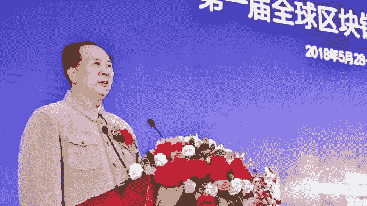

# 亚洲每周加密集锦| 5 月 28 日至 6 月 1 日

> 原文：<https://medium.com/hackernoon/weekly-crypto-highlights-in-asia-may-28th-june-1st-edbdcf9d0d2a>

# ***硬币和兑换***

*-起源于中国的主要加密货币交易所火币正在* [*巴西开店。*](https://globalcoinresearch.us17.list-manage.com/track/click?u=859b0d423a7f7baa4cdb46f26&id=8e3fb3c3a9&e=c17afd228e)

*——币安新的美国*[*【10 亿美元基金*](https://globalcoinresearch.us17.list-manage.com/track/click?u=859b0d423a7f7baa4cdb46f26&id=e29fb41432&e=c17afd228e) *将以币安代币计价。投资还包括基金，这可能会显著增加币安的机构交易。*

*——在本周 EOS 和 TRON 的 mainnet 发布的路上，EOS 有漏洞被* [*一家中国安全*](https://globalcoinresearch.us17.list-manage.com/track/click?u=859b0d423a7f7baa4cdb46f26&id=2a6eddc642&e=c17afd228e) *公司和一些中国媒体发现试图破坏* [*TRON 的 CEO*](https://globalcoinresearch.us17.list-manage.com/track/click?u=859b0d423a7f7baa4cdb46f26&id=4088852ea1&e=c17afd228e) *Justin Zhen。TRON 最近 7 天* [*下跌 20%*](https://globalcoinresearch.us17.list-manage.com/track/click?u=859b0d423a7f7baa4cdb46f26&id=c9d4f8deba&e=c17afd228e) *。EOS 仍然从长达一年的销售中筹集了 40 亿美元* *。* 要继续关注 EOS 本周末的发布，请查看 [Steemit](https://globalcoinresearch.us17.list-manage.com/track/click?u=859b0d423a7f7baa4cdb46f26&id=f465884414&e=c17afd228e) 和 [YouTube](https://globalcoinresearch.us17.list-manage.com/track/click?u=859b0d423a7f7baa4cdb46f26&id=29517338cd&e=c17afd228e) 上的视频流

*-韩国交易所 Bithumb 禁止在* [*等 11 个国家*](https://globalcoinresearch.us17.list-manage.com/track/click?u=859b0d423a7f7baa4cdb46f26&id=5b14008ade&e=c17afd228e) *交易，并正在降低未* [*实名账户的提现限额*](https://globalcoinresearch.us17.list-manage.com/track/click?u=859b0d423a7f7baa4cdb46f26&id=2bb302e124&e=c17afd228e)

# *宏观和监管观察*

*本周，我们看到了韩国和日本在监管和商业方面的一些进展，这标志着这些生态系统日益成熟。中国官员继续推动区块链的发展。*

*🇰🇷在 8 个月的禁令后再次允许国内的 ICO。大法院也首次承认比特币为[资产、](https://globalcoinresearch.us17.list-manage.com/track/click?u=859b0d423a7f7baa4cdb46f26&id=04b7dd92e2&e=c17afd228e)并没收[数字](https://globalcoinresearch.us17.list-manage.com/track/click?u=859b0d423a7f7baa4cdb46f26&id=c404f75eb0&e=c17afd228e)货币  。*

*🇯🇵金融厅对多家数字货币公司进行反洗钱[监管](https://globalcoinresearch.us17.list-manage.com/track/click?u=859b0d423a7f7baa4cdb46f26&id=2dae230a89&e=c17afd228e)。此外，6 个新的密码交易所正在启动。*

*🇨🇳 [President](https://globalcoinresearch.us17.list-manage.com/track/click?u=859b0d423a7f7baa4cdb46f26&id=d774e086b2&e=c17afd228e) Xi Jinping along with Chinese authorities continue to be bullish on blockchain. Looking to form [National](https://globalcoinresearch.us17.list-manage.com/track/click?u=859b0d423a7f7baa4cdb46f26&id=34fcf046e3&e=c17afd228e) [Blockchain Standardization Committee](https://globalcoinresearch.us17.list-manage.com/track/click?u=859b0d423a7f7baa4cdb46f26&id=6be67af8bb&e=c17afd228e) by the end of 2018.*

*🇮🇳 Indian said [no thanks](https://globalcoinresearch.us17.list-manage.com/track/click?u=859b0d423a7f7baa4cdb46f26&id=ee449e3060&e=c17afd228e) to using the Petro, launched by Venezuela, to buy the nation’s crude oil.*

# *Business*

*- Bitcoin mining company Bitmainhas been under scrutiny from the POW [community](https://globalcoinresearch.us17.list-manage.com/track/click?u=859b0d423a7f7baa4cdb46f26&id=e77cb86376&e=c17afd228e) and for its latest [mining products.](https://globalcoinresearch.us17.list-manage.com/track/click?u=859b0d423a7f7baa4cdb46f26&id=83d682c951&e=c17afd228e)*

# ****Picture of the Week****

**Chinese cryptocurrency media companies are boycotting the Boao Blockchain Conference after the organizer used a* [*Chairman Mao impersonator*](https://globalcoinresearch.us17.list-manage.com/track/click?u=859b0d423a7f7baa4cdb46f26&id=6be0b70b6f&e=c17afd228e) *to promote the event.**

**