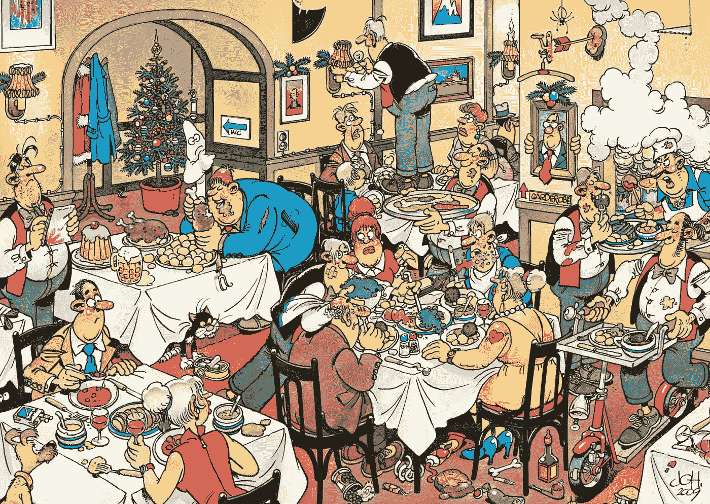
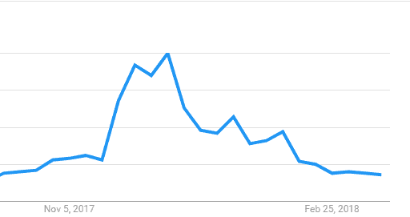

# 关于利用加密获利的每周 5 大问题— 10KQA 挑战

> 原文：<https://medium.com/hackernoon/weekly-top-5-questions-about-making-a-profit-with-crypto-10kqa-challenge-602cce953a7e>

前段时间我们开始了 [10KQA 挑战](https://howtotoken.com/all-questions/)(详情[这里](https://hackernoon.com/the-10-000-question-challenge-your-blockchain-journey-starts-here-98829f6b3cbc))。核心思想很简单:为任何想了解区块链和加密货币的人建立一个包含 1 万个问题的适度列表。

你还记得当你第一次开始学习一些复杂的东西，但很难找到你需要的信息，你有一百万个问题吗？学习的最简单的方法就是开始问问题和接受答案。但是你不熟悉的东西就很难问了。这就是 10KQA 的用武之地。

老实说，事情并没有像我们预期的那么快开始(可能是因为自去年 12 月以来，加密领域的核心需求下降了 5 倍)。比特币的价值下降，所以大多数人不再问问题:)但众所周知，区块链技术有巨大的潜力，它不会停止。

在过去的两周里，我们遇到了很多有趣的人，他们热衷于学习区块链和加密(如果你想加入，请写评论)。这是我们本周公布的一些有趣的问题。

## 如何评估一个 ICO 项目的透明度？(来源 [***此处***](https://howtotoken.com/question/instruments-allow-assess-transparency-projects-basing-metrics/)***)***

对此的最佳答案是一个可以用来检查的工具。[neufund.org](https://neufund.org/)——提供了解决方案——[ICO 透明监视器](http://icomonitor.io)。

这个工具使用起来非常简单，它从区块链获取数据，并通过一份包含 14 个问题的问卷进行处理，该问卷有助于回答以下问题:这个 ICO 是否透明？

看看它是基于哪些问题是很有趣的，它们可以在这里访问

## ***随着难度调整，矿工的成长计划是什么？(来源*** [***此处***](https://howtotoken.com/question/miners-growth-plan-difficulty-adjusts/) ***)？***

[Marco Streng](https://twitter.com/marco_streng),[Genesis Mining](http://genesis-mining.com)的首席执行官，在接受 [Moneycontrol](https://www.moneycontrol.com/news/interview/tales-from-a-bitcoin-mine-an-interview-with-marco-streng-ceo-of-genesis-mining-2351375.html) 采访时分享了他的观点。

他列举了六个因素，这些因素将有助于在奖励减少和难度增加时保持利润。

*   利用规模经济来保持低成本(使用 Enigma 在四个不同的大洲开采农场)。
*   ASICS 高度简化的供应链。
*   与能源公司达成好的交易，并专注于使用可再生能源。
*   直接与芯片制造商合作。
*   最先进的采矿农场管理软件叫做创世纪蜂巢，这是我们自己开发的。
*   Multipool 技术通过根据客户的盈利能力在不同硬币之间切换，进一步提高了客户的盈利能力。

正如你所看到的，采矿业务已经变得相当高科技，普通用户很难自己开始采矿(不使用游泳池)。

## 与其他资产类别相比，加密交易有什么不同吗？(来源[此处](https://howtotoken.com/question/differences-trading-crypto-asset-classes/))？

多亏了 John Hwang，以下是它与众不同的五点:

*   完全暴露于内幕交易和抽水和倾销计划。
*   缺少存款或安全保险。
*   没有任何收入、资产或商业模式的支持。
*   不可逆转的永久损失的持续风险。
*   交易所之间缺乏价格一致性和订单保护。

因此，如果你认为你的交易背景将有助于你理解区块链的核心，你也应该考虑到，加密是一个全新的世界，在那里有许多特殊的属性和风险，你应该考虑。

## 加密货币的价格正在快速下跌。我该怎么办？(来源[此处](https://howtotoken.com/question/prices-of-cryptocurrencies-are-dropping-so-fastly-and-deely-what-should-i-do/))？

当然，这里没有正确的答案或解决方案(下面写的所有内容都不应被视为可行的投资建议，它只是基于加密社区研究的意见)。

我们发现了帮助我们在快速变化的加密市场中保持冷静的四个主要因素:

*   只要比特币存在，Altcoin 就会存在。
*   尽管比特币可能会消亡，但它将会继续存在。
*   分析一下比特币是怎么回事，引发这种向上运动的是什么。如果你没有找到任何东西，我们可以假设这是一个牛市陷阱，这意味着它更有可能 altcoin 将被抽水。
*   很多人因为情绪而赔了钱。保持冷静。如果你做不到这一点，投资动荡的加密市场可能不适合你。

正如我们上个月所看到的，加密交易是非常危险的。这里的经验法则是——永远不要投资超过你可能损失的部分。

## 什么更有利可图:在 ICO 期间购买 ICO 代币还是在兑换入口后购买(来源[此处](https://howtotoken.com/question/what-is-more-profitable-buying-tokens-of-icos-during-ico-or-after-exchange-entrance/))？

这个问题没有精确的答案。但是一位 [Bitcointalk](https://bitcointalk.org/index.php?topic=2701941.20) 用户有一个有趣的观点:

很难从 ICO 中获得很大的利润，因为项目刚刚开始，它需要证明硬币是否足够好，能够在交易所生存下来。我认为，如果我们害怕损失，那么在交易所晚些时候购买是我们能做的最好的事情，我们应该确定我们想要用多少钱来购买硬币。但是如果我们真的想参与 ICO，那么我们需要找到关于这个项目的信息，以及所有能让我们相信这个项目会在交易所取得成功的信息。

要加入我们的挑战并获取新的更新，请关注我们:

*   电报:【t.me/TENKQA 
*   推特: [@howtotoken](http://twitter.com/howtotoken)

我们将感谢所有的参与者、想法和讨论。我希望我们都能从这个过程中得到一些积极的东西，以及那种难忘的心流感觉。

我们还在寻找版主加入我们的挑战，他们将与我们一起教育和搜索关于区块链和加密的新问题和答案，这些类别包括:

*   核心区块链开发
*   利润(贸易、ICO、采矿)
*   真正的颠覆性模式
*   法规

**并查看我们的新功能【区块链专家】** [**这里**](https://howtotoken.com/blockchain-experts/) **。这些是我们在区块链利基市场阅读和关注的专家。**

***我们需要你的掌声*** 👏 ***为了让更多的人接触到这是一份新的刊物。请通过推文、脸书分享等方式传播这个故事。***

## 关于作者:

基里尔·希洛夫——geek forge . io 和 Howtotoken.com 的创始人。采访全球 10，000 名顶尖专家，他们揭示了通往技术奇点的道路上最大的问题。加入我的**# 10k QA challenge:**[geek forge 公式](https://formula.geekforge.io/)。