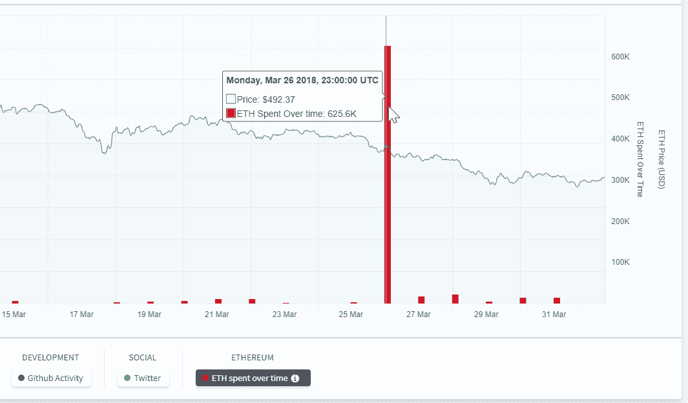
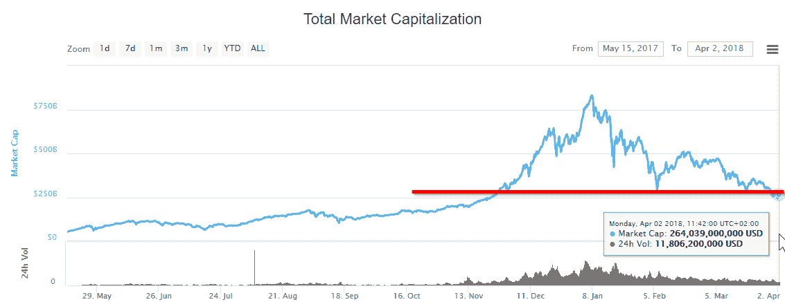
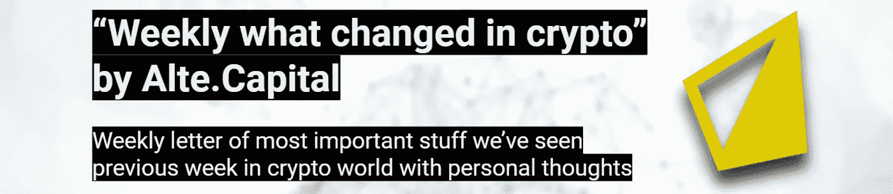

# “加密中的每周变化”2018 年 4 月 26 日至 2 日，作者 Alte。资本

> 原文：<https://medium.com/hackernoon/weekly-what-changed-in-crypto-26-02-april-2018-by-alte-capital-dedff0a5186e>

## 我们上周在《密码世界》中看到的最重要的东西的每周信件和个人想法

# 整个星期主要司机

上周充斥着谣言，说比特大陆将开始为 Ethash 算法提供基于 ASIC 的矿工，甚至他们已经开始使用它们挖掘以太坊。尽管如此，这些都是未经证实的消息，但如果属实，它们可能会影响长期采矿盈利能力和采矿集中化，并最终影响价格。这在使用 Ethash 的项目社区中引起了许多关注和讨论，主要是关于他们是否应该修改他们的算法以防止 ASIC 挖掘。这可能会导致上周的抛售，特别是如果比特大陆已经开采以太坊并立即在市场上出售的话。**但是，也可能相反。这可能会让人想起过去(2012 年至 2015 年)的情况，当时比特大陆宣布并开始发运比特币 ASIC，导致价格大幅上涨。**

下滑的另一个原因是 ICO 的持续套现。正如我们两周前的信中所述(参见:[http://bit.ly/letter-19-03-2018](http://bit.ly/letter-19-03-2018)):

> 没有 ICO 项目的成功大规模采用，代币经济就被打破了。希望我们将很快看到大众少数项目越来越受欢迎。

例如，根据这个消息来源([https://sanbase-low.santiment.net/projects/ethereum](https://sanbase-low.santiment.net/projects/ethereum))，上周 EOS 从他们的众筹合同中转移了大约 61.5 万 ETH。就目前的市场状况而言，这是一笔巨款。或许他们这样做是为了在市场上出售部分 ETH，然后抬高 EOS 的代币价格。

Ethereum cashout by EOS on 26th March 2018 ([https://sanbase-low.santiment.net/projects/ethereum](https://sanbase-low.santiment.net/projects/ethereum))

最后，几乎没有与避税天堂国家相关的进展，这些国家正在完成对加密技术变得友好的工作。例如马耳他和白俄罗斯。请看下面的新闻。

# 价格行为

如前所述，我们遇到了 2800 亿美元市值的主要阻力，我们通过了。如果我们看不到反弹，我们可能会在该区域下方漂流更长时间。

Crypto market capitalization below 280 billion dollars (https://coinmarketcap.com)

几乎整个市场又经历了一周的抛售。主要硬币的价值下降了 15%到 30%。目前大多数硬币都处于 2017 年 11 月的价格水平。2017 年 11 月，这些价格水平是大幅上涨的起点。

Weekly performance — 26–02 April 2018 (by coin360.io)

# 2018 年 4 月 26 日至 2018 年 4 月 2 日第 26 周的主要秘密活动

**马耳他允许博彩业使用加密技术**
马耳他博彩管理局是世界上最大的在线博彩机构之一(主要是因为其税收减免)，刚刚发布了一份白皮书，就在线博彩公司使用和接受加密技术进行咨询。通过允许游戏公司开始接受加密，马耳他再次将自己置于加密管辖区的前沿。此前，欧洲其他“避税天堂”(如卢森堡或白俄罗斯)也传出计划对加密变得更加友好的消息。

**加密业务现在在白俄罗斯合法**
白俄罗斯可能成为另一个加密友好的离岸地区。全面的法规，主要是加密部门的合法化，现在已经正式到位。密码行业的企业家和公司实体可以在世界任何地方自由开展业务，只要他们注册成为白俄罗斯高科技园区的居民。法令为加密业务引入税收减免和其他激励措施，直至 2023 年 1 月 1 日。对从开采、发行和放置数字硬币中获利的公司不征税。

Bitfinex 计划迁往瑞士最大的加密货币交易所之一可能会将总部从香港迁至瑞士。这些变化的原因可能是亚洲国家对加密货币的贸易壁垒不断增加。不像瑞士，它越来越被称为“秘密国家”。第二个重要的变化是在股票交易所引入了新的法币对日元和英镑。

**Monero 发布新更新抗 ASIC**
Monero 发布新更新，其主要发布功能与调整他们的算法有关，以防止 ASIC 挖矿。社区对此提出了大量要求。

**比特币基地宣布计划在 GDAX 中增加以太币交易**
在宣布这一计划的同时，有消息称 ERC20 代币将无法与他们的支付处理产品比特币基地商务兼容。比特币基地只会在比特币基地的硬币在 GDAX 上市后才添加硬币。在评估 GDAX 的因素(如流动性、价格稳定性和其他市场健康指标)后，公司可能会选择将一项 ERC20 资产添加到比特币基地钱包中。

**大型电子商务平台的新型加密支付网关**
使用开源电子商务解决方案 Prestashop 的 80，000 家欧洲新商户将能够接受加密。在 Coingate 上建立账户后，该团队向商家承诺，只需“点击几下”就能安装支付模块。次日以欧元进行实时结算。两家公司都在支付和加密领域经验丰富。

谢谢你读到这里。如果你喜欢这篇文章，请分享，评论，按住👏有几次。这真的很有帮助。

> 下一封“加密中的变化”信件将于 2018 年 4 月 9 日发出

**关注我的** [**推特**](https://twitter.com/Alte_Capital) **如果你将来对这些更深入、更翔实的报道感兴趣的话！**

