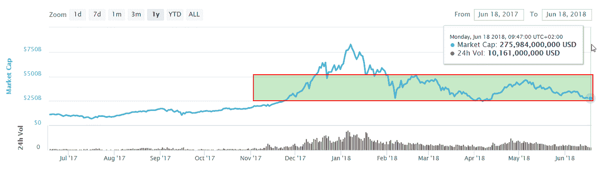

# “每周什么改变了加密”由 Alte。首都——2018 年 6 月 11 日至 18 日

> 原文：<https://medium.com/hackernoon/weekly-what-changed-in-crypto-by-alte-capital-11-18-june-2018-62469cbf02d>

## 最重要的东西，我们已经看到了前一周在密码世界与个人想法

# 整个星期主要司机

这是价格下行压力的又一周。这让许多投资者感到不安，注入了难以量化的不确定性。尽管价格波动，但没有什么值得注意的发展。首先，交易所的交易量也在下降。一些交易所注意到交易量每周下降 50-70%。这可能与以下事实有关:与过去相比，现在有更多的交易所，而且仍有新的交易所在开业。或许一些交易所也在减少假货数量。
**其次，伴随着小问题 EOS 终于设法开始了他们的主网作战。**这结束了为期两周的发布过程。尽管启动过程中存在技术问题，但我们可以看到启动 main-net 并不是一件有利可图事情。这更像是“出售新闻”事件，在开始阶段有许多不可预见的行为。
**在接下来的几天另一个 TOP 10 项目，TRON 也要启动 main-net** 。很可能它会遵循与 EOS 相同的路径，就在开始之后。看起来这些项目需要兑现他们的承诺来保持用户和投资者的参与。这在短期内并不容易，因为开发应用程序和框架需要时间。

# 价格行为

经过我们前几周的预测，我们已经达到了 2700 亿美元市值的关键支撑。本周我们应该会看到这一层面的一些行动。只是很难说导火索会是什么。

Crypto market cap near 270 billion dollars support

# 2018 年 6 月 18 日第 11 周的主要秘密活动

**SEC 声明以太坊不是证券**
SEC 关于加密货币和初始硬币发行(ICO)的负责人表示，比特币和以太不是证券，但许多(但不是全部)ICO 是证券，将受到 SEC 和相关证券法的监管。这个声明消除了以太坊的一些风险，但是增加了其他项目团队的风险。现在很难说哪个 ICO 的项目会受到影响。

韩国加密货币交易所 Coinrail 在一次明显的黑客攻击中损失了价值 4000 万美元的代用币。黑客窃取了几个 ICO 令牌。主要是普迪克斯，登特和创。看起来黑客试图兑现一些 PundiX 代币，并将它们转移到 IDEX 交易所。IDEX 在 6 月 11 日发表了一份声明，确认他们有一些被盗的令牌，在调查期间，它们被安全地存储在智能合同中。

**GPU 供应商受到越来越高的库存困扰**
有报道称，自 2018 年 3 月以来，基于 ASIC 和 GPU 驱动的采矿设备供应商都出现了供不应求的情况。因此，台湾显卡供应商的库存迅速回升，销售价格降至 2017 年初的水平。例如，TSMC 已经下调了对 2018 年制造矿业专用集成电路收入的估计。矿业投资回报的下降迫使许多小型采矿场关闭。

**比特币基地推出指数基金**
暂时只面向美国合格投资者。该基金让投资者投资于比特币基地加密货币交易所上市的所有资产类别，并根据其各自的市值进行加权

**富国银行禁止用信用卡购买加密货币**
这是紧随美国银行、花旗集团和摩根大通的脚步，他们都在今年早些时候限制用信用卡购买加密货币。去年的一项研究发现，18%的比特币投资者用信用卡为他们的购买提供资金。

> 下一封“加密中的变化”信件将于 2018 年 6 月 25 日发出

谢谢你读到这里。如果你喜欢这篇文章，请分享，评论，按住👏有几次。这真的很有帮助。

**关注我的**[**Twitter**](https://twitter.com/Alte_Capital)**如果你将来对这些更深入、更翔实的文章感兴趣的话！**