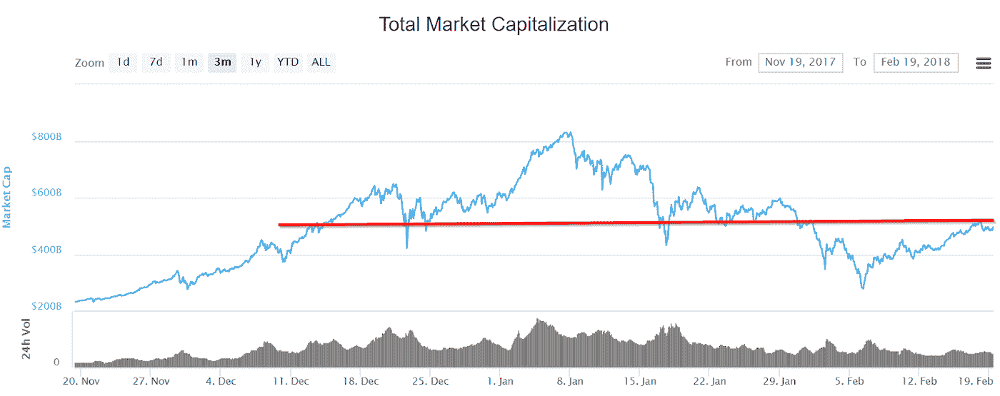

# 每周什么改变了密码由阿尔特。首都——2018 年 2 月 12 日至 19 日

> 原文：<https://medium.com/hackernoon/weekly-what-changed-in-crypto-by-alte-capital-12-19-february-2018-5ec1e90b2f5c>

欢迎来到我们下一期的“加密中的每周变化”。我们致力于分享我们上周在密码世界看到的最重要的东西

## **整周主要驱动因素:**

我们似乎可以在市场上观察到来自韩国的投资者的回报。韩国交易所上周的成交量出现了系统性增长。2 月 13 日，Bithumb 交易所 24 小时的交易额约为 1 亿美元，而周六 16 日的交易额为 3.1 亿美元。

第二，主要参与者的比特币期货头寸的最新数据是由 CFTC 在 2 月 13 日星期二公布的。2 月比特币合约系列到期的前一天。正如最新数据显示的那样，空头头寸仍然在他们中间占优势。虽然它们的规模最近略有下降，但仍然相对较大。尽管华尔街大玩家的负面情绪，硬币价格继续上涨。

> 与 Alte 连接。资本

> 请访问我们的[网站](http://www.alte.capital)，在[推特](https://twitter.com/Alte_Capital)和[脸书](https://www.facebook.com/Alte.capital)上关注我们，分享这个故事。这对我们很有帮助。

## 价格行为

几乎所有的主要硬币上周都上涨了。对于比特币来说，这是特别好的一周。较小的大写硬币有更多的混合结果。

市值回到 5 亿美元的水平。这是一个重要的关卡，我们应该在这一点上看到有趣的动作。如果最近令人印象深刻的复苏会持续更长时间，这个区域应该会保持。

# 最重要的事件

**西班牙寻求通过加密友好立法**

当其他欧洲国家寻求对加密货币进行更严格的监管时，西班牙希望效仿瑞士，通过提出加密友好型立法来领先一步。

执政党声称正在准备加密友好的立法，旨在吸引区块链公司，特别是通过包括税收减免。

**加拿大首个通过区块链进行证券清算和结算的平台**

加拿大证券交易所(CSE)宣布将推出一个利用区块链技术独特功能的证券清算和结算平台。该平台将使公司能够通过令牌化证券发行传统的股权和债务，这些证券将通过证券令牌发行(“s to”)提供给投资者。与区块链的加密货币不同，sto 将受到相关证券委员会的全面监管。对于 Waves 或 Polymath 这样的平台来说，这可能是一种竞争，也可能是一件好事，这些平台的主要特点是列出令牌。

**波兰中央银行秘密付钱给 Youtubers 诽谤 Cryptos**

波兰中央银行承认“它在社交媒体上开展了一场关于虚拟货币问题的运动”，但没有就此事提供任何进一步的评论。波兰中央银行这一行动的合法性尚不清楚，因为通常在一个民主国家，国家行为者或承包商从事针对本国公民的宣传是非法的。

**以太坊 ASIC 矿机**

有传言称，比特大陆计划在 2018 年第三季度推出以太坊 ASIC 矿机。如果这是真的，这将意味着所有以太坊矿工的困难时期。这也与上周以太坊经典价格的上涨有关。

**很少有美国人上报加密货币税收报告**

今年已经通过公司 Credit Karma 申报联邦税收的 25 万个人中，只有不到 100 人向美国税务机关报告了加密货币交易。原因是很难报告加密货币的收益或损失，并且需要很长时间来报告。

**西联测试涟漪**

金融服务提供商西联汇款(Western Union)正在使用 Ripple(XRP)基于区块链的结算系统测试交易。吴证实，他们正在测试涟漪后，一个月的猜测，开始于 1 月初。

**加密挖掘代替广告拦截**

2 月 12 日星期一，Salon.com 开始测试一种新的解决方案，利用屏蔽广告的用户的计算机能力来挖掘硬币。当使用广告拦截器时，用户会看到一个弹出窗口，要求您禁用广告拦截器或通过允许 Salon 使用您未使用的计算能力来挖掘 Monero 来阻止广告。

**比特币基地创建自己的支付系统**

比特币基地创造了一种新的服务——比特币基地商务，它促进了商品和服务的不同加密货币支付。比特币基地商务允许在任何地方使用该服务，接受比特币、比特币现金、以太坊和莱特币支付，并接受加密货币直接进入用户的钱包。比特币基地商务已经与最大的多渠道商务平台之一 Shopify 整合，现在正在积极增加更多集成，以尽可能轻松地接受加密货币。

**微软将使用区块链保护身份**

微软计划使用区块链技术允许用户拥有并安全访问他们的在线角色。他们还希望将区块链与微软认证器集成在一起。在与分散身份基金会(DIF)开始合作后，微软宣布他们希望使用区块链技术来解决我们在管理数字身份时面临的一些挑战。新的解决方案旨在提高隐私和更好地控制我们的数字数据。

> 我们的下一期“加密有何变化”将于 2018 年 2 月 25 日发布

## 访问我们的[网站](http://www.alte.capital)，在[推特](https://twitter.com/Alte_Capital)和[脸书](https://www.facebook.com/Alte.capital)上关注我们，分享这个故事。这对我们很有帮助。