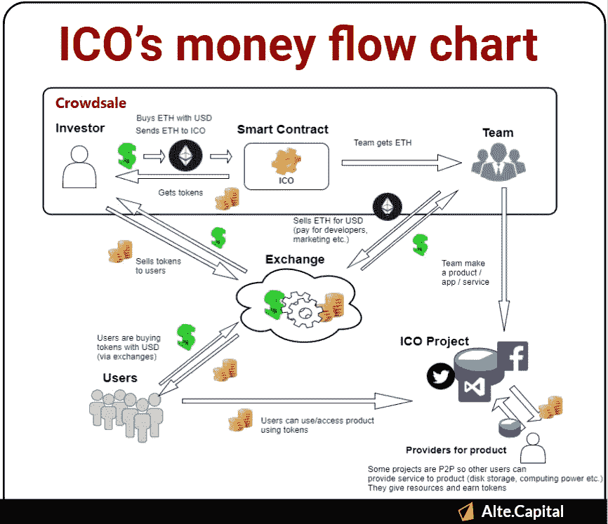
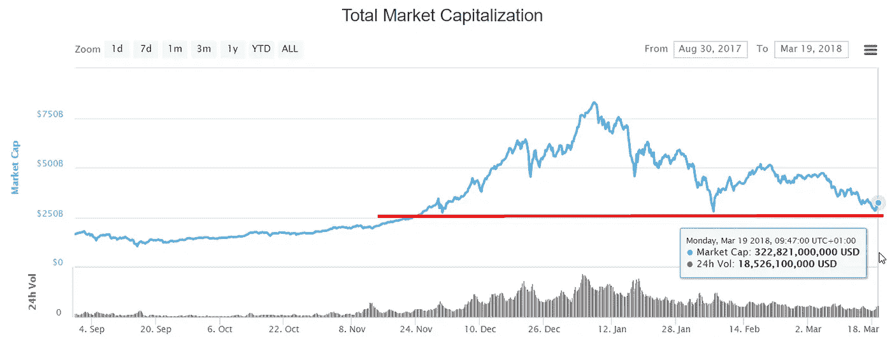
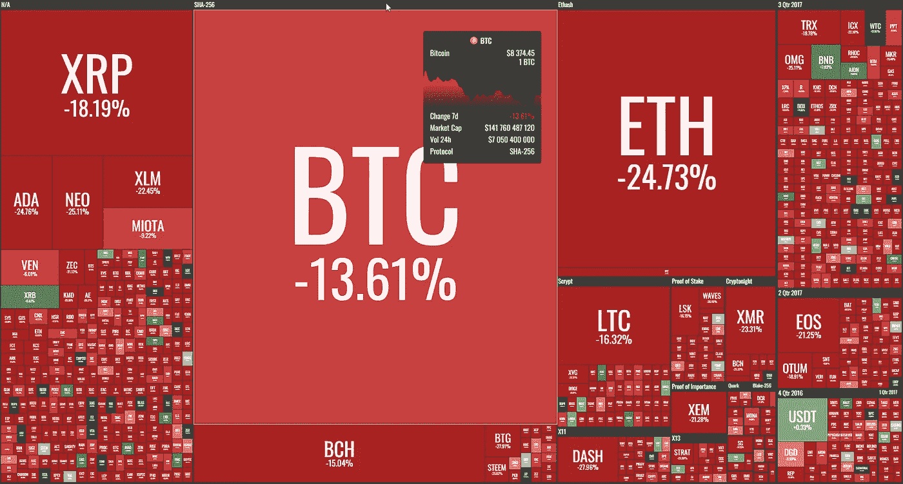

# “每周什么改变了加密”由 Alte。首都——2018 年 3 月 12 日至 19 日

> 原文：<https://medium.com/hackernoon/weekly-what-changed-in-crypto-by-alte-capital-12-19-march-2018-4a5c23a09350>

## 我们上周在《密码世界》中看到的最重要的东西的每周信件和个人评论

# 整个星期主要司机

我们已经看到市场下跌了大约 11 周。这一困难时期导致许多投资者恐慌或辞职。有几个迹象表明，目前的市场抛售可能与 ICO 的项目套现有关，这些项目在去年赚了很多以太币。这有三个主要因素。首先，他们正在套现，因为他们需要资金进行开发和营销。其次，看集合资金的估值是怎么往下走的，团队开始计算现在变现是否更好。最后，最近有许多项目可能害怕美国证券交易委员会的最新动向，怀疑通过进行象征性销售违反证券法。

前一段时间，我们准备了“ICO 货币流程图”，以帮助更好地了解 ICO 货币流通的样子。如你所见，没有 ICO 项目的成功大规模采用，代币经济就被打破了。希望我们将很快看到大众少数项目越来越受欢迎。

*关注我们的* [*推特*](https://twitter.com/Alte_Capital) *和* [*脸书*](https://www.facebook.com/Alte.capital) *并分享这个故事。这对我们很有帮助。*

ICO money flow diagram — Alte.Capital

此外，采矿业的盈利能力有了重大发展。比特币目前以采矿的盈亏平衡成本交易，目前为 8000 美元。

> 采矿业的盈利能力正在接近我们在 2015 年可以看到的水平。

此外，挖掘其他算法的盈利能力在上周大幅下降，但挖掘 Ethash 或 Equihash 硬币仍高于电力成本。有趣的是，看看采矿盈利能力是否会低于成本，以及这是否会导致关闭采矿钻机(就像 2014 年至 2015 年一样)。

# 价格行为

又是一周的主要硬币抛售。所有主要的硬币都感觉很重要，我们遇到了大约 2.8 亿美元的主要阻力。幸运的是，我们还没有度过难关。

Weekly crypto performance — 12–19 March 2018 (by coin360.io)

# 重大事件

SEC 证实对 ICO 的
进行大量调查周二，SEC 证实该机构正在对 ICO 进行数十项调查。该声明是在 2 月底媒体报道 SEC 向涉嫌参与 ICO 违反证券法的公司发出请求后发表的。
在过去的一年里，美国证券交易委员会(SEC)扩大了针对加密业务的活动，因为它认为加密业务不符合证券法。SEC 官员此前曾表示，他们正在调查非法活动的空间，特别关注代币销售。

**韩国考虑规范解禁 ICO 的**
韩国对 ICO 的禁令可能在未来几个月内有所松动。去年九月，国家金融服务委员会决定取缔 ICO。然而,《韩国时报》的一份新报告表明，禁令可能会部分解除，特别是针对那些满足尚未确定的条件的销售。
尽管当地禁止，许多韩国用户仍继续参与国际 ico。

**谷歌从 2018 年 6 月开始禁止加密货币和 ICO 广告**
根据谷歌最近更新的金融产品政策，“加密货币和相关内容将不被接受(包括但不限于硬币、兑换、钱包和交易提示的首次优惠)”。这一行动适用于所有谷歌广告产品，这意味着公司将无法在搜索引擎巨头的网站上以及第三方网站上显示与 cryptos 相关的广告。

**韩国检方突击搜查交易所**
韩国检方突击搜查了三家加密货币交易所，原因是怀疑其员工盗用了客户账户的资金。包括高管在内的交易所工作人员涉嫌从客户账户中抽取资金，并用这些资金在其他交易所购买加密货币。另一份报告指出，这些交易所已经被该国的金融监管机构——金融服务委员会(FSA)接管，并且这些公司的经营者被指控挪用公款。

**美国国会经济报告重点介绍加密货币**
美国国会公布的《2018 年联合经济报告》有整整一章专门讨论加密货币，包括比特币、以太坊和区块链监管的未来；这份综合报告追踪了加密货币的崛起，特别指出比特币和以太坊的价格增长显著，超过了道琼斯工业平均指数和标准普尔 500 指数。这份报告只是最新的迹象，表明美国政府正在认真对待区块链和加密货币的问题。

感谢您阅读整个故事！

> 我们的下一封“加密中的变化”信函将于 2018 年 3 月 26 日到期

## 访问我们的[网站](http://www.alte.capital)，在[推特](https://twitter.com/Alte_Capital)和[脸书](https://www.facebook.com/Alte.capital)上关注我们，分享这个故事。这对我们很有帮助。