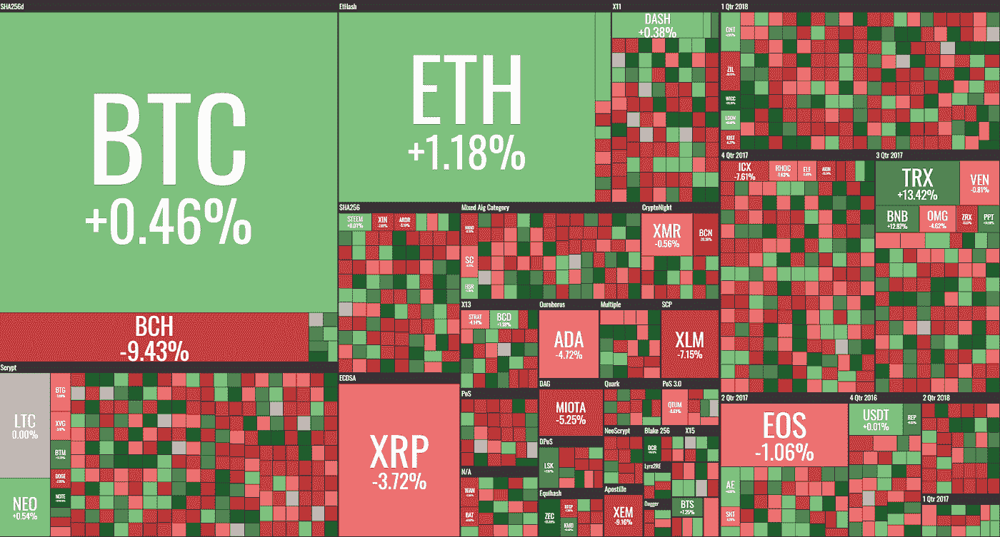

# “每周什么改变了加密”由 Alte。首都—2018 年 5 月 14 日至 21 日

> 原文：<https://medium.com/hackernoon/weekly-what-changed-in-crypto-by-alte-capital-14-21st-may-2018-ea50eecd189c>

## 最重要的东西，我们已经看到了前一周在密码世界与个人想法

# 主要发展

对于 crypto 来说，这是非常平静的一周，尽管有许多新闻和发展，但没有任何重大发展对价格产生重大影响。正如我们在前两封信中所说的，我们将继续观察这样的市场状况几周([链接](https://hackernoon.com/weekly-what-changed-in-crypto-by-alte-capital-30-7th-may-2018-2a247ab31d22/#c032))。
这是因为很少有 100 强项目宣布将在 6 月和 7 月完成主要里程碑。在这种情况下，专注于能够获得更多关注的小型项目可能会有所帮助。

Weekly 14–21st May 2018 crypto performance (by coin360.io)

**此外，我们注意到一些关于 stablecoins** 和真实资产支持代币的发展。越来越多的项目、公司宣布并交付他们在该领域的解决方案。这些项目要普及还需要一段时间，但与一年前相比，交易者有了更多的选择，这是件好事。当时，只有 USDT(Tether)是可交易的，而且只能在集中交易所交易。

# 2018 年 5 月 21 日第 14 周的主要秘密活动

纳斯达克将在下个月开始严格的加密交易。这条消息来自金融巨头，该交易所将被命名为 DX。纳斯达克计划提供一个平稳的入职流程，并收取零交易费用(可能在一段时间内)。

法国财政部长 Bruno Le Marie 在抨击区块链和加密技术后，呼吁法国成为加密技术的领导者。叙述中有趣的变化。据报道，部长承认他在区块链和加密货币问题上“是错误的”，他现在形容自己对这项技术“充满热情”。

**根据中国政府机构，以太坊在加密货币技术中排名最高。**这一消息是在中国决定对 28 种加密货币进行分类和评估之后发布的。

**Circle(高盛初创公司)筹集了 1.1 亿美元**并准备推出其 stablecoin。该硬币将被称为美元硬币，将与美元挂钩。

**比特币基地正在办理银行牌照**。该公司已与监管机构会面，讨论他们的业务和银行章程。

**三菱 UFJ 金融集团(日本)**，总资产 2.5 万亿美元的世界第五大银行，将开始试验自己的加密货币 MUFG Coin。试验计划将涉及 10 万个银行账户，并为其持有者提供移动钱包应用程序。

**感谢您阅读至此。**

> *“crypto 有什么变化”每周一来！*

**关注我的** [**推特**](https://twitter.com/Alte_Capital) **如果你将来对这些更深入、更翔实的报道感兴趣的话！**