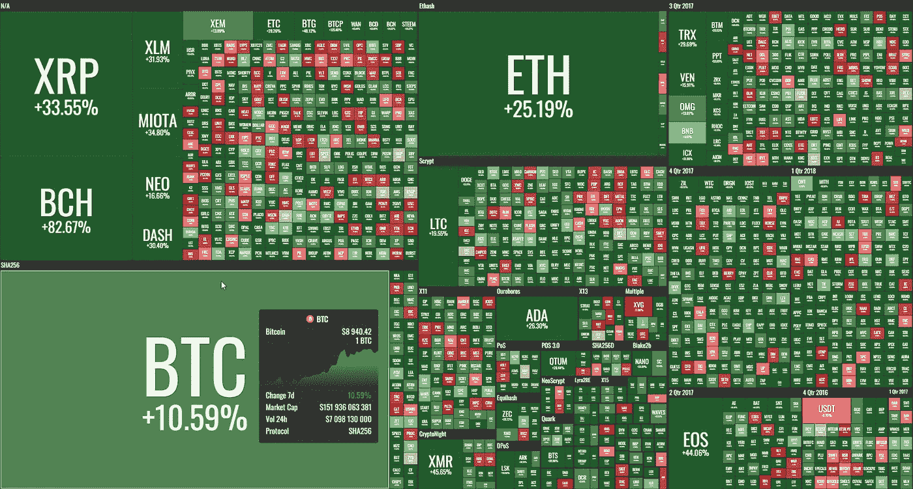
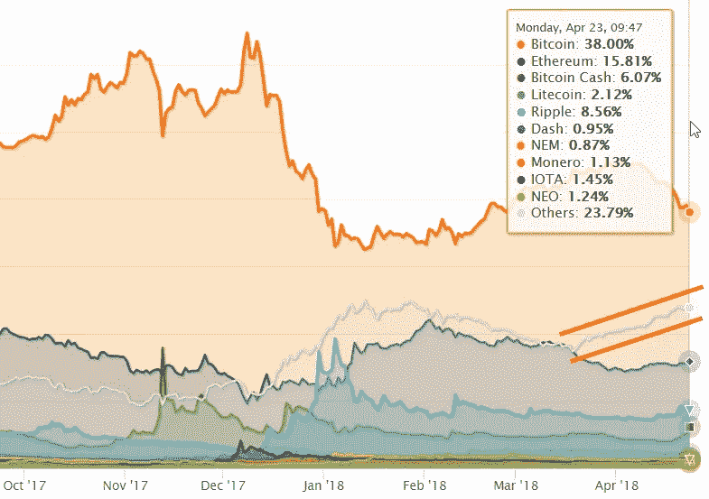

# “每周什么改变了加密”由 Alte。首都——2018 年 4 月 16 日至 23 日

> 原文：<https://medium.com/hackernoon/weekly-what-changed-in-crypto-by-alte-capital-16-23-april-2018-c2a83f0cd669>

## 最重要的东西，我们已经看到了前一周在密码世界与个人想法

# **主要进展**

**上周在密码市场上，只有一个值得注意的发展。**几乎所有的硬币都上涨了，我们看到了从三月底部水平的持续复苏。我们不清楚为什么复苏会如此之快。这可能与美国税收季的结束有关(正如我们两周前已经写的那样)，但现在看起来更像是一些新的资本正在进入 crypto，ICO 的项目停止了向 fiats 出售 crypto。或许，大部分 ICO 的 2018 年预算已经足够了，不需要再多卖了。

**另一个原因可能是，许多当前的 ICO(或前 ICO)正在通过 Fiat only** 增加资金，因此他们不需要在以后抛弃 crypto。例如 Telegram 目前最大的 ICO，我们认为对投资者来说可能非常糟糕，已经筹集了 24 亿美元，但不是在 crypto。

**最后，最近的变动可能与投资组合重组和更多参与替代投资有关**。请看下文，比特币的统治地位如何在两周内萎缩。

# 价格行为

最近几周，所有主要硬币的交易都很稳定。比特币筹集了 10%，前 10 名硬币筹集了 20-30%，唯一的例外是比特币现金，上涨了约 82%。这可以与即将推出的 fork 相联系，fork 将引入新功能。

Weekly crypto performance — 16–23 April 2018 (by coin360.io)

**市值**达到近 4000 亿美元，值得注意的是，比特币市场份额开始下降，主要是因为替代币的上涨。Zilliqa (ZIL)就是这样一个例子，它在两周内上涨了约 40%。

Weekly crypto market capitalization — 16–23 April 2018 (by coinmarketcap.com)

# 2018 年 4 月 16 日至 23 日第 16 周的主要活动

**纽约司法部长要求 13 家加密交易所提供信息**
司法部长埃里克·施耐德曼(Eric Schneiderman)周二(4 月 17 日)表示，他向十几家加密交易所发送了信函，寻求有关其内部控制以及如何保护客户的信息。“事实调查”是他的虚拟市场诚信计划(Virtual Markets Integrity Initiative)的一部分，该计划旨在“增加数字货币交易平台的透明度和问责制”，并通知监管者、投资者和消费者。北海巨妖在他们的网站上回应说“监管者应该反省自己”，向司法部长提出了一系列尖锐的问题。

**比特币基地终止与维基解密的合作** 维基解密声称其一家官方商店已被比特币基地加密货币交易所关闭。虽然比特币基地声明中提到金融犯罪网络的使命是防止洗钱，但目前还不清楚到底是什么导致了这一切断。维基解密已经开始在推特上呼吁抵制比特币基地。

风险投资公司 Andreessen Horowitz 帮助召集了一批投资者和律师，他们于 3 月下旬与美国证券交易委员会会面。该小组会见了证券交易委员会，提出了他们的“安全港”的想法，允许一些代币被归类为“公用代币”，而不是证券。
该提案称，当代币可以在计算机网络上用于其预期目的时，它就具有完全的功能，而不是像今天许多代币那样作为投机投资。

**亚马逊推出新的 AWS 区块链模板** 亚马逊云区块链模板使用流行的开源框架提供了一种快速简单的方法来创建和部署安全的区块链网络。模板使用户能够专注于构建区块链应用，而不是花费时间和精力手动设置区块链网络。亚马逊的竞争对手微软云 Azure 已经引入了类似的模板。

**欧盟为加密货币交易所引入新的客户验证**欧洲议会投票通过了对加密行业更严格的监管以及欧盟反洗钱指令的更新版本。新措施还解决了与预付卡和虚拟货币相关的风险。为了结束与虚拟货币相关的匿名性，虚拟货币交易平台和托管钱包提供商将像银行一样，必须实施客户尽职调查控制，包括客户验证要求。这些平台和提供商也必须注册，货币兑换和支票兑现机构以及信托或公司服务提供商也是如此。

**Earn.com 收购了 Cipher Browser，比特币基地收购了 Cipher Browser，比特币基地在三月份雇佣了其第一位并购老板，开始了新的合作伙伴关系，以扩大其在加密市场的机会。密码浏览器团队拥有自己的分散式手机浏览器 Toshi，并将密码浏览器的功能整合到 Toshi 浏览器中。Earn.com 也有类似的计划。Earn.com 暂停了其 token 的推出，转而将重点放在与比特币基地的基础设施整合和扩大服务上。**

> 下一封“加密中的变化”信件将于 2018 年 4 月 30 日发出

**感谢您阅读至此。如果你喜欢这篇文章，请分享，评论，按住👏有几次。这真的很有帮助。**

**关注我的** [**推特**](https://twitter.com/Alte_Capital) **如果你将来对这些更深入、更翔实的报道感兴趣的话！**