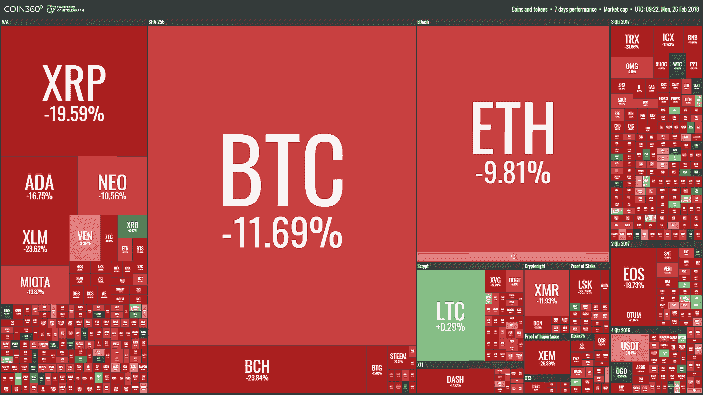
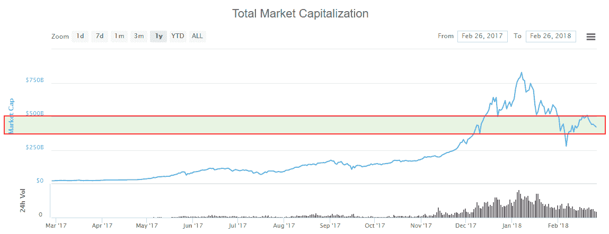

# “每周什么改变了加密”由 Alte。首都——2018 年 2 月 19 日至 26 日

> 原文：<https://medium.com/hackernoon/weekly-what-changed-in-crypto-by-alte-capital-19-26-february-2018-a29f236e22f0>

> 对我们来说，最重要的东西是我们上周在 crypto world 中看到的。

# 整个星期主要司机

上周没有多少价格变动的消息。我们可以观察到与加密货币和 ICO 的监管尝试相关的新闻数量增加。他们可以产生长期的影响，但不是短期的。

# 价格行为

除了莱特币之外，几乎所有主要硬币的表现都不佳。正如我们在上周的信中所述，市场接近了非常重要的资本水平，约为 5000 亿美元。导致我们现在可以观察到的拉回和下降。我们认为，我们将在 2-3 周内保持在 4400-5000 亿美元的水平。

Weekly price changes 19–26 February 2018\. From [https://coin360.io/](https://coin360.io/)

Crypto market capitalization 26 February 2018\. From https://coinmarketcap.com

# 重大事件

**委内瑞拉推出石油**

委内瑞拉政府已经开始预售首个国家加密货币——Petro(PTR)，其价值基于原油。第二天，马杜罗在推特上说，他们获得了 7.35 亿美元。根据官方说法，石油项目和代币交易将于 4 月 1 日开始。由于玻利瓦尔价值极低，政府决定寻找替代方法拯救委内瑞拉经济。在过去的 12 个月中，委内瑞拉的通胀率为 4.115%，玻利瓦尔的价值损失了 96%。

**罗宾汉开通加密货币交易**

移动应用股票交易提供商 Robinhood 正式推出加密货币交易，今天将这项新服务推广到美国五个州。通过 Robinhood 应用程序进行的交易可能**不是“免费的”** — **它们不需要 Robinhood 支付任何*额外的*费用，**但很可能仍需支付交易所在交易所收取的交易费用。

罗宾汉也有奇怪的提款权。在发布[之前，常见问题](https://support.robinhood.com/hc/en-us/articles/360000088663-Crypto-Transfers-Deposits)指出，如果满足足够的 ID 要求，可以撤销加密，撤销可能需要几天时间。

**比特币基地和 Bitfinex 采用 SegWit**

两个最流行的密码交易所，比特币基地和 Bitfinex 宣布支持 SegWit 协议。比特币基地在推特上表示，它已经完成了对 SegWit 的测试。另一方面，Bitfinex 已经为所有 BTC 客户采用了 SegWit。该产品向比特币投资者承诺更快的交易时间和更低的交易费用。

## 格鲁吉亚可能接受加密货币支付税款

格鲁吉亚将接受税收和许可证的加密货币。佐治亚州比特币税根据共和党州参议员约书亚·麦克孔和迈克尔·威廉斯提出的 464 法案，收到的加密货币将在收到付款后的 24 小时内转换为美元。

美国正在采取重要措施，让加密货币市场在尽可能少的干扰下发展。

**德国联邦金融监管局对 ico 的监管**

德国联邦金融监督局澄清了 ico 的义务。根据新的更新，潜在的 ICO 运营商必须彻底检查“所谓 ICO 背后的基础令牌、硬币或加密货币是否被视为证券监管领域的金融工具。”瑞士金融监管机构 FINMA 也为 ico 引入了新的监管准则。本月，该国还加入了一场关于在国际层面上扩大加密货币监管的辩论。

**英国将评估加密货币**

英国财政部委员会(UK Treasury Committee)正在发起一项对数字货币的调查，在最近加密交易所的涨跌之后，数字货币正吸引着人们的极大兴趣。财政委员会主席尼基·摩根表示，他们希望保护那些可能不知道加密货币目前在英国不受监管的个人。该委员会将询问关于加密货币的最关键话题，即它们是否可以在未来取代传统支付系统，监管是否有利于初创企业，其他国家如何对待加密货币，以及区块链技术如何为政府服务。

> 我们的下一期“加密有何变化”将于 2018 年 3 月 5 日发布

## 访问我们的[网站](http://www.alte.capital)，在[推特](https://twitter.com/Alte_Capital)和[脸书](https://www.facebook.com/Alte.capital)上关注我们，分享这个故事。这对我们很有帮助。