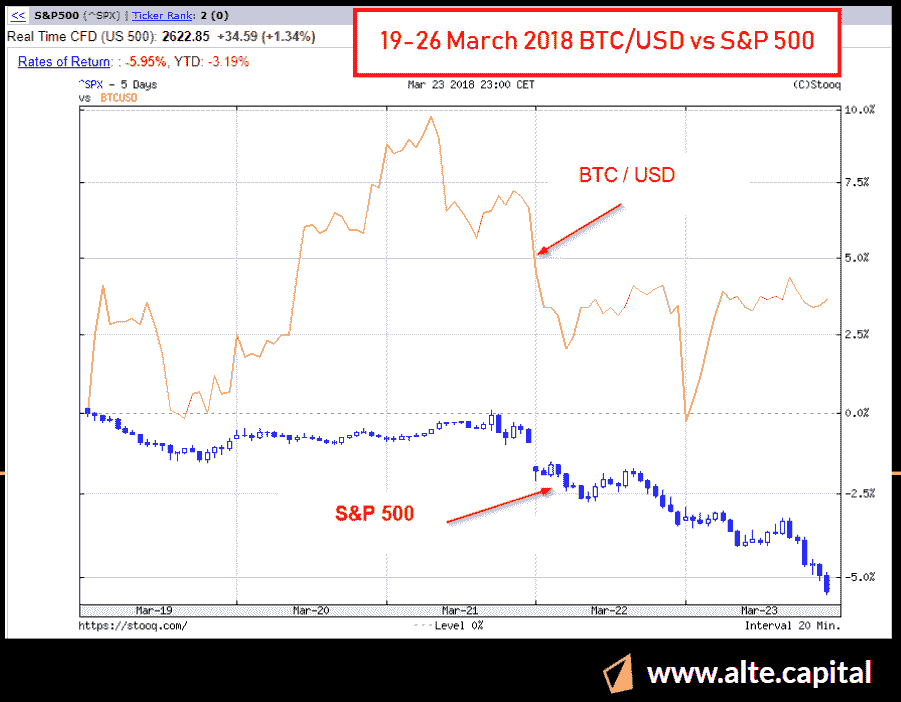
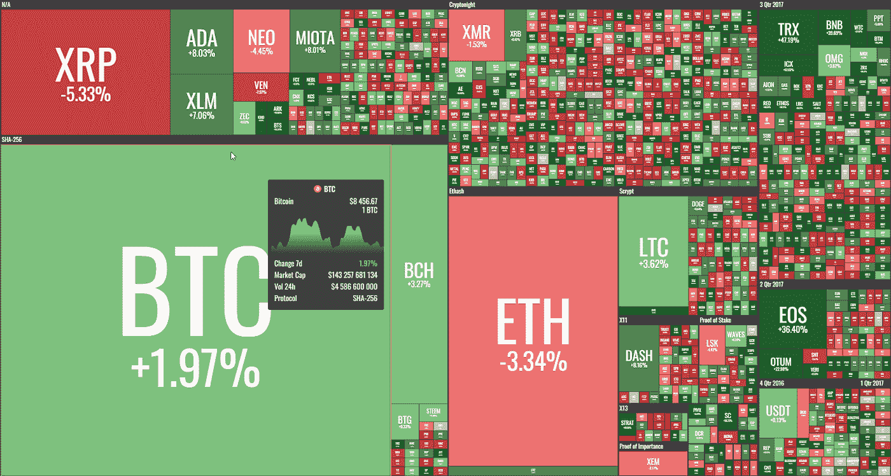
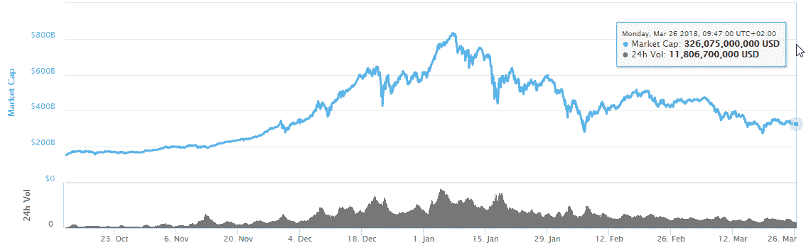

# “每周什么改变了加密”由 Alte。首都——2018 年 3 月 19 日至 26 日

> 原文：<https://medium.com/hackernoon/weekly-what-changed-in-crypto-by-alte-capital-19-26-march-2018-3140da862f71>

## 我们上周在《密码世界》中看到的最重要的东西的每周信件和个人想法

# 整个星期主要司机

对于密码市场来说，这是稳定的一周。它可以与在阿根廷举行的 2018 年 G20 峰会联系起来，这清楚地表明，对于这样的高级别制造商来说，加密仍然是一个没有得到很好理解的领域，我认为国家领导人认为他们没有真正的解决方案来监管它。这是上周的主要风险。现在，这种风险已经消失了几个月。

其次，上周还有其他非常重要的市场发展。我们可能会看到新一轮的股票抛售。标准普尔 500 指数在过去 10 个交易日中有 8 个交易日下跌超过 7%。在此期间，我们可以观察到比特币的上涨。如果这种趋势继续下去，它可能会导致股票和密码之间有趣的相关性。加密可能是对冲未来几周或几个月股票下跌的好机会。看它将如何发展将是非常有趣的。

Bitcoin and S&P 500 negative correlation during equities crackdown

# 价格行为

比特币和以太坊上周都没有大动作。然而，其他硬币取得了更显著的成果。特别是 EOS 和 TRON，我认为这是非常不明确和有风险的项目。我们也可以观察大图标和币安硬币的消息引发的收益。

Weekly crypto performance — 19–26 March 2018 (by coin360.io)

本周结束时，我们的市值约为 3260 亿美元，交易量仍在缓慢下降。主要阻力在 2800 亿美元左右。

Weekly crypto market capitalization — 19–26 March 2018 (by coinmarketcap.com)

# 2018 年 3 月 19 日至 26 日第 19 周的主要活动

**币安宣布在马尔他**
开展银行业合作。此前，日本金融厅(FSA)向香港加密交易所发出通知，要求该公司向日本交易监管机构注册。在这次打击之后，币安计划在马耳他(欧盟成员)开设一个办事处。
如果最终确定，币安可能会增加法定交易对，这意味着人们可以直接用美元或欧元购买密码。

万事达卡计划仅支持由政府支持的加密货币
该声明发布之际，万事达卡正逐渐软化其对加密货币的立场。现在，该公司亚太地区的联合总裁宣布，他们将“很高兴看到”由政府创建或由监管机构支持的密码。
万事达卡已经在与区块链技术和加密货币合作，万事达卡实验室已经申请了 30 多项与区块链技术和加密货币相关的专利。

G20 同意监控加密技术，但没有实际行动
来自全球 20 个最大经济体的财政部长和央行行长在布宜诺斯艾利斯召开会议，要求监管机构监控这些“加密资产”，但没有采取任何具体行动。从很多方面来说，技术是这次活动的中心主题。银行业高管在一份声明中表示:

> “我们承认，技术创新，包括潜在的加密资产，有可能提高金融体系和更广泛经济的效率和包容性。”

**美国财政部欲将钱包地址列入黑名单**
外国资产控制办公室(OFAC)3 月 19 日宣布，它正在考虑将加密钱包地址纳入其禁止美国个人和企业与之进行交易的个人和实体名单。这将是对美国财政部制裁黑名单上的人的补充。将要求金融机构对照 OFAC 提供的清单，审查为交易提供的任何虚拟货币地址，并报告、拒绝服务或阻止涉及任何所列地址的交易。理论上，矿商、混合服务、交易所也应该对照这份黑名单验证所有交易，但几乎不可能做到。

**20%的大学生用他们的助学金投资加密货币**
根据学生贷款报告的发现，一个学生贷款信息网站超过 20%的大学生用学生贷款购买加密货币。虽然该调查没有说明普通大学生在加密货币上的花费，但加密货币可能是非常重要的信息。同样明显的是，年轻人更倾向于进行加密货币投资。此外，这一发现表明，购买密码是用信用卡进行的。田纳西州通过一项法案，承认智能合约和区块链交易。该法案自一月份提出以来，在立法机关顺利通过，两院一致通过。正如条例草案案文所解释:
“如所介绍，认可使用区块链科技及智能合约进行电子交易的法定权限；保护受区块链技术保护的某些信息的所有权。”
法律承认智能合同具有法律效力，规定“不得仅仅因为合同包含智能合同条款而否认与交易相关的合同的法律效力、有效性或可执行性。”

> 下一封“加密中的变化”信件将于 2018 年 4 月 2 日发出

感谢您读到这里。如果你喜欢这篇文章，请分享，评论，按住👏有几次。这真的很有帮助。

**关注我的** [**推特**](https://twitter.com/Alte_Capital) **如果你将来对这些更深入、更翔实的报道感兴趣的话！**