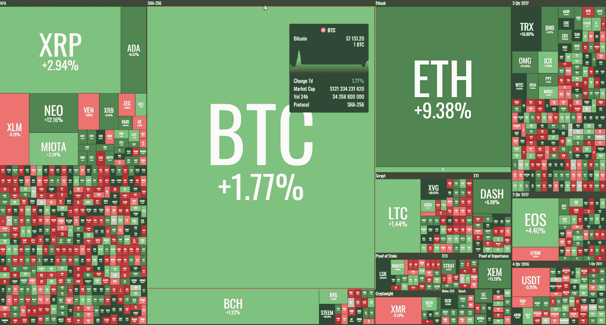
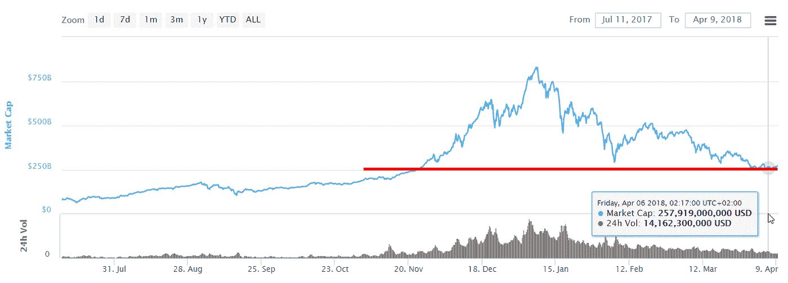
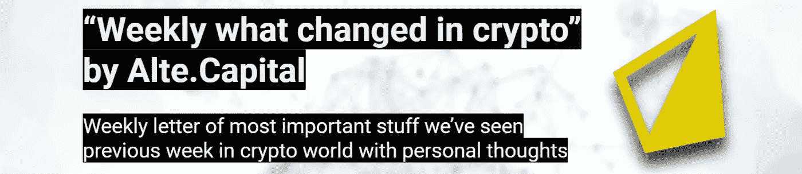

# “每周什么改变了加密”由 Alte。首都——2018 年 4 月 2 日至 9 日

> 原文：<https://medium.com/hackernoon/weekly-what-changed-in-crypto-by-alte-capital-2-9-april-2018-2c1349095d6d>

## 我们上周在《密码世界》中看到的最重要的东西的每周信件和个人评论

# 整个星期主要司机

我们可以观察到过去几天市场波动性的下降，看起来市场已经触底。抛售压力即将得到缓解，因为美国税收季将在不到两周内结束。

> 今年的纳税日对美国加密投资者来说似乎很重要。

问题可能是一些人将去年的收益进行了再投资，并在 2018 年 12 月或 1 月购买了其他密码。这些人认为他们很好，因为到时候他们可以兑现他们的密码来缴税。然而，价格突然下跌，他们不得不亏本出售来交税。有时他们不得不卖出比计划多得多的东西。也有些人感到惊讶，交易加密到加密是应税事件。比特大陆的 ASIC 机器有了新的发展。看起来以太坊社区想要阻止开采 Eth 的可能性，但是开发者们还没有决定这么做。要了解比特大陆已经拥有多大的实力，值得注意的是，Monero hash 率在上周分叉后下降了约 70%。这意味着比特大陆的机器可能已经拥有 50–70%的以太坊网络散列率。

最后，DAPP 宣布即将上线。例如，digix.global (DGD)项目宣布，在 ICO 两年后，他们设法交付他们的项目。现在可以购买 1 克黄金支持的 1 个代币。看到这将如何发展是很有趣的，因为这是**资产令牌化的第一个例子**。这样，加密经济学应该变得更加稳定，因为这是允许更好地发现加密硬币和代币价格的另一种方式。

# 价格行为

这是价格稳定的一周，但我们可以观察到比特币自 2018 年 2 月以来的最低价格，约为 6600 美元。看起来这是目前的主要阻力，我们应该在下周看到更高的水平。

Weekly crypto performance — 2–9 April 2018 (by coin360.io)

市场资本总额上周跌至约 2570 亿美元。这也是目前整个市场的关键阻力位，如果我们想在不久的将来看到收益，就必须保持这一水平。

Weekly crypto market capitalization— 2–9 April 2018 (by coinmarketcap.com)

## 【2018 年 4 月 9 日第 2 周重大加密事件

**波兰试图引入可怕的加密税收规则**
波兰政府宣布了关于加密货币税收的官方立场。一些交易加密货币的人可能需要缴纳超过 100%的税。这可能是一个问题，尤其是对年轻人来说。这也会迫使加密企业将业务转移到波兰以外。

**西班牙和波兰当局正在寻找加密用户的数据**
西班牙和波兰税务当局已经向加密交易所和加密交易公司发出信息请求。代理机构正在寻找有关交易和参与交易各方的详细信息。

**乔治·索罗斯和洛克斐勒家族研究加密交易**
据彭博称，索罗斯家族投资公司索罗斯基金管理公司的经理之一，在过去的几个月里已经获准交易数字货币。
此外，洛克菲勒家族的官方风险投资部门 Venrock 与加密投资集团 Coinfund 合作，支持加密货币和区块链业务创新。

**印度储备银行宣布阻止**
印度加入了阻止加密货币发展的国家行列。印度储备银行(RBI)宣布，立即禁止与从事加密货币交易的公司合作。中央银行宣布其目标是“消费者保护、市场诚信和洗钱”。
另一方面，第二天印度国家银行宣布，它仍在研究央行数字货币。

**谢谢你看完整个故事！**

> 我们的下一封“加密中的变化”信函将于 2018 年 4 月 16 日到期

## 访问我们的[网站](http://www.alte.capital)，在[推特](https://twitter.com/Alte_Capital)和[脸书](https://www.facebook.com/Alte.capital)上关注我们，分享这个故事。这对我们很有帮助。

