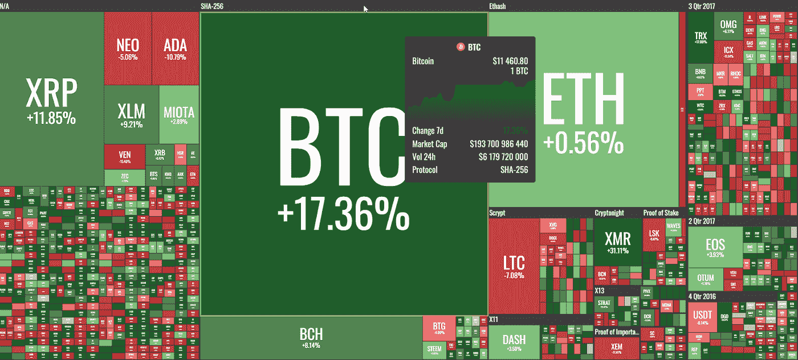
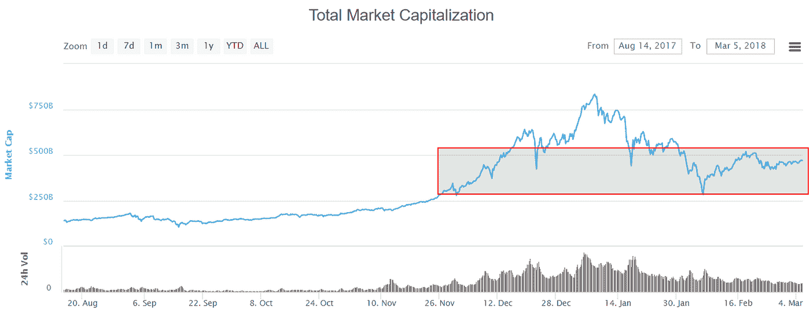

# “每周什么改变了加密”由 Alte。首都——2018 年 3 月 26 日至 5 日

> 原文：<https://medium.com/hackernoon/weekly-what-changed-in-crypto-by-alte-capital-26-5-march-2018-b9670cdc9812>

根据我们上周在《密码世界》中看到的内容，我们分享了最重要的东西。每周一早上好好享受吧！

# 整个星期主要司机

上周，许多项目团队宣布了他们的工作进展，我们可以看到，很快他们将开始兑现他们的承诺。

一段时间以来，加密货币的上涨一直与股市的牛市相对应(特别是美国和标准普尔 500)。虽然加密货币在过去几周经历了暴跌，但我们尚未看到它们将如何应对股市熊市。
我们将在未来几周内看到加密货币是否能在股市下跌期间提供多样化的好处(假设标准普尔 500 指数将在未来几天下跌)。

2 月 28 日有一个 ZClassic 叉。有些人不明白如何在分叉期间表现，他们损失了大约 90%的投资资本。

之前有关于各国发行本国加密货币的新闻。例如，土耳其、马绍尔群岛和伊朗(通过与执政党相关的消息来源)宣布他们正在考虑这个问题。这不会很快发生，但看看这些国家的意图是很有趣的。

最后，我们看到越来越多的人开始玩 cypto 游戏，主要是克隆几周前推出的 CryptoKitties。这仍然是一个小趋势，但看起来这可能是区块链的第一个用例之一。

# 价格行为

对于比特币和 Monero 来说，这是非常好的一周。此外，所有市场的日成交量都超过了 84 亿美元，是自 2 月 20 日以来的最高水平。虽然必须记住，12 月和 1 月的日营业额甚至达到 130 亿美元。

From https://coins360.io

自上周以来，市值增长了近 9%，我们的市值仍在 4200 亿至 5000 亿美元之间，这是一个重要的领域。很快(在 1-2 周内)我们将会知道市场将走向何方。

From [https://coinmarketcap.com](https://coinmarketcap.com)

# 重大事件

根据一份新文件，德国将把比特币作为一种支付手段，视为等同于法定货币的税收手段。
该文件通过将加密货币视为合法的支付方式来证明其税收决定的合理性，声明:

> “虚拟货币(加密货币，如比特币)成为合法支付手段的等价物，因为这些所谓的虚拟货币作为替代合同和即时支付手段已被交易参与者接受。”

出于税收目的，这意味着将比特币转换为法定货币或反之亦然是“应税杂项收益”。

**荷兰合作银行——正在考虑提供加密钱包**
荷兰合作银行(荷兰主要银行)已经为这个项目推出了一个名为“Rabobit”的专门网站其内部 kickstarter 计划的一部分被称为“集成加密货币钱包”，为客户提供“将加密货币存储在由可信方托管的钱包中”的机会。

**日本最大的贸易公司推出自己的加密货币**
日本最大的贸易公司乐天(Rakuten)正计划基于区块链技术和乐天超级积分计划推出自己的加密货币——乐天币。乐天超级积分计划于 15 年前首次推出，自那以来一直非常成功，客户获得了 1 万亿超级积分，价值约 91 亿美元。客户每次购买时都会获得积分，积分可以兑换折扣或购买某些产品。

**JD.com 中国电子商务平台将测试区块链**中国最大的零售商和电子商务公司 JD.com 推出了 AI Catapult，这是一个用于发展区块链技术和人工智能(AI)的加速器。作为京东计划的一部分，AI Catapult 将与区块链初创公司合作。

Circle 收购了 Poloniex
Circle(一家由高盛(Goldman Sachs)和其他几家大银行支持的初创公司)以大约 4 亿美元的价格收购了广受欢迎的加密货币交易所 Poloniex。圈子是 2013 年开始的 P2P 支付公司。Circle 的移动支付平台 Circle Pay 允许用户持有、发送和接收传统的法定货币。对 Poloniex 的收购将使 Circle 成为对其他大型加密交易所的威胁，如比特币基地、Bittrex 和北海巨妖。

**保时捷开始测试区块链**测试的应用程序包括通过应用程序锁定和解锁车辆，临时访问授权和基于区块链的新商业模式。这些功能将在所谓的自动驾驶汽车中发挥作用。

> 我们的下一期《改变了什么》将于 2018 年 3 月 12 日上映

## 与 Alte 连接。资本

请访问我们的[网站](http://www.alte.capital)，在[推特](https://twitter.com/Alte_Capital)和[脸书](https://facebook.com/Alte.Capital)上关注我们。