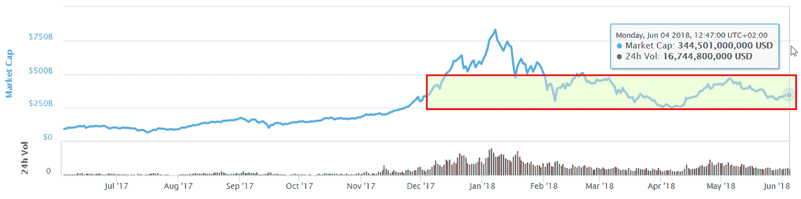
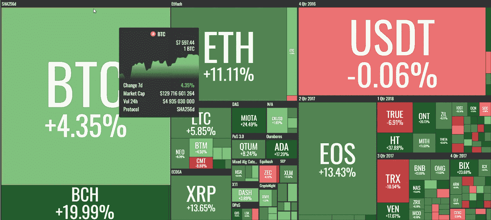

# “每周什么改变了加密”由 Alte。首都——2018 年 6 月 28 日至 4 日

> 原文：<https://medium.com/hackernoon/weekly-what-changed-in-crypto-by-alte-capital-28-4-june-2018-521c90160a05>

## 最重要的东西，我们已经看到了前一周在密码世界与个人想法

# 主要发展

从区块链领养的角度来看，上周非常有趣。EOS 长达 1 年的 ICO 确实结束了。这是以太坊网络上最大的 ICO。在接下来的一周，如果一切按计划进行，新区块链 EOS 将开始。因此，这将是最近在以太坊筹集资金并计划制作独立区块链的少数 ICO 中的第一个。同样的方法，我们将看到，例如奥米塞戈(OMG)，Zilliqa (ZIL)和创(TRX)令牌。他们还计划推出单独的区块链。

> 关于这一点，有几个方面值得注意

**EOS 团队声明他们只做 EOS。IO 软件**并向社区公开。他们不想为将来可能不会被 SEC(或其他监管机构)指控的新网络启动承担责任，以执行非官方的证券启动。
**观察什么街区真有意思。一家(EOS 背后的公司)将使用他们赚来的乙醚。**他们已经拥有超过 10%的 EOS 供应，所以他们积累更多是不明智的。
**其次，连续几天，EOS 代币被冻结在人们的钱包里。大多数人将他们的 ERC20 EOS 代币从交易所转移到钱包里。现在他们要等到 EOS 区块链启动，但这可能需要几天时间才能完成。即使在开始的时候，由于缺乏应用程序，也很难使用这些新的 EOS 令牌。例如，没有任何充分测试和信任的钱包。由于这个原因，我们可以假设交易所的剩余代币将被大量交易，我们可以看到 EOS 对非常高的波动性。
**最后，从开发者的角度来看，EOS 似乎还处于开发的早期阶段**，我们可以看到该平台存在许多错误和问题。可以肯定的是，在不久的将来，我们将会看到针对钱包的黑客和诈骗企图，以及针对其 21 个节点的 DDOS 攻击。**

# 价格行为

价格从上周的水平开始回升，我们可以看到主要硬币和代币价格上涨。市场资本总额仍在 2700 亿至 4500 亿美元之间。我们应该在那个区域多呆 1 到 2 周，然后我们应该会看到一些更有意义的变化。

Crypto market cap consolidation area between 300–450 billion dollars

Weekly 28–6th June 2018 crypto performance (by coin360.io)

# 2018 年 5 月 28 日至 4 日第 28 周的主要秘密活动

微软公司，收购 GitHub 公司
这家软件制造商已经同意收购 GitHub，这是一家受许多软件开发商欢迎的代码库公司。GitHub 也是加密项目的一种标准，大多数项目都使用它来托管代码和项目文档等。

**爱沙尼亚放弃创建国家加密货币的计划**
这个波罗的海国家放弃了将这些数字代币与欧元挂钩或向所有公民提供的计划，负责该国信息技术战略的官员 Siim Sikkut 说。相反，他们将作为激励措施给予电子居民，即使用爱沙尼亚电子身份远程签署文件和成立公司的外国人

**Bittrex.com 签署了一项银行协议**，允许公司投资者用美元交易加密货币。Bittrex 将与总部位于纽约的签名银行合作推出这项服务。Poloniex(由高盛支持)已经暂停了客户的交易，直到他们完成验证。在此之前，资金被冻结，未经核实的用户只能提取资金。

**火币 Pro 推出针对散户的加密货币交易所交易基金(ETF)**。他们基于指数的产品不像传统的 ETF 那样在受监管的证券交易所交易，也不能在传统的经纪账户中持有。这只基金的与众不同之处在于，散户投资者可以用非常少的初始投资购买它。

谢谢你读到这里。

> “加密中的变化”将于每周一发布！

**关注我的**[**Twitter**](https://twitter.com/Alte_Capital)**如果你将来对这些更深入、更翔实的文章感兴趣的话！**