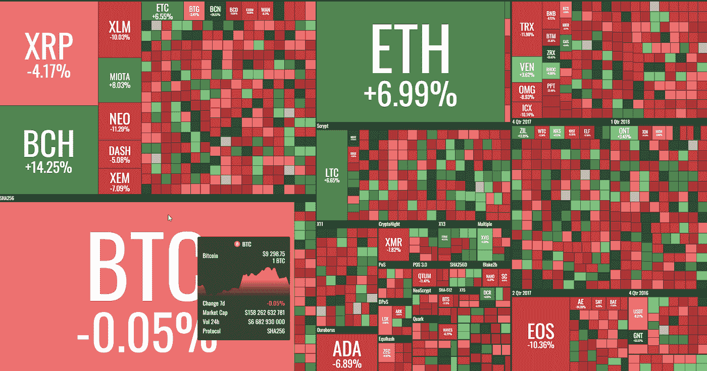
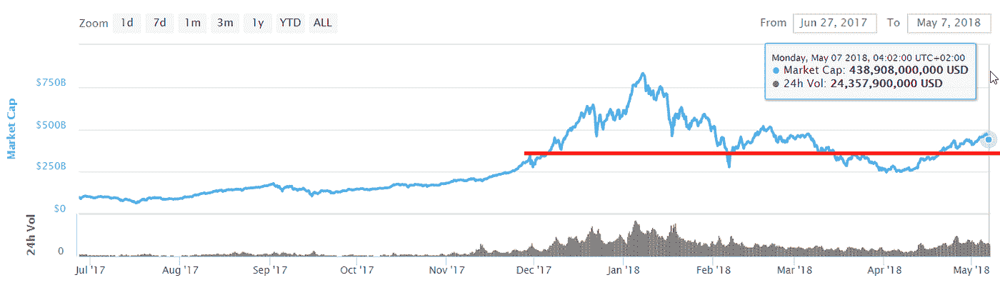

# “每周什么改变了加密”由 Alte。首都—2018 年 5 月 30 日至 7 日

> 原文：<https://medium.com/hackernoon/weekly-what-changed-in-crypto-by-alte-capital-30-7th-may-2018-2a247ab31d22>

## 最重要的东西，我们已经看到了前一周在密码世界与个人想法

# 主要发展

上周的主要驱动力似乎是关于未来一周将会发生什么的新闻。有传言称，CFTC 和 SEC 官员将于 5 月 7 日会面，审查以太坊、Ripple 和其他密码的法律地位。开发人员和一些代表该行业的律师感到沮丧的是，SEC 继续应用一种神秘的法律测试来确定加密资产是否属于 SEC 监管的一篮子资产。

> 我们看到其他国家的监管机构也在努力，SEC 的案例可以显示美国政府在控制加密空间方面的意图。

尽管这次内部会议真的会召开，但不会有任何最终决定。

**另一方面**，更多的项目宣布他们计划在接下来的几周内完成他们的里程碑。看起来这是 Stratis、Loom Network、Ziliqua、IOTA 和 0x 等一些项目的价格驱动因素。

最后，我们看到每周都有越来越多的人开始使用分散式交易所**。**巨大的用户增长和不断增加的交易量给 idex.markets 带来了问题，该公司因性能问题于几天前停止工作。这表明需要更好、更可扩展的分散式应用程序。

# 价格行为

对于主要硬币来说，这是一个喜忧参半的一周。一些获得和一些失去的价值在 10%的范围内。像 Cardano 和 EOS 这样的项目，由于前几周的巨大收益，其价值明显下降。

Weekly crypto performance — 30–7 May 2018 (by coin360.io)

市值在 5 月 6 日达到 4700 亿美元，看起来这可能是我们的中期阻力。我们认为，未来几周，市场将在 3500-4700 亿美元之间浮动。

Weekly crypto market capitalization — 30–7 May 2018 (by coinmarketcap.com)

## 【2018 年 5 月 30 日至 7 日周内的重大秘密事件

**Reddit 计划恢复比特币支付并增加以太币和莱特币**
Reddit 计划恢复加密货币作为其黄金会员的支付选项——这一次比特币将不是唯一的选项。在周四接受切达采访时，首席技术专家克里斯·斯洛维表示，加密支付选项将在平台更名后回归。此外，首席技术官表示，在以太坊和莱特币上向 Reddit 付款将是可能的。

**Telegram pre-ICO 结束**
Telegram 进行的 pre-ICO 最大股份之一已被扣押。到目前为止，约有 200 名投资者投资了预售，资金累计约 17 亿美元。
电报会这样做的原因尚不清楚，虽然据推测可能是越来越多的新规定。然而，一些人认为，原因仅仅是为了筹集足够的资金，用于开发区块链的平台。

**Ripple Labs 起诉**
一名投资者对 financial Ripple Labs 提起诉讼，指控该公司向散户投资者提供未注册证券，违反了州和联邦法律。诉状称，Ripple 预先开采了 XRP 硬币，并以“本质上永无止境的首次硬币发行”的形式向公众出售。

> 这非常有趣，因为 Ripple Labs(该公司)在 2014 年没有创造 Ripple (XRP)硬币。

80%的 XRP 供应是由创造者(公司创始人)赠予他们的，以围绕其构建用例。剩下的 20%被硬币的最初创造者瓜分。在 Ripple Labs 持有的 80%股份中，大部分被锁定在第三方托管中，并慢慢释放给 Ripple 以增加流动性。

**普华永道收购了 VeChain** 的股份
普华永道(PWC)收购了中国初创公司 ve chain Global Technology Holding Limited 的少数股份，后者是 VEN 的创始人。普华永道打算将 VeChain 区块链平台整合到他们提供给客户的解决方案中。

**日本金融监管机构正在推动交易所取消 Monero、DASH 和 Zcash**
目前没有完全禁止的报道，目前在日本处理 Monero、Dash 和 Zcash 仍然是合法的。相反，政府似乎正在采取间接的途径来结束这些加密货币的使用。日本金融监管机构正在对该国的加密货币交易所悄悄施加压力，以说服他们停止处理犯罪分子和黑客青睐的数字货币，包括 Monero、Dash 和 Zcash，因为它们很难跟踪。

*下一封“加密中的变化”信函将于 2018 年 4 月 30 日到期*

**感谢您阅读至此。如果你喜欢这篇文章，请分享，评论，按住👏有几次。这真的很有帮助。**

**关注我的**[**Twitter**](https://twitter.com/Alte_Capital)**如果你将来对这些更深入、更翔实的文章感兴趣的话！**