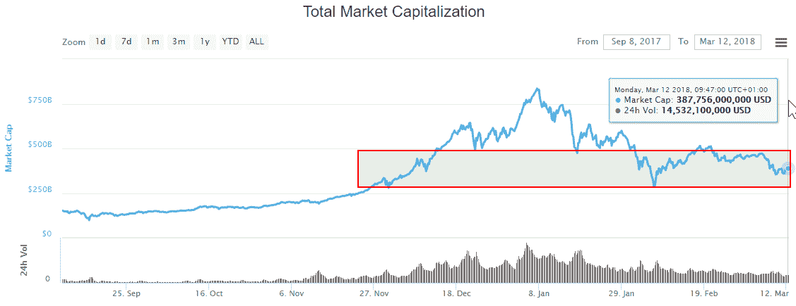
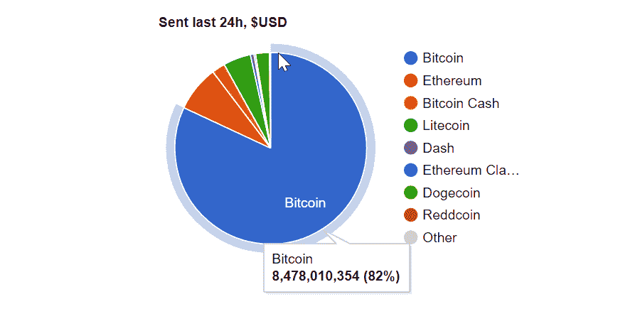
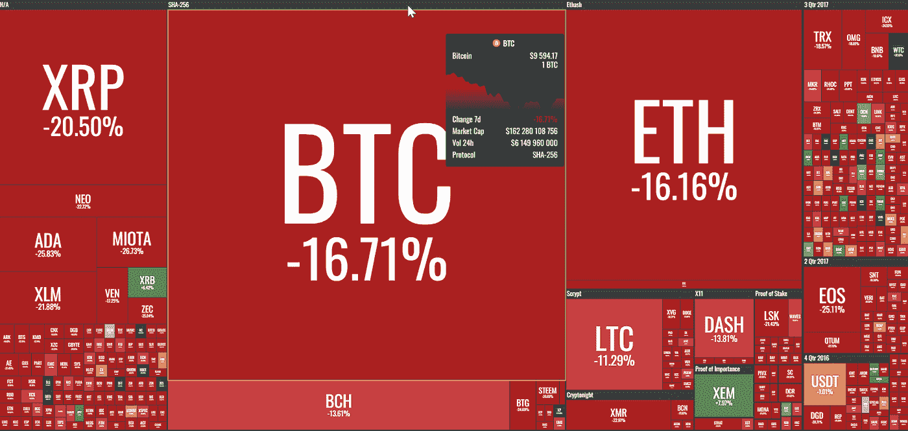

# “每周什么改变了加密”由 Alte。首都——2018 年 3 月 5 日至 12 日

> 原文：<https://medium.com/hackernoon/weekly-what-changed-in-crypto-by-alte-capital-5-12-march-2018-1d4edea9275f>

## 我们上周在《密码世界》中看到的最重要的东西的每周信件和个人评论

# 整个星期主要司机

上周主力部队被企图币安黑客(详情如下)。幸运的是，检测到并阻止了一次攻击。这导致市场上的谣言和抛售。这是几个月以来我们第一次观察到最大的交易所之一出现问题，因此对许多新的密码交易员来说，这可能是一件新鲜事。

市值仍在 3.5 亿至 5 亿美元之间，这使得比特币的价格在 8500 至 9700 美元之间。成交量正在缓慢下降，这应该是最后一周的水平。只是很难说什么消息会引发动向。

From coinmarketcap.com

为什么我们认为比特币的价格如此重要，即使它现在只占加密市值的 40%左右？因为它仍占美元交易额的近 80 %。

Cryptocurrencies volume. From bitinfocharts.com.

> 在推特和[脸书](https://www.facebook.com/Alte.capital)上关注我们，分享这个故事。这对我们很有帮助。

# 价格行为

上周，所有主要硬币都出现抛售。本周唯一的赢家是 NEM，它募集了 8%的资金。

5 —12th March 2018 prices fall. From coin360.io.

# 重大事件

**币安差点黑掉**
3 月 7 日，币安因调查未经授权的市场交易而暂停提款。用户报告他们的账户上有奇怪的交易，VIA/BTC 市场经历了异常活动。币安说，这个问题只影响那些注册的 API 密钥，所有的资金被自动冻结，没有资金被盗。后来，币安宣布悬赏捉拿黑客未遂，并悬赏 25 万美元，奖励任何提供信息，导致参与黑客未遂的黑客被依法逮捕的人。

**日本——Mt Gox 受托人 Nobuaki Kobayashi 承认在市场上售出了大约 3.5 万辆 BTC 和 3.4 万辆 BCH**

Mt Gox 是第一家大型比特币交易所，在破产前抢走了成千上万人的数百万美元。
受托人已经出售了足够支付当前 Mt Gox 客户负债或非常接近负债的资产。在目前这个时刻，没有理由再卖了。受托人仍然拥有大约 166，000 BTC。其余的比特币将留在原地，直到法院决定民事赔偿是否通过。这可能需要几个月甚至几年的时间，他们才能弄清楚谁将获得剩余的比特币，以及他们将如何分配这些比特币。

**比特币基地正在创建加密指数基金**

数字货币巨头比特币基地最近宣布，他们将推出一只被动管理的加密货币指数基金。该基金将有最低 10K 美元和每年 2%的管理费，它将包括所有在 GDAX 上交易的数字货币，按市值加权。

**Bittrex 正在努力增加美元并移除系绳**

最大的加密货币交易所之一 Bittrex 可能很快就会放弃 Tether。据首席执行官 Bill Shihara 说，他的团队分析了原子交换和分散交换可能对 Bittrex 产生的影响。

感谢你阅读整个故事！

> 我们的下一期“加密有何变化”将于 2018 年 3 月 19 日发布

## 访问我们的[网站](http://www.alte.capital)，在[推特](https://twitter.com/Alte_Capital)和[脸书](https://www.facebook.com/Alte.capital)上关注我们，分享这个故事。这对我们很有帮助。