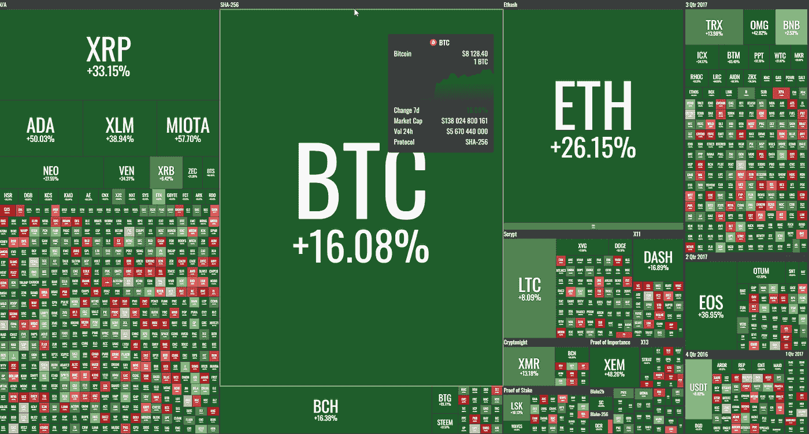
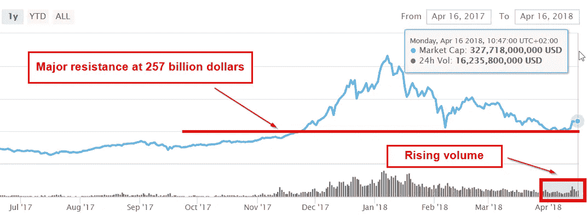

# “每周什么改变了加密”由 Alte。首都——2018 年 4 月 9 日至 16 日

> 原文：<https://medium.com/hackernoon/weekly-what-changed-in-crypto-by-alte-capital-9-16-april-2018-106872575466>

## 最重要的东西，我们已经看到了前一周在密码世界与个人想法

## 整个星期主要司机

上周，新闻流变得不那么负面，正如我们在前一封信中所写的，大部分税收抛售季节已经结束。我们还写道:

> 看起来这是当前的主要阻力，我们应该在下周看到更高的水平 [**见上一篇:“每周信 2-4 月 9 日”**](https://hackernoon.com/weekly-what-changed-in-crypto-by-alte-capital-2-9-april-2018-2c1349095d6d)

自 4 月 12 日星期四以来，我们可以观察到整个市场的收益。

**有一种趋势是公司和交易所将业务转移到对加密更友好的国家。我们可以看到币安和 OKEx 的公告。也有其他较小的公司和项目正在考虑这样的举措。这种情况可能会加剧，尤其是对于那些无法为加密环境保证稳定的税收和监管体系的公司。**

假人(GNT)项目宣布经过近 18 个月的开发，他们已经完成了项目的第一个版本。那是以太坊网络上第一批 ICO 项目之一。在此之前，其他几个项目也开始兑现承诺，启动项目。这类项目必须获得用户的关注，并在用户中流行起来，因为如果不能成功地大规模采用，代币的经济性就会被打破。

> **没有 ICO 项目的成功，“区块链经济”也不会成功**

## 价格行为

几乎所有的硬币都在上周反弹并表现良好。比特币在 6600 美元左右守住主要阻力后，反弹至 8120 美元。
我们可以看到**OMI sego、Cardano 和 IOTA 的周涨幅甚至达到了 50%**。这可能是一个迹象，表明其他替代硬币在未来几周的表现也可能好于前 5 名硬币。

Weekly crypto performance —9–16th April 2018 (by coin360.io)

市值上升到 3260 亿美元的有趣因素是不断上升的交易量。这给了人们一个希望，即大约 2570 亿美元的主要支撑位被守住了。

Weekly crypto market capitalization — 9–16th April 2018 (by coinmarketcap.com)

## 2018 年 4 月 16 日第 9 周的主要加密活动

**Bittrex 重新开放新注册**
Bittrex(美国)宣布恢复新用户注册并推出其增强型网站。此外，Bittrex 现在支持企业账户，并接受新的企业申请。去年 12 月，Bittrex 暂停了新用户的注册，以保持平台的体验、稳定性和安全性。Bittrex 还对该公司的网站和交易平台进行了增强，包括对其 API 的性能、可用性和安全性的改进。

**欧洲国家加入区块链伙伴关系**
22 个欧洲国家签署了建立欧洲区块链伙伴关系宣言。该伙伴关系将成为欧盟成员国之间交流技术和监管领域的经验和专业知识的合作工具，并为启动全 EU-的区块链应用做准备。

**德国第二大证券交易所推出新的交易所应用**
德国人将获得一个新的加密货币交易所。Sowa Labs 是德国第二大传统证券交易所 Boerse Stuttgart 的子公司，正在开发一款加密货币交易应用程序。名为 Bizon 的平台将于秋季上市。Sowa 实验室的主任 Ulli Spankowski 说:“这是世界上第一个背后有传统证券交易所的加密应用程序。”最初，交易所将提供 BTC、瑞士联邦理工学院、长期资本和 XRP 的交易。

日本正致力于 ICO 的合法化和监管工作。4 月日，日本商业研究小组起草了一份提案，要求政府以保护投资者利益和鼓励新兴区块链产业发展的方式监管 ICO。未来几周，日本金融厅将分析新法案的比例。大概在 2018 年，日本将成为首批基于 ICO 的全球商业中心之一。

**OKEx 是马耳他下一个加密货币交易所开业运营**
OKEx 首席执行官李宇春表示:“我们期待与马耳他政府合作，因为它具有前瞻性思维，与我们有许多相同的价值观，其中最重要的是保护交易商和公众，遵守反洗钱和了解您的客户标准，以及对区块链生态系统持续发展的创新和重要性的认可。”
这是继币安之后又一家考虑将马尔他作为其业务新目的地的交易所。

**谢谢你看完整个故事！**

> 我们的下一封“加密中的变化”信函将于 2018 年 4 月 23 日到期

## 访问我们的[网站](http://www.alte.capital)，在[推特](https://twitter.com/Alte_Capital)和[脸书](https://www.facebook.com/Alte.capital)上关注我们，分享这个故事。这对我们很有帮助。

