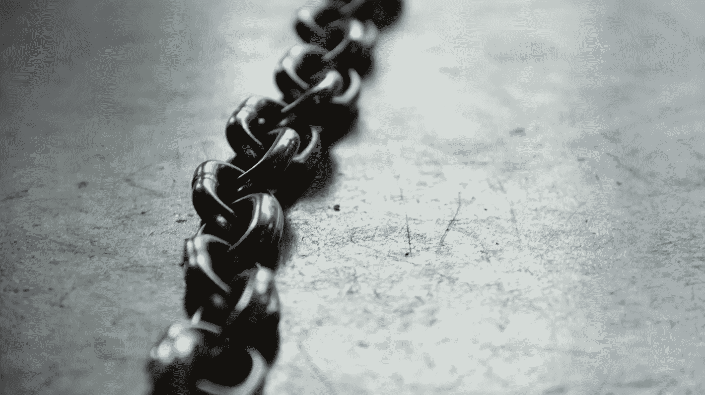

# 使用区块链的怪异和不平凡的方式

> 原文：<https://medium.com/hackernoon/weird-and-non-trivial-ways-of-using-blockchain-1edbf228a1f8>

Photo by [Kaley Dykstra](https://unsplash.com/photos/gtVrejEGdmM?utm_source=unsplash&utm_medium=referral&utm_content=creditCopyText) on [Unsplash](https://unsplash.com/search/photos/block-chain?utm_source=unsplash&utm_medium=referral&utm_content=creditCopyText)

区块链已经问世十年了，今天，几乎没有人会否认这是一项突破性的发明。当比特币首次出现时，它是驱动比特币的底层技术，但自那以后，它已经发展得越来越多。

从早期作为边缘技术开始，区块链现在被传统的[金融](https://hackernoon.com/how-vr-and-ar-will-shape-the-future-of-fintech-b8bafa2748ee)和政府机构彻底调查(有时被执行)。这是因为这种高度安全的分布式分散分类账已被证明是一种强大的反欺诈解决方案。

验证交易和身份并生成多个可靠记录以分散方式存储(在不同位置)的过程有可能改变行业。因此，大银行和企业巨头现在竞相利用这一数字数据库来获得竞争优势。

与此同时，科技界的一些人已经开始发现区块链的一些非常规用途。在本文中，我将探索使用区块链的一些奇怪而又重要的方法。

# **1。区块链婚礼**

Image source: [C](http://coinoutletatm.com/)oinOutlet

是的，你没看错！

自从 2014 年大卫·蒙德鲁斯和乔伊丝·巴约在区块链举行了他们的第一次婚礼以来，这已经成为了加密界的一件“事情”。这里的想法是使用区块链提交[智能誓言](https://smartvows.com/)，它将被永久存储在数字账本中。

从那时起，Bitfury 的员工， [Alex 和 Daria 也在 block](https://cointelegraph.com/press-releases/bitfury-helps-team-member-secure-marriage-license-on-bitcoin-blockchain) 中添加了另一条链(你甚至可以[在这里](https://live.blockcypher.com/btc/tx/e81f708ca09fc93337c3950158c4a4f8a9bcf57176fcee6e2869bc6ac4dc5db5/)查看交易)。虽然这些夫妇在区块链永久登记结婚，但必须指出的是，他们都遵循了适当的法律和民事协议。

虽然区块链婚礼听起来很新奇，但这很快就会成为常态。格鲁吉亚共和国和乌克兰的政府已经在区块链上运行其他注册表，因此我们可能正处于政府机构大变革的风口浪尖。

# **2。性同意的记录**

Image source: LegalThings

总部位于阿姆斯特丹的初创公司 *LegalThings* 今年 1 月推出了一款名为 [*Legal Fling*](https://legalfling.io/) 的手机应用，借助分布式数字账本来验证性同意。尽管这一举措是受 **#MeToo** 运动的启发，但该应用程序的目的不仅仅是记录用户对性行为的同意。

例如，用户可以指定他们在参与行为时什么是舒服的，什么是不舒服的。这可以是任何事情，如使用避孕套，使用露骨的语言，分享照片和视频。

该信息可以作为消息请求转发给潜在的性伙伴，该性伙伴然后可以决定接受或拒绝邀请(基于交互的条款)。如果个人接受，此信息将被记录在区块链上(永久)。

# **3。追踪血钻**

Image source: EverLedger

几十年来，来自冲突地区的矿物和宝石一直是个大问题。然而，最近这种创新的分散式分类账已成为追踪、跟踪和数字证明钻石和其他贵重商品所有权的实用解决方案。

像 Everledger 这样的初创公司(完成了一轮价值 1040 万美元的融资)很适合这样做。这种模式甚至可以应用于解决与象牙偷猎和打击假冒商品有关的问题。

钻石集团德比尔斯还利用区块链支持的平台 Tracr 成功追踪了 100 颗高价值钻石从矿场到商店的全程。

还有一种跨行业的趋势，即在整个供应链中追踪成品珠宝的来源。为了提高透明度，行业内的主要参与者发起了 [TrustChainTM 计划](https://newsroom.ibm.com/announcements?item=122899)(由 *IBM 区块链平台*提供支持)。

如果世界其他地方也采用这种方式，那么冲突地区的血腥钻石和其他宝石很快就会被终结。

# **4。分散的太空计划**

Image source: incrypts.com

当你想到一个分散的分布式账本时，空间可能是最后想到的东西。然而，有两个倡议共享同一个名字，太空链，旨在结合区块链技术和空间。

第一个 [SpaceChain](http://www.spacechain.org/) 项目致力于让每个人都能参与太空任务。虽然这一切听起来有点牵强，但关于[未来太空任务的信息很容易在网站](http://www.spacechain.org/plan20152020.html)上获得，他们计划在那里进行首次从太空到地球的加密货币交易。

第二家[太空链](https://spacechain.com/)公司的目标是成为第一家分散式太空机构，建立地球上第一个基于区块链的开源卫星网络。如果实现，用户将能够从太空创建、管理和更新分散的应用程序。

由于 SpaceChain 操作系统将对每个人免费开放，这种方法可以大大有助于消除限制空间访问和全球合作的障碍。通过消除太空探索中的民族主义和政府控制，这一倡议可以加速太空计划的发展。

# **5。区块链家禽**

Image source: TE-FOOD

起初，家禽和区块链似乎不是一个很好的搭配，但实际上这是一个很好的主意，将服务于有意识的消费者。 [GoGo Chicken(由中国保险科技孵化器中安在线支持)](https://qz.com/1158236/the-gogo-chicken-program-in-china-is-adding-poultry-to-the-blockchain-with-facial-recognition/)旨在利用区块链的面部识别功能，从自由放养的有机鸡孵化的那一刻起就对其进行跟踪。

由于这些鸡将配备 GPS 手环，预订鸡的客户可以通过移动应用程序实时跟踪鸡的饮食。虽然 GoGo Chicken 开始时只有 10 万只鸡，但该公司希望在三年内跟踪 2300 万只鸡。

随着世界各地的人们越来越注重健康，他们会越来越想知道自己到底要吃什么。因此，我们可以期待看到更多的食品相关的区块链项目。

嘉吉公司去年也做了类似的事情，推出了金银花白色品牌假日火鸡。在这种情况下，顾客可以在 HoneysuckleWhite.com 发短信或输入包装上的代码，追踪这只鸟的生活和旅程，从它在家庭农场的起源到他们的餐桌。

虽然其中一些区块链项目听起来可能有点奇怪，但它们确实带来了真正的价值。由于这种高度分散的分类账不会消失，我们当然可以期待在未来几年听到更多关于非平凡但奇怪的区块链项目。