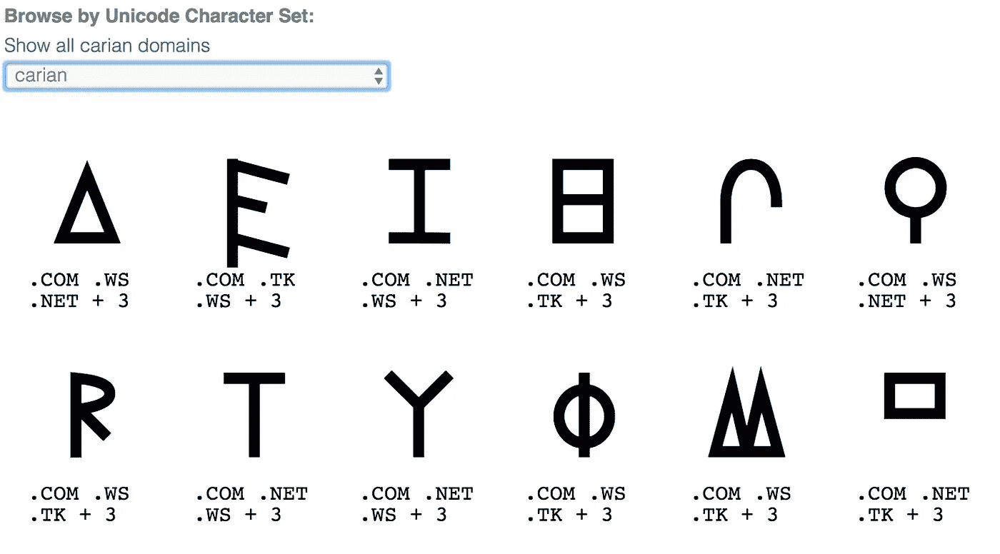

# weirdonecharacterdomainsuperstore . com:我是如何建造它的

> 原文：<https://medium.com/hackernoon/weirdonecharacterdomainsuperstore-com-how-i-built-this-e0ec4e6fc2b8>

Weird One Character Domain Superstore

## [WeirdOneCharacterDomainSuperstore.com](https://WeirdOneCharacterDomainSuperstore.com)又名 [ツ.ws](https://ツ.ws) …一个怪异的 unicode 单字符域名的网络应用…一个失控的周末项目…

**TLDR；**我建了一个[怪异的单字符域超市](https://WeirdOneCharacterDomainSuperstore.com)。这比预期的要多得多，而且完全荒谬，但是已经完成了。尽情享受吧！

# 这是什么？

WeirdOneCharacterDomainSuperstore.com 正是你所期待的:一个你可以去购买奇怪的单字符域名的地方。虽然世界上的 x . com 可能属于埃隆·马斯克(Elon Musk)之流，但你不需要拥有自己的电动汽车公司来拥有自己的单一角色领域。

你只需要做一些选择。错误的选择。 [𐋐.军队](https://xn--bdk.ws/domain/%F0%90%8B%90.army?page=2&filterExtension=army&sort=time&sortOrder=asc&fromSearch=true&isNew=&byChar=false)的选择。

在这篇文章中，我将试着描述我创建[WeirdOneCharacterDomainSuperstore.com](https://WeirdOneCharacterDomainSuperstore.com)的过程和一些技术挑战。这不是火箭科学，但比你想象的要复杂得多。

我喜欢愚蠢的黑客马拉松。我是一名专业的网络开发人员，白天负责一个大项目，但是晚上，我喜欢做一些让我开心的事情。

一个奇怪的 unicode 域超级商店。为什么不呢？我喜欢有才华的人在不确定的事情上投入太多精力。一个坏主意，完全执行。

或者至少最低限度地执行。

# 怪异的一个字符域超级商店 MVP

为什么这样的市场还不存在呢？这些是你需要建立一个最小可行的怪异的单字符域超市的东西:

*   一个好域名
*   在你的参考浏览器中，什么字符是有效的和可见的
*   关于每个角色的元数据:语言/类别/名字等…
*   一种检查域可用性的方法
*   可用域的数据库
*   用于排序和显示域名列表和数据的 webapp。你必须向访问者展示可用的域名，他们不会只是猜测。
*   赚钱的方法

没有哪一步是困难的，但是有足够的东西，没有一个理性的人会在如此愚蠢的事情上花费，除非他们已经在其他一些半生不熟的项目上做了很多艰苦的工作。

# 谁会做这种事？

我是乔恩·罗伊格，给你带来表情域的人。我们刚刚上了《罪恶新闻》……这多酷啊？

Emoji Domains on Vice News

我没有发明表情符号域名……我只是通过提供第一个真正简单的方法在 [i❤️.注册它们来帮助它们流行起来 ws](https://i❤️.ws) 。这是一个很大的成功，我们正在努力寻找方法在 2018 年将其推向主流。

无论如何，当我四处寻找新的表情符号域名合作伙伴时——如果你是一个对出售表情符号域名感兴趣的 ccTLD，请联系我——我有几个其他项目正在酝酿中。我的日常工作是在 GoDaddy 的生产力应用程序组担任开发人员，但我奇怪的副业是领域研究组。我们现在的主要项目是 i❤️.ws ，但是我一直在寻找方法来扩展我在……嗯……不寻常领域的专业知识。

# 有一个充满活力的买卖域名的社区

如果你想谈论奇怪的域名，并找到其他有组织的人，想聊天，唯一的游戏是域名售后市场…你知道，人们在那里买卖域名。有像[论坛](https://www.namepros.com/forums/idn-and-emoji-domain-discussion.113/)之类的人们谈论域名的地方。

当然，域名投资者在市场上的存在多少有些争议——开发者倾向于将他们视为擅自占地者——但鉴于他们实际上投资于域名，他们可能既是伟大的合作伙伴，也是丰富的知识。伙计，那群人里有一些有趣的角色。

当你试图启动一个新的域名项目，就像我用表情符号域名和 i❤️.一样 ws ，你想交朋友。

为此，我在几个月前建立了一个[表情域市场](https://i❤️.ws/marketplace)，从 [GoDaddy](https://hackernoon.com/tagged/godaddy) 售后系统中检索数据，并做各种事情来增强/揭示表情域的当前可用性，其中一些非常有价值，尤其是如果你知道要寻找什么，在哪里买，在哪里卖。

我不确定表情符号域名市场到底赚了多少钱，但它对社区来说是一个有用的[工具](https://hackernoon.com/tagged/tool)，维护成本低，而且看到人们已经注册并正在试图出售的所有不同的域名也很有趣。

# 一个非常糟糕的想法的起源

让我们谈一谈一个人如何获得表情域市场的内容，你会开始看到这是如何陷入疯狂的…

*   你从 GoDaddy 那里得到一个拍卖域名的列表，一组大的 CSV 文件
*   为了加快处理时间，可以通过简单的编程方式忽略尽可能多的数据。在我们的例子中，因为我们只查看 IDN 域，所以您可以忽略不以 xn-开头的所有内容
*   您浏览剩余的数据，挑选出您感兴趣的项目。在这种情况下，表情域…有数千个。你没有包括在市场中的项目，你把它们发送到控制台，以确保你没有忽略你应该包括的一些东西。

总之，我看着人们试图出售的域名输出，我说，“哇。人们真的记录了一些非常奇怪的东西。”

Some weird unicode domains rejected by my emoji filters… a lot of them are essentially phishing sites

# 回家过节

许多有趣的项目都是在假期中诞生的，在这段时间里，开发人员不在办公室，商业活动的节奏会放缓几个星期。根据传说，Linux 就是这样来的。我认为 WeirdOneCharacterDomainSuperstore.com 会在伟大工程中找到自己的位置。

我在家，独自一人…我的家人回到了费城，我有几天时间来建造我想要的东西。

“用整头水牛，”我对自己说。“我已经得到了所有的数据，我只需要一种新的方式来展示它。我将为那些我一直拒绝的奇怪的 unicode 域名建立一个小市场。”

"如果没有别的，单字符域名可能会有市场."

# 最佳最差域名

WeirdOneCharacterDomainSuperstore.com 是给定的。讽刺的是它的长度，它是如此不酷，它很酷。我想。对吗？毫无疑问，当你偶然发现 WeirdOneCharacterDomainSuperstore.com 的 T2 时，你正在访问的是什么网站。

如果没有一个可供选择的单字符域，我真的不能有一个奇怪的单字符超市。就像他们说的“喂狗”。

[ツ.ws](https://ツ.ws) 来得稍晚一些，在 GoDaddy 售后市场上作为过期域名被选中。传统上，在[WeirdOneCharacterDomainSuperstore](https://WeirdOneCharacterDomainSuperstore.com)之前，这些域名没有太多的竞争，因为它们不容易在原生 GoDaddy 界面中查看。为了进入市场，你必须进行我之前提到的域名拍卖数据处理。尽管如此，还是有一些竞争。

[ツ.ws](https://ツ.ws) 不是我的第一选择。最初，我打算和❶.一起去 ws，并在售后市场上购买了它——我仍然认为它很好——但人们知道ツ的字符超出了它作为“半形片假名字母 TU”的价值让人会心一笑。

[ツ.ws](https://ツ.ws) 在 unicode my target 浏览器，Chrome for Mac 中正常显示。不会变成双关语。很可爱。

另外:。ws 代表“怪异超市”

所以就这样了。

两个网址都激活后，我可以用较长的一个分享不喜欢 Unicode 的社交媒体——比如 Facebook——同时保持 [ツ.ws](https://ツ.ws) 对于 Twitter 之类的网站来说，字符数非常重要。

我将每个域指向不同的 IP 地址。我希望蜘蛛会喜欢那玩意。

# 🤑赚钱

WeirdOneCharacterDomainSuperstore 没有任何广告，也没有从任何人那里拿钱。

鉴于这是我奇怪的副业，我总是需要关注我的优先事项。我有家庭、朋友和爱好。我无法管理客户服务和密码以及信用卡支付网关，除非它真的值得我花费时间。

WeirdOneCharacterDomainSuperstore.com 本质上是一个通过 GoDaddy 购买域名的广告。整个互动都是通过 CJ 会员计划来实现的，所以我从点击这个应用的用户所花的钱中得到一个百分比。

这是一个很好的安排，i❤️.ws 的工作方式也是一样的。从理论上讲，我可以通过管理我自己的注册商和自己处理所有事情来赚更多的钱，但是这需要付出更多的努力。

# 没有经理，没有框架

WeirdOneCharacterDomainSuperstore.com 没什么好奇怪的。这是一个非常基本的网络应用程序，建立在 Node.js/Express 的 SQLite 后端数据库上。

我一整天都在 React 和 Ember 等软件中辛苦工作……虽然这些复杂的前端框架在“严肃”的环境中有些东西要说，但我不想在 webpacking 和林挺上花费任何不必要的时间。

又瘦又贱。

[WeirdOneCharacterDomainSuperstore.com](https://WeirdOneCharacterDomainSuperstore.com)完全是通过 handlebars.js 进行服务器端渲染。交付完全渲染的 HTML 页面而没有多余废话的结果是，你可以变得超级 SEO 友好。

感觉如此错误…但又如此正确。

# 杰出的人物

Some of the characters supported by Weird One Character Domain Superstore

你不能在专门研究奇怪的单字符域名的网站上列出任何奇怪的单字符域名:你必须确定它是否有合理的机会显示在浏览器中。

这里不是越南。有规则的。沙子上的线必须被画出来。

首先，你必须选择一个浏览器作为参考，并说，“如果字符不能在这个浏览器中正常显示，我就不包括它们。”

为了了解在我的参考浏览器 Mac Chrome 上什么是普遍有效的，我访问了[维基百科的 Unicode 字符列表](https://en.wikipedia.org/wiki/List_of_Unicode_characters)，以找出哪些显示了，哪些没有。然而，尝试复制每一组字符并手工删除不可见的字符是没有意义的。那将是一项极其乏味的任务。

…也就是说，计算机擅长的事情。我们只需要把我们的机器指向正确的方向。

那么……嗯……你是怎么做到的？

# 收集你的符号

一次一个码位地扫描所有的 Unicode 是没有意义的。首先，有数十亿的潜在点击量。第二，你需要最终将每个角色分类，放入一个合适的子组。

幸运的是，有[马蒂亚斯](https://twitter.com/mathias)，谷歌的一名工程师，他做了很多伟大的 Unicode 工作。他标志性的库， [unicode-10.0.0](https://www.npmjs.com/package/unicode-10.0.0) ，包含了入门所需的各种字符。谢谢老兄。

耶！这段代码看起来像这样，肯定会干净得多:

Generate a list of all the Unicode 10.0.0 characters

酷毙了。现在怎么办？

如何才能算出浏览器实际可以显示哪些字符？

# 你看到我看到的了吗？

在走了几条错误的道路之后，包括谷歌的 Noto 字体库和一些奇怪的数据提取技术，我发现了一个非常简单的解决方案——只需将所有字符一次一个地渲染到画布上，将结果图像转换为 png，并与已知的“坏”字符列表进行比较:空白、方框、“豆腐”等。

缺点是你必须在浏览器中运行它才能工作。另外，这需要几分钟时间。

这里不打算对代码质量做任何声明——这是一个一次性的脚本——但是我是这样做的。

Figure out which characters display in your browser

完成后，我们得到了一个清晰的分类列表，列出了 OS X 10.13.2 版 Mac Chrome 中所有可见的字符。太棒了。

我想过把它分解成自己的东西:一个简单的网络应用程序，帮助自动确定哪些字符在哪些浏览器上工作，并记录/公开分享结果，但我不确定除了我之外是否有人在乎。

我们可以把所有的角色效果图存档！做一个画廊！有人吗？布勒？

# 对不起，那个域名有空吗？

A little bit of js code…

另一项来自 i❤️.的再生技术 ws :域检查器。

GoDaddy 在 developers.godaddy.com 的[提供了一个域可用性 API，所以那部分是微不足道的。工作方式与您预期的非常相似:输入一个域和一个 API 键，它会返回一些 JSON 来告诉您该域是否可用以及它的价格。](http://developers.godaddy.com)

如果一个域名是可用的，并在我的批准字符列表中，应用程序会将该域名添加到数据库中。如果价格发生了变化，它会在数据库中更新价格。如果该域名现在被占用，它将被删除。

你知道:肮脏的东西。

一旦这是建立和运行，你可以开始用奇怪的一个字符域填充你的超级商店。

# 寻找奇怪的域名

由于该应用程序可以自我填充，加载完整的域名只是构建一个小脚本，扫描给定 TLD 上所有可能的字符，并将其指向奇怪的单字符域名超市。我从大的开始:[。com](https://ツ.ws/search?filterExtension=com) ，[。网](https://ツ.ws/search?filterExtension=net)，[。org](https://ツ.ws/search?filterExtension=org) 并补充了一些我知道的总是能容忍怪异的:[。tk](https://ツ.ws/search?filterExtension=tk) 和[。ws](https://ツ.ws/search?filterExtension=ws) 。从那以后，我一直在添加让我发笑的 TLD:[。狗](https://ツ.ws/search?filterExtension=dog)、[。军队](https://ツ.ws/search?filterExtension=army)和[。披萨](https://ツ.ws/search?filterExtension=pizza)。

也许还会有更多……我们拭目以待。

GoDaddy discovery API 上有 API 使用限制，因此必须调整自己的速度，在几周内完成列表。

请放心，就在你读到这里的时候，某个地方的某个虚拟机正在试图找出ω。学院是可用的。

# 保持简单

奇怪的单字符域有一个可发现性问题:在看到您的新宠奇怪的 Unicode 字符之前，您不知道您想要哪个奇怪的 Unicode 字符。

我不是世界上最好的网页设计师，所以我尽量不要太聪明。目标是让角色脱颖而出，努力做到有趣。

我选定了一张大大的图表作为进入单一怪异角色领域体验的主要途径:

Display of Carian domain names, front page of [ツ.ws](https://ツ.ws)

我写了一堆基本的搜索和排序函数，为所有的域提供了一个还算不错的界面，尽管有些混乱。仍然不确定如何处理大量的字符集，比如 CJK。现在，我只是切断他们。

还有一个完全可疑的常见问题。

最后的润色包括 SEO 元数据和社交媒体共享——比正常情况稍微复杂一点，因为包含 unicode 的 URL 路径必须进行 URL 编码。没那么难…只是需要记住的另一件事。Unicode 有时需要帮手。

我在 flamingtext.com 的[制作了我令人惊叹的标志。我想知道那个网站是否赚钱…有点傻，但是足够好。Thx！](http://flamingtext.com)

我可能还可以添加其他功能，但我不确定这是否值得。当然，欢迎建议…

# 而现在…

它在那里…在它所有的荣耀里。WeirdOneCharacterDomainSuperstore.com[！](https://WeirdOneCharacterDomainSuperstore.com)

我最初预计在四五天内完成，但最终在感恩节和 2018 年新年之间花了大约两个月。

最后，我不确定有没有人想要这个东西。也就是说，这完全让我发笑。

这是一个应该存在的东西，现在它确实存在。

尽情享受吧！ [ツ.ws](https://ツ.ws)